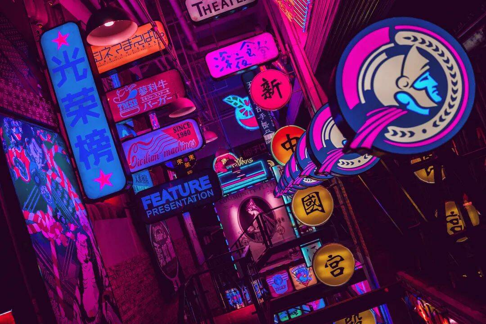
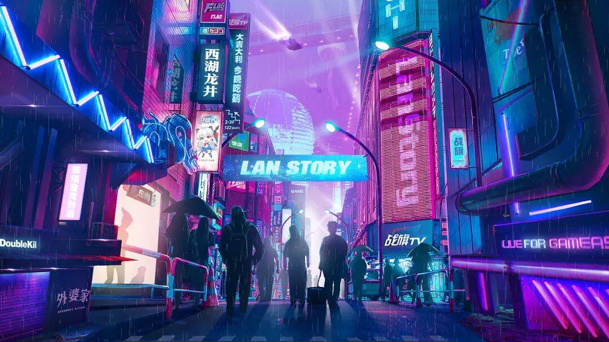
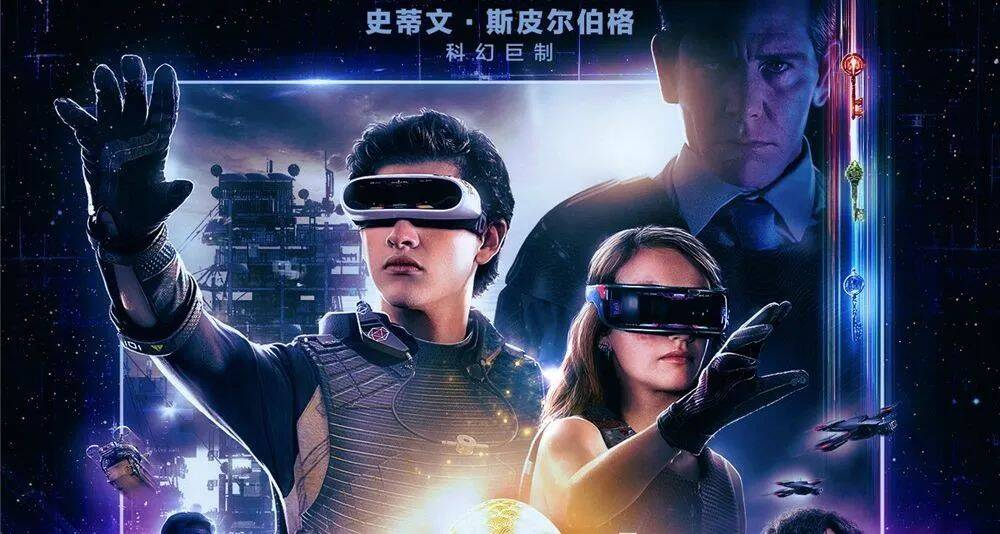
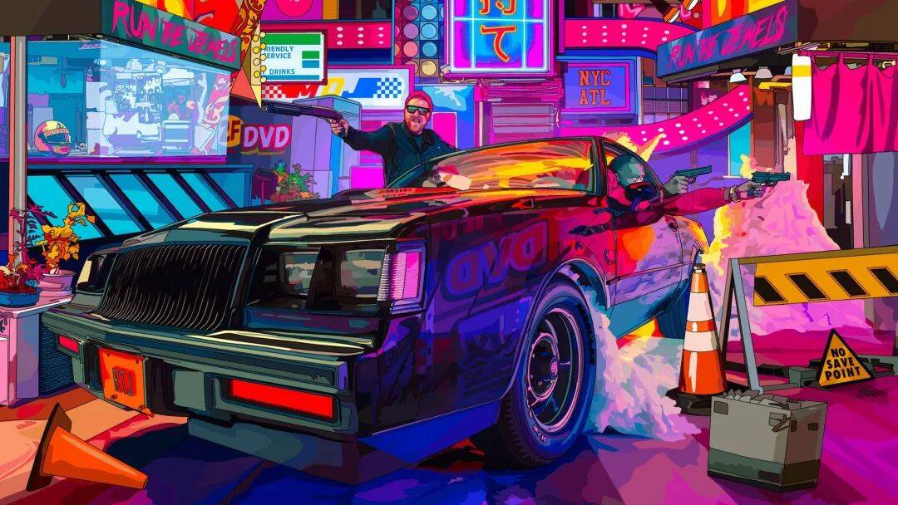
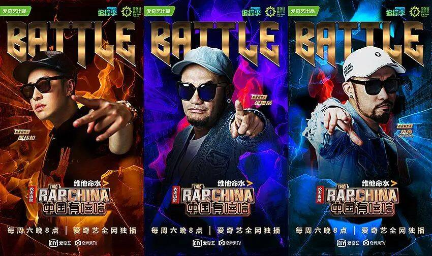
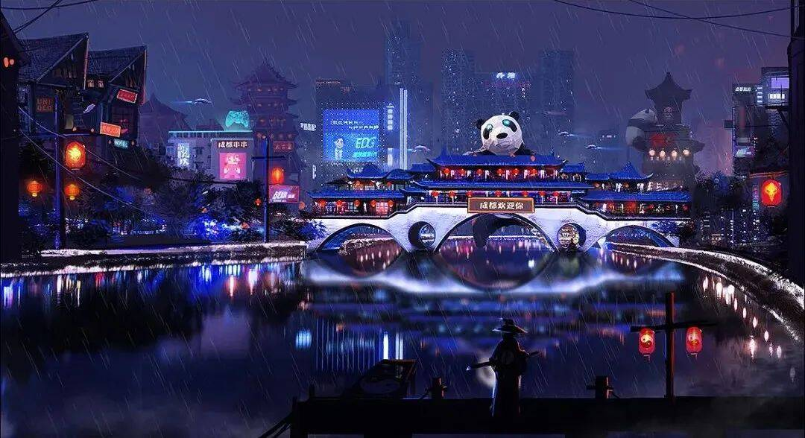

# 赛博朋克与元宇宙有啥关系？

这股风在街舞、音乐、电竞、艺术、鞋衣电商、以及需要传达个性自我的品牌平面广告，都可以看到它的身影，深受年轻人追捧。

这股风就是“赛博朋克”！

再加上今年元宇宙的横空出世，这股风愈加火爆。

## 01 什么是赛博朋克？

赛博朋克反映出科技高度发展的人类文明，与脆弱渺小的人类个体之间的强烈反差，同时外界与内在，钢铁与肉体，现实与虚幻等矛盾在其中交织。其新锐的图形符号和霓虹彩色浪潮，给人以迷幻绚烂的奇幻体验感，与当下年轻群体叛逆、崇尚自由、特立独行的性格不谋而和，酷到极点。

## 02 元宇宙和赛博朋克

今年元宇宙这个概念持续走火，Facebook更名Meta更是把这个概念引爆，引起了各大科技公司纷纷下场元宇宙。

元宇宙相当于赛博朋克的温和版，源自赛博朋克开山作《雪崩》，其去掉了赛博朋克中的控制和反抗，留下了物理层面的虚拟世界。如果在未来元宇宙最终实现，深谙赛博朋克的设计师可以扮演什么角色呢？建设者or掘金者？

## 03 赛博朋克到底有多火？

看过任何一部赛博朋克风格的电影，都能感知到它的魅力：耸立的高楼大厦与虚拟现实、人工智能、网络、电子是未来世界的重要象征元素；

▲电影《头号玩家》

▲游戏《赛博朋克2077》

画面以蓝紫等暗冷色调为主，会选用色彩靓丽的霓虹灯光感的对比色，暗喻高科技未来与低端生活的矛盾。

除此外，一些受众为年轻人新潮的展现自我的综艺，比如近些年出现的《中国有嘻哈》、《这就是街舞》等都会以赛博朋克作为主要的场景设计风格，它们的海报也是同款风格，通过扭曲、故障、霓虹的色彩展示前景人物的个性、张扬等特点。

▲综艺《这就是街舞》

▲综艺《中国有嘻哈》

总之，凡是涉及到受众为年轻人或者想要展现未来感、科技感，都可以尝试赛博朋克风格，带来不一样的感官冲击。

对于赛博朋克，有些人觉得太锋芒、不实际、不落地，对这种风格不理解，但再多人不喜欢，也止不住它的爆火。

对于设计师来说，最关键的还是学会在流行的审美趋势中向前一步，不断思考能够给这个领域提供什么独特的设计，并不断放手进行崭新和有趣的尝试，才能真正带来改变乃至潮流。

相信赛博朋克也会被更多的人认可。都说“时尚是一场轮回”，当赛博朋克不再小众，那便是先锋设计师们再踏上叛逆征程的时刻。
