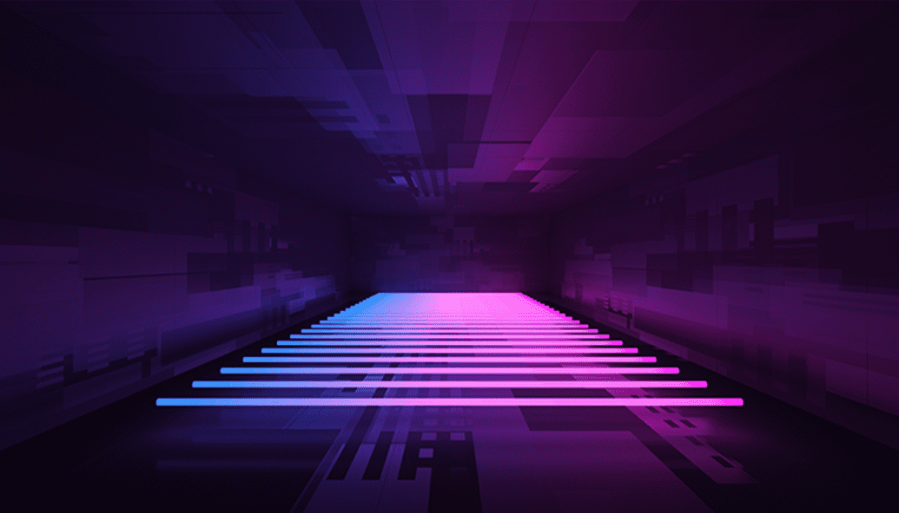
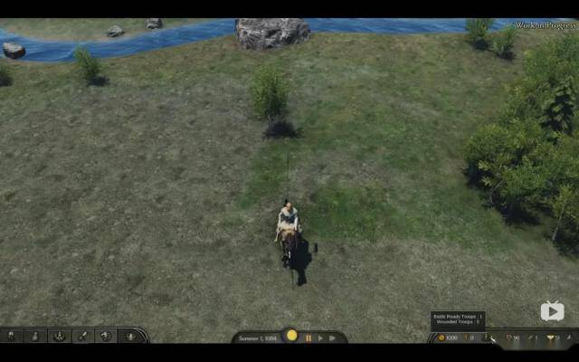
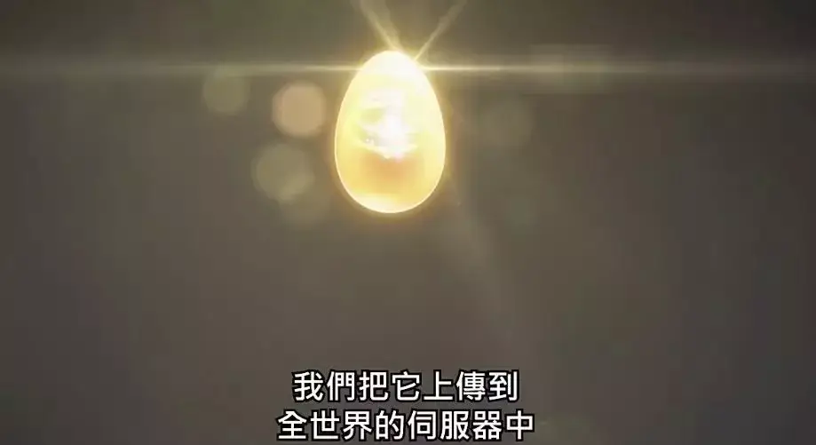

# 元宇宙与“赛博监狱”

1992 年，尼尔·斯蒂芬森在他的小说《雪崩》中对未来技术进行了一番赛博朋克式的探索：移动计算、虚拟现实、数字货币、智能手机和增强现实等赫然在列。

二十多年后，这部小说成了硅谷无数人心中的神作。许多工程师、企业家、未来主义者和极客将《雪崩》视为对当今科技领域的绝佳预言。

也正是它，催生了人们对 Metaverse（元宇宙）的热情。

现在，Facebook 掌舵人宣称，他们将不再是一家社交公司，而是会成为一家“元宇宙公司”；微软 CEO 在主题演讲以及最新一季财报电话会议上宣布，自己将建立一个“企业元宇宙”；Epic CEO 和 Roblox 创始人也都深信：Metaverse 将带来与电话、互联网同等规模的变革。

一时间，太多人开始竞相追逐这个所谓的新世界。

本文将基于《雪崩》小说本身讨论三个问题：**《雪崩》中的“元宇宙”究竟长什么样？它为何引发大家广泛关注？我们应该如何理解它的到来？**

《雪崩》与并不美丽的未来新世界

照大多数媒体的描述，Metaverse 对崇尚思考未来的人有着近乎致命的吸引力。不过，我们也该回头仔细思考“元宇宙”的最初来源。

“元宇宙”诞生于《雪崩》这部小说。故事发生在未来的美国，身兼黑客和披萨送货司机双重身份的男主人公 Hiro，无意间让雪崩病毒感染了自己的朋友（也是元宇宙中一个极端重要的人物），导致后者虚拟身份崩溃和不可逆的脑部伤害，就此他开始寻找真相的历程。

我们暂且略去情节，聚焦在作者对未来世界的刻画上：全球经济崩溃后，美国曾经的强盛不复存在，这里开始由私营企业和特权阶层统治。中下层劳动力被迫找寻各类“怪异”工作维持生计，而富人居住在有枪炮和军队保护的完全封闭的社区。

好在，这里有一个完全沉浸式的虚拟环境，为绝望国家里的所有人提供一个机会——短**暂逃离无法忍受的现实。**

“这个虚构之地，就是元宇宙。”尼尔·斯蒂芬森写道。

元宇宙的大部分建筑是沿着 The Street 开发的，The Street 是一条长达 65536 公里（2 的 16 次方）的巨型通道，环绕着整个虚拟世界。这个世界的用户选择一个头像来代表自己，更高分辨率意味着成本更高，因此，即便在虚拟世界，人们也有了阶层之别。

那么，人们在元宇宙中做些什么？

和现实一样，The Street 是不断发展的。开发商会在主干道的基础上建造新的街道，以及各种特殊建筑物、公园、地标，人们还可以去自由战斗区互相“猎杀”。

需要特别指出的是，这个虚拟世界里有一类人，被称为“石像鬼（Gargoyle）”，由于过分沉迷其中，他们选择让自己永久待在这里。而这样做的代价就是在现实世界中永久毁容。在《雪崩》出版后的十几年，“石像鬼”一直被视为对电脑/手机屏幕成瘾陷阱的预言。

在斯蒂芬森的笔下，未来的元宇宙是一个令人上瘾、充斥暴力的地方。种种黑暗设定，在这个概念的鼓吹者所吟颂的元宇宙赞歌中，并没有提及丝毫。

2021 年 3 月，美国游戏平台 Roblox 在纽交所上市，点燃了 Metaverse 这个诞生于 1992 年的概念。一时间，众多游戏公司、社交应用甚至是完全不相关的远程协同办公都开始硬蹭 Metaverse。

Roblox 是 Minecraft（我的世界）最主要的竞争对手。两者同样提供了像素风格的开放世界沙盒，而他们之间最大的区别在于 Roblox 提供了更复杂的开发工具，并允许玩家出售自己设计的玩法来赚取真正的钱，这也使得它被认为比 Minecraft 更像 Metaverse。

Metaverse 被译作“元宇宙”，它不是一种游戏，而是在赛博空间创造另一种宇宙的尝试。它可能有游戏一样的界面，现实世界一般的物理引擎，可以长期真实存在的经济系统。它可能没有固定的道具，因为一切道具都是玩家自己创造的，就像现实世界一样。它甚至可以没有固定的玩法与故事，因为一切的历史也都是玩家自己书写的，就像现实世界一样。

但是，与现实世界不同的是，在这些新创元宇宙中，赛博上帝有能力无时无刻不监视并控制着我们的一切。资本与监管不能操纵现实世界的物理定律，但在 Metaverse 里它们可以。

而操纵与监管技术就像小说中的一把枪，它一旦出现就必然开火。1Metaverse 里可以下蹲么？

2019 年 5 月 7 日，央视报道网络游戏《我的世界》中，部分用户利用游戏各项功能发布涉黄信息，被众多家长举报。

“一个全是砖块的像素游戏，怎么涉黄？”

这是几乎所有网民看到新闻标题的时候脑海中浮现的第一个问题。

但在详细的报道中，《我的世界》中能涉黄的功能非常多了，除了正常的聊天涉黄之外，游戏对玩家道具命名、房间名称等方面的拦截机制不尽完美。

最离谱的是，有疑似性变态者开房间后吸引玩家进入，然后再用自己的角色反复蹲起来模拟不可描述的行为。这种赛博强奸尽管不会对儿童造成生理上的伤害，也不是游戏设计者能预先想到的，但任谁看了也都会觉得非常不适。

文字性的显性涉黄是非常容易治理的，但反而是这种“赛博强奸”的治理却极为困难。

你究竟怎么判断一个在 Metaverse 中反复下蹲的人是在性骚扰，还是在舞蹈呢？或者换一种问法，如果在一个 Metaverse 中是被禁止蹲起的，那么它还能被称之为 Metaverse 么？

Metaverse 的最大卖点在于，“它不是一款游戏，而是另一个世界‘’。

人们可以在里面摆脱游戏设计者设计的玩法，探索出自己的生存方式。因此， Metaverse 之所以能成立，是因为玩家能在里的体验比其它游戏更真实和自由。玩家不止要能移动、奔跑、跳跃，还要能蹲下、躺下、托腮思考、与周围的一切互动再被反互动、要能在世界中留下痕迹，这些痕迹还要能对其它玩家产生影响。它的金融系统要能支持玩家间的自由买卖，它的物理引擎要让玩家能够通过自己的创造到达不同的地点甚至是重新定义地图。

基于这种模拟，Metaverse 才有机会让玩家自己创造出游戏设计师一辈子也想不出来的创新玩法。

以 Minecraft 为例，这是一个用砖块组成一切的游戏，它没有任何官方既定的主流玩法。一切就像是 70 后、80 后小时候在路边玩的沙土与泥巴。

但这同时意味着，就算是所有可以直接传递内容的功能（比如聊天、私信和道具命名）全部被删除，人们依然可以直接用方块拼成足以构成对儿童威胁的信息。

比如最简单的——堆个生殖器。

2016 年，加拿大警方破获一起未成年人用 Minecraft 传播儿童色情的案件

在现实世界中，任何人都有用路边的泥巴捏个人体器官的自由。有人可能会觉得这是先锋艺术，有人可能会觉得这有些恶俗，但只有你真的把这种艺术作品摆在学校门口才会引起公愤而被家长迅速捣毁。

然而在 Metaverse 中，一切遵循完全不同的逻辑。

在现有的 Metaverse 里不存在愤怒的家长，也不存在正义的警察，它的治理与现实世界中由执行力形成的“治理均衡”不同。在这个全新的世界里，只存在一个强而有力的“赛博上帝”，也就是 Metaverse 投射到现实世界中运营游戏或 App 的企业。

“赛博上帝”的存在，意味着人们会对它有不切实际的诉求。

具体来说，就是当有足够多的孩子在玩《我的世界》的时候，家长们的诉求就不再是摧毁一个情色艺术品，而是要求企业想办法禁绝所有可能与情色相关的表达出现的可能。

任何人对任何内容的怒火都会以 Metaverse 之外的某种形式直接冲击这个实体本身，迫使它做出越来越保守的决定。

这种全知全能的监控能力要么不出现，一旦出现，它就只有被滥用这一种可能。

这当然能保护孩子，但也伤及了那些正常进行创作和表达的人。Metaverse 也会逐渐成为无鱼的至清之水。比黄网还严格的 Metaverse

Minecraft 并不是第一个遭遇监管危机的 Metaverse 应用，Metaverse 应用也不仅在中国会遭遇监管危机。

2003 年，网络游戏《第二人生》，该游戏是全球第一个大型元宇宙实验。与当时众多玩法固定的网络游戏不同，它是一个开放的、没有固定玩法的虚拟社交体系，并融合了模拟人生、模拟城市的一定元素，使得人们可以真正的在互联网世界中开始一个新的人生旅程。

该游戏内部包含一整套经济系统和开发工具，玩家可以利用游戏内的 3D 建模工具和 Linden 脚本语言创造游戏中此前从未存在的道具、玩法、生物、建筑、载具等。这些内容还可以通过 Linden 在玩家之间自行流转。

与别的游戏中，“氪金”是向游戏生产商购买一件已经存在的皮肤或道具不同。在《第二人生》中，玩家购买的衣服可能是被别的玩家生产制造的，而收取 Linden 币的也不是游戏开发商而是其他玩家。

由于 Linden 实验室承认居民创造物的版权，再加上 Linden 币可以在黑市中与美元双向兑换（官方仅提供单向销售），因此在《第二人生》里迅速出现了生产虚拟物品的虚拟企业。

比起《赛博朋克 2077》，《第二人生》里的捏鸡系统可复杂多了，而且还有专门售卖不同赛博鸡的虚拟企业。直到 2020 年，每月还有新的赛博鸡在上架。

但随着媒体的报道和上线人数的激增，《第二人生》中的色情与非法问题开始渗透到现实世界。Linden 实验室也在现实世界中遭遇到了官司。因为，既然存在于《第二人生》中虚拟企业是可行的而且可以与现实世界互动，那么虚拟黑帮，虚拟恐怖组织就同样可以存在和发展。

比如，《第二人生》承认玩家在该游戏中创作的物体和内容拥有物权和版权，这显著增加了该公司作为诉讼被告的可能。事实上，曾有一个专注于生产《第二人生》虚拟道具的玩家，起诉了 Linden 实验室，迫使后者调查另一名玩家对自己制作的虚拟情趣用品的盗版行为。

到 2006 年，游戏的运营公司 Linden 实验室不得不要求所有登录《第二人生》的玩家必须提交一个经过认证的 Paypal 付款帐户或信用卡帐户。

虽然《第二人生》的主服务器一直保持低审查的策略，但从 2006 年开始他们从主服务器（Main Gird）中分裂出了青少年服务器（Teen Grid）。

该服务器严格审查服务器内的一切行为和内容以确保其维持在 PG13，并还曾经实施过中国家长梦寐以求的服务器宵禁——只有太平洋时间的中午 12 点到晚 10 点之间开放。

值得注意的是，这比中国最早的互联网实名制法规《互联网用户账号名称管理规定》要求“后台实名，前台自愿”早了 9 年。

然而，《第二人生》青少年服务器的结局并不好。2011 年，Linden 实验室宣布将会关闭青少年服务器，青少年服务器内所有玩家的数据将被冻结合并，直到玩家年龄超过 16 岁后，才能在主服务器中取回自己的财产。

这种粗暴的监管方式几乎让人对 Linden 实验室允诺的“另一个世界”感到失望，同一时期随着移动互联网的崛起，Facebook 和 Instagram 等社交网络的崛起也拉走了那些原本试图在《第二人生》中构建另一个社会的年轻人。

在之后的多年里，Linden 实验室经历了多次裁员，重心转向 VR 项目 Sansar 的研发。直到 2019 年，Metaverse 成为资本风口， Linden 实验室才宣布将重新聚焦《第二人生》的后续研发。

然而在 Linden 实验室做出强监管的那个时间节点，它在现实世界中所受到的公众压力可想而知。3治理均衡与灰度生态

1785 年，英国哲学家杰里米·边沁所提出“环形监狱”的概念，这种监狱顺序允许一个警卫监视所有的犯人，并且犯人不知道自己是否在被监控。

监狱本就有监察犯人的合法性，但以环形监狱的形式监察犯人违反了最基本的人性，对于罪不至死的犯人来说，这并不合理。这才是环形监狱之所以被人诟病的原因。

古巴一座被废弃的环形监狱，现被当做环形监狱模型、博物馆保留。仅需一个警卫在中心的瞭望塔，即刻监视所有犯人。

事实上，现实中的社会既不是非黑即白，也不是一个温室，而是一种在治理均衡下的灰度生态。

比如，城管不会随时监视违法摆摊的商贩，也不会对高峰时段屡次占道经营的人视而不见。在长期的猫鼠游戏中，达成的其实是一种既能满足市民购物需求又能满足交通顺畅与市民便利购买果蔬之间的灰度状态。

再比如，盗版光盘和盗版纸质书对版权方的伤害远小于互联网时代的盗版。因为尽管前者更难以被监管，但前者也同样难以大规模传播。在没有互联网的时候，购买盗版光盘和购买纸质书都要“看运气”，盗版光盘厂与盗版书厂也面临着较大的刑事风险。但在互联网时代，任何一个用户都可以成为盗版传播的源头，这大大加速了盗版传播。在互联网之前，盗版“信息普惠”作用与“侵害作者利益”之间也形成了灰度地带。

同样的，在没有互联网的时代，未成年人不能直接从正经渠道（比如电视）中获得色情、暴力或极端信息。但他们总还是会路过那些有不良书籍的摊贩，路过成人用品商店，以及被那些“坏同学”耳濡目染，逐渐的进入成人世界——这更符合自然的成长逻辑，因为人类并不是在 17 岁当天的 24 点一瞬长大的。

但在互联网时代，所有的治理均衡和灰度生态均被打破。

一个没有纳入监管的电商卖家就能售卖几十亿的违禁商品，一个盗版网站就能让版权方损失超过一半以上的预期收益，一个漏网的黄色网站就能让初中生在接下来的 2 小时成为“大人”。这也成为了对监管和各大平台违规内容赶尽杀绝一丝不留的“依据”。

“管管孩子，救救游戏”与“管管游戏，救救孩子”之间的激烈冲突，其实是这种治理均衡在互联网领域完全失灵的一个表征。在 80 年代，一本“武侠小说”能让孩子废寝忘食一周，但一个没有防沉迷系统的游戏可以让孩子沉迷数年。

互联网大幅压缩了信息灰度传播的可能，你不可能构造一个让成年人获得少量成人内容的网络环境，这一点与上文谈到的 Metaverse 中的治理困境相同，要么全员恶人，要么一点没有。

分级无益于解决这一问题，因为互联网时代的分级，在执行层面存在严重问题。

欧美在实体出版物领域建立起的分级制度在互联网普及后几乎对未成年人完全无效，未成年人可以使用几乎所有渠道全量取得任何自己想要看的色情内容。这种情况其实并不能难理解，未成年人去购买一本实体“黄书”要冒着很大的风险，他要找到愿意违法向未成年人出售的商店，要有足够的私密空间来藏匿黄书，还要有不被父母和老师发现的时间来阅读。

而在冒着这么大的风险之后，他所能获得“不合时宜的信息”仅仅是一本书的量。

而对于任何登录色情网站的未成年人，只要在初次登录被问及是否成年时点击“是”，就再也不会有任何阻拦（信用卡验证只出现在购买会员的环节）。而且就算是加上信用卡年龄验证，效果也不会太好。我们可以参照在中国的游戏领域，有多少孩子是在使用家长的帐号在游戏中沉迷和消费。

很多看禁书长大，但觉得自己三观“没有长歪”的 80 后开明父母，可能并未意识到黄网与自己小时候在限制条件下获得的黄书在信息规模和对儿童的影响方面完全不同。
英文社区 Reddit 在访问 18X 帖子或板块时所弹出的提示。这代表了欧美互联网分级在执行层面的典型状态，突出一个“掩耳盗铃”。

因此分级制度基本上是默许了尼尔·波茨曼在《童年的消逝》中对电视机的批判：让初中以上的孩子一次性成年。

但不分级情况下，中国模式的弊病大家也都深有体会。它在很大程度上营造出一个无菌温室，导致所有的成年人都感到痛苦。

可以说，两种模式都没能成功还原出现实世界中的治理均衡与灰度生态。而对于 Metaverse 来说，它越是倡导“自由度”就越是容易让我们撞上治理的“空气墙”。

比如，一个最奇葩的现象是：我们可以在游戏中互相攻击，却不能在游戏中互相辱骂。

在海外，《堡垒之夜》一直比《绝地求生》更受青少年人的喜爱，这是由于许多欧美的青少年将《堡垒之夜》当作一个赛博操场。

随着城市化进程的加深，少子化的日趋凸显，城市中供青少年自由安全玩耍的角落正在变少，《堡垒之夜》丰富可互动的主场景则刚好提供了这样一个补充。许多欧美年轻人在这款游戏中根本不会理会游戏的主要目标（战胜对手），而只是与一群好友在游戏场景中玩一些彼此之间的互动游戏，比如踢球、赛跑、捉迷藏。

.webp)

《堡垒之夜》中存在的建造系统，让青少年玩家更能挖掘完成比赛之外的玩法

然而，在这个赛博操场上，遵循着一种与现实世界完全不同的逻辑：你可以朝着玩家开枪，因为这是游戏的正常玩法。但你不能对任何人说 Fuck，否则你的账号就会被封禁。

说脏话是错的么？当然是错的，但青少年有权利在知错的情况下犯错，并承担被父母或家长抓住后的结果。

在物理世界的反馈链条中，青少年可以学会在什么场合、什么人群下以什么形式表达愤怒。而在赛博空间内，由于 Metaverse 上帝的存在，这种天然的社交学习过程被打破了。

我们尚且不知道，在这种如同环形监狱一样的赛博温室中成长意味着什么。

但遗憾的是，00 后似乎已经没有选择。跑步进入环形监狱

在治理均衡问题解决之前，越多的人将越多的时间投入到 Metaverse 中，则会带来越大的冲突与矛盾。

而解决这一问题的路径，几乎只有一条，那就是完全分布式的 Metaverse。

有两个影视作品可以解释现有 Metaverse 和分布式 Metaverse 的差异。一个是美国科幻电影/小说《头号玩家》中的绿洲，另一个是日本科幻动画/小说《刀剑神域》最初反派角色茅场晶彦死后的各个游戏世界。

这两者的区别是，绿洲尽管是一个看似无穷无尽的开放世界，但实际上它的游戏基础规则和各种权限受到绿洲公司的直接控制。理论上如果不是该公司的创始人故意留下控制权线索，主角一行人永远不可能有机会带领平民玩家在绿洲的世界中翻盘。

最终《头号玩家》里绿洲的改善也依赖于成为新执剑人的主角韦德在道德上的驱动力。

当韦德最终取得了绿洲的控制权，决定在之后让绿洲服务器每周关闭两天让大家“回归现实世界与家庭生活”时，也从未考虑过那些根本不想回归现实的人，比如绝症患者的感受。韦德成了新的赛博上帝，但他依然受困于自身在现实世界中的地位。

仰仗于主角团道德的绿洲能保持多久的科技向善是个问号，因为在原作设定中绿洲之所以会陷入向恶，本身也是由于绿洲上一任“上帝”死亡造成的权力真空。

而一旦“赛博上帝”本身更倾向于“向恶”，我们将面临比现实世界中更严重的操控与剥削。

以绿洲为模板的 Metaverse，过于依赖单个机构或个人道德水平和监管对整个世界的影响。没有任何机制性或技术性的方式保障乌托邦的长久存在，才是这些乌托邦违背初衷的原因。

这与现实中目前热炒的 Metaverse 早期概念产品，Minecraft（我的世界）、Fortnite（堡垒之夜） 和 Robolx 所面临的困境是完全一致的。

Robolx 从 2017 年起接入了第三方公司 Community Sift 的“人类互动审核系统”，通过人工智能实时和手动追溯惩罚的方法保障未成年人的游戏纯净性。

Minecraft 因允许建立个人服务器因此稍好，但它仍然不是能被任何人所修改的开源方案，也没有任何强制力量约束微软在将来始终允许 Minecraft 私人服务器的存在。

而更重要的是，这些 Metaverse 目前全部由并不受到公众信任的科技巨头所持有。

而在《刀剑神域》中，最初的游戏开发者茅场晶彦作为邪恶 BOSS 死亡后，主角开源了整个“刀剑神域”虚拟世界的游戏资源与底层代码。在这样的前提下，之后几季的故事中，技术与应用的路径朝着与绿洲完全不同的路径发展——

在《刀剑神域》的后续世界观中，不同的企业、单位、组织甚至个人，通过开源的代码架起了拥有完全不同规则和玩法的小世界。但他们之间又遵循统一的接口进行用户数据的传输和保管。虽然有企业或组织能够控制单一的小世界，但没有人能控制用户分身在不同世界之间的流转。

分散的 Metaverse 能确保它像现实世界一样形成某种治理与信息的均衡——审查者不可能一次消灭所有的“不良信息”，但同样的人们也无法一次性获得所有“不良信息”。这种均衡状态下，能使 Metaverse 在信息流动和社会形态上更像处于灰度纯净的现实世界，既满足了创作表达，又满足了社会安定。

但想要达到这种分布式、均衡式的 Metaverse 却难上加难。Metaverse 之所以在 2020 年成为新的风口，是因为技术力的发展。经纬创投在其早前发布的文章中直言：

首先，技术成熟度的拐点似乎已经到来。Metaverse 所需要的 VR/AR/MR、AI、NLP、计算机视觉渲染、云端虚拟化、脑机接口等多种技术，都已经发展到了一定阶段。这为Metaverse的落地奠定了基础。

在这一连串的技术贯口儿里，没有一个技术不是依赖中心化互联网或资本巨头的。可以说，正是由于各类堆料型技术的进步，成为了这一轮 Metaverse 风口的主要推动力，这无疑会进一步加剧互联网的中心化和寡头垄断化。

而真正的去中心化的 Web 3.0，却仍处于复刻一个微博都不能成型的困难阶段。

那么，我们真的要在现在进入 Metaverse 时代么？

《黑镜》S04E01 《联邦星舰卡里斯特号》，描绘了一个我们可能将会面对的 Metavese 世界，如果你对本文讨论的话题有更多兴趣可以去看看。
