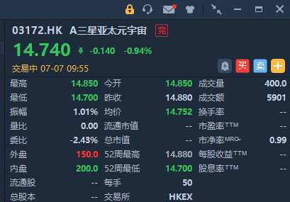

# 元宇宙概念股最新消息 三星元宇宙概念ETF今日在港交所挂牌

随着元宇宙的持续升温，各界巨头也开展了元宇宙相关业务。元宇宙概念股最新消息有：三星亚太元宇宙概念 (新西兰除外)ETF $03172.HK ，今日正式登陆香港联交所-主板上市交易，开盘报价14.85港元，微跌0.2%，现跌0.94%。

行情来源：华盛证券

该ETF是香港首只亚太元宇宙概念（新西兰除外）ETF，拟采取由上而下选股方法，专注亚洲元宇宙概念，ETF将由40-60家具有元宇宙相关概念的公司组成。亚洲元宇宙股票估值处于多年低位，极具吸引力，主动管理，将由经验丰富的研究团队挑选合适公司作出投资。
