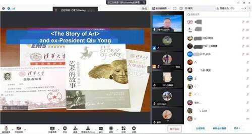

# 元宇宙之数字藏品线上研讨会举办 助力文化产业数字化升级

5月14日，由清华MBA学生文化经济俱乐部发起主办的“元宇宙之数字藏品”研讨会在线上成功举办，140多位来自不同行业、不同领域的清华MBA同学共交流、谈心声、话期待，聚焦数字藏品在文化经济领域的探索实践。

根据不完全统计的数据，2021年数字藏品融资超过300起，金额超过50亿美金。今年以来，也有不少数字藏品平台拿下大额融资。那么，到底什么是数字藏品？数字藏品在中国环境下应用场景有哪些？合规性政策如何解读？从投资人的角度又怎么看？文化经济俱乐部邀请到两位业内嘉宾，为同学们做了精彩分享。

作为首位斯坦福大学全球人工智能高管项目顾问，刁孝力嘉宾从创业者和投资人的视角，跟大家分享了数字藏品如何创造价值以及当下的风险分析，同时对中国文化IP借力数字藏品出海等也做了精彩解读。

另一位嘉宾，One Show国际创意节ADC国际设计奖亚太区负责人及阿里拍卖数字艺术拍卖核心TP马超则为大家解读了数字藏品在中国环境下的应用场景、合规性政策以及未来发展趋势的预判。 

来自不同行业、不同领域的文化经济俱乐部的同学们与嘉宾进行了充分互动交流。

如来自清华MBA22级P3班的郭同学提问“元宇宙与教育场景结合，从投资人角度是否看好？”、来自22级P3班陈同学提问“在现有的监管体系下，中国企业如何深度介入数字藏品及WEB3.0？”、来自22级P4班的赵同学提问“当前阶段个人适合以何种身份参与到行业中来”、来自22级G班马同学则表示“希望了解行业背景及趋势，并参与”、来自20级P2班刘同学提问“数字藏品的发展趋势是什么？”、来自20级P1班的张同学提问“如何看待未来商业模式的发展与创新？”，来自19级G班同学刘同学表示“想了解下目前出版行业与数字藏品的结合点”等等。

 不久前，《中国文化产业年度报告（2022）》发布。报告中指出，数字藏品与传统艺术品金融、娱乐传媒、数字文博等领域逐渐融合，形成多样的数字资产和虚拟生态。在中国，阿里、腾讯等互联网巨头亦纷纷加码数字藏品艺术，先后推出敦煌飞天、九色鹿、新华社新闻等深受年轻群体喜爱的数字藏品，并以拍卖、盲盒、艺术展等形式不断拓宽数字藏品艺术的边界，为推动文化遗产数字化、年轻化、生活化提供新的机遇。
