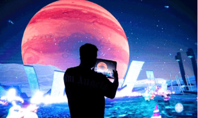

# 天猫推出「元宇宙艺术展」，如何评价数字艺术收藏品的价值与前景？

6月26日下午，“大有来头——画廊周北京GWBJ元宇宙空间暨大有产品发布会”在北京798召开。本次发布会，由「大有」联合画廊周北京共同举办。届时，国内首个元宇宙当代艺术数字空间——“画廊周北京元宇宙空间”正式上线，并全球同步直播。

当下，元宇宙、非同质化代币（NFT）、虚拟人、Web3.0等新概念,已经飞入寻常百姓家。来自麦肯锡的研究显示，到2030年，元宇宙概念将创造5万亿美元的价值。然而，元宇宙概念在成为热搜的同时，依然处于非常初级的阶段：IP展现形式单一、缺乏落地场景、用户如何在元宇宙空间里实现互动、传统业务规则如何适配等问题，都限制了元宇宙领域真正的价值创造和实现。

“画廊周北京元宇宙空间”的发布，意味着元宇宙数字空间场景落地当代艺术行业的首款产品诞生。

传统艺术行业以白盒子空间（博物馆、展览馆、画廊等）为载体的艺术系统将全面升级，实现线下空间与线上场景的无缝链接。在这个平行于物理世界、跨越虚拟与现实、永久续存的多人互动空间内，用户拥有专属虚拟化身，随时随地关注参展画廊的展讯，实现全景式、开放式的逛展体验。

未来，“画廊周北京元宇宙空间”内，将逐步开放合作画廊的元宇宙入口，从这里可以抵达画廊的虚拟空间，各类精彩纷呈的艺术展全天候、无时差等你来看。另外，每一个合作画廊的线下展览、甚至某一件神秘的艺术品，都会成为元宇宙空间的虚拟入口。「大有」帮助艺术机构和艺术家建构web3.0时代观众与作品之间的全新关系。

「大有」创始人黑羽在发布会中表示，“元宇宙中除了人（虚拟人）和物（NFT或物权），其实更重要的是“场”。场，决定了用户的感官体验和互动方式，体现了真实的商业规则。「大有」，专注打造元宇宙空间场景，打通线上和线下，联结人与物，不仅可以实现艺术机构的“云观展”、商业地产的‘云逛街’、风景名胜的‘云旅行’，更可以和品牌、IP、艺术家进行深度结合，定制专属元宇宙数字空间。用技术助力新的商业模式和超现实的艺术表现力。目前，我们已经为数十位合作艺术家和品牌打造了专属的元宇宙艺术空间。”

「大有」，成立于2021年，是国内率先主张“用艺术打造元宇宙数字空间”，并且实现数字空间场景产品化的公司。作为艺术数字化的创新者，元宇宙模式与实体经济结合的探索者、领跑者，致力于下一代互联网数字空间的内容表现力设计、沉浸感参与和新用户营销的全流程服务打造。核心团队来自阿里巴巴、华为、网易、小米、游卡等知名互联网巨头和游戏制作公司，其研发人员占比超过六成。目前已经获得两轮投资。

从商业角度看，作为元宇宙时代的全场景服务商，大有基于3D场景构建，跨平台统一产品研发(XR/App/H5/小程序)、多联盟数据链支持、艺术展览混合场域建造、数字艺术创新优化等核心技术，用艺术化表达支持多行业数字空间场景落地。目前，已经实现在微信小程序、大有APP、VR眼镜端的内容构建。

Pico作为全球知名的VR/AR品牌，旗下6DoF VR一体机Pico Neo3在消费级场景获得一致好评，「大有」作为国内首家率先主张“用艺术打造数字空间”的公司，VR、XR的跨产品平台的体验是实现数字场景的重要的产品环节，已与Pico建联，共同拓宽艺术与VR行业的合作边界。

元宇宙究竟能做些什么？元宇宙会不会是新一代的艺术表现形式？究竟应该如何利用元宇宙赋能传统行业、提振实体经济？

「大有」在路上，用行动创造答案。
