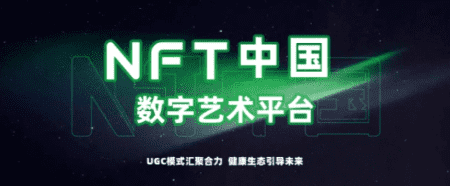

# 元宇宙nft数字藏品系统开发

无论NFT在国外被如何被追捧，在国内当它以“数字藏品”的名称出现时，大部分投资者关心的依然是能不能快速、轻松地通过买卖差价赚到钱。

6月7日晚间的一个视频号直播间里，主屏幕的PPT中，展示着桥水基金创始人达里奥的几段关于投资价值论述的理论，主播围绕价值、价格侃侃而谈，讲解着数字藏品的泡沫问题。

而在评论区，源源不断的用户在刷屏喊话某数字藏品平台负责人，为近期某个数字藏品的销售活动维权。

这讽刺的一幕宛如NFT当下的矛盾境遇。近日，福布斯公布了2022金融科技50强名单（2022年最具创新力的金融科技公司），其中有9家加密公司入榜，包括目前全球最大的综合NFT交易平台OpenSea，它在今年1月宣布已经完成了3亿美元的C轮融资，公司估值达到130亿美元。

然而无论NFT在国外被如何被追捧，在国内当它以“数字藏品”的名称出现时，大部分投资者关心的依然是能不能快速、轻松地通过买卖差价赚到钱。

“突然特别热”

“这个（数字藏品）领域就在今年春节后突然特别热”，一位目前投身区块链行业的李先生对记者表示。

记者从天眼查通过以“数字藏品”为关键词搜索，商标中含有数字藏品的公司数量就有45家，而以数字藏品公司工商资料经营范围的共性关键词“文化艺术+技术+软件开发+艺术品或工艺美术品及收藏品”搜索，结果显示相关公司数量至少上万家。

记者梳理发现，上述45家相关数字藏品公司核准成立时间几乎不会早于2019年，27家公司是在2022年后获核准成立，注册资本金在几百万到数千万之间，但依然只有少部分公司有实缴资本。

在6月6日澄清跑路传闻的天穹数藏，其运营主体为多行（海南）艺术品交易有限公司。天眼查数据显示，这家公司成立于2022年1月17日，注册资本为1000万元人民币，实缴资本为0。

天穹数藏官网显示，公司是多行（海南）艺术品交易有限公司推出的国内头部数藏平台，于2022年4月正式上线。天穹是国内为数不多拥有艺术品拍卖资质的数藏平台，也是国内运营资质完善的数藏平台，提供数字艺术藏品的发行和售卖等配套服务。在天穹可以浏览各种数字艺术藏品，利用区块链技术将其唯一化变成数字资产，并且支持在线互动交易等。
