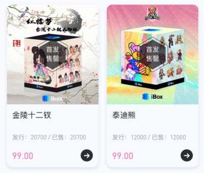
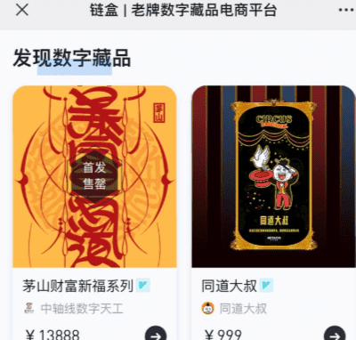
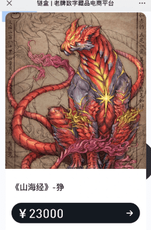

# 什么是元宇宙数字藏品？能给我们生活中带来那些便利？

**数字藏品是什么?** 

数字藏品是使用蚂蚁区块链技术进行唯一标识的经数字化的特定作品、艺术品和商品，包括但不限于数字画作、图片、音乐、视频、3D模型等各种形式。

数字藏品为虚拟数字商品，而非实物，一经售出不支持退换。

每个数字藏品都映射着特定区块链上的唯一序列号，不可篡改、不可分割，也不能互相替代。每一个数字藏品都代表特定作品、艺术品和商品或其限量发售的单个数字复制品，记录着其不可篡改的链上权利。

因此数字藏品与虚拟货币等同质化代币存在本质不同，有特定作品、艺术品和商品的实际价值做支撑，也不具备支付功能等任何货币属性。

导读：蚂蚁链NFG免费制作,支付宝NFG代制作，蚂蚁链粉丝粒NFG代制作，协助上架支付宝NFG粉丝粒

蚂蚁链NFG代制作,蚂蚁链上线NFG

6月23日一早，朋友圈被2款NFG皮肤刷屏了，分别是敦煌飞天和九色鹿皮肤。全球限量发行，仅16000张。

有意思的是，该NFG是基于蚂蚁链发行的，具有蚂蚁链专属唯一编码。如果要购买，需要10个蚂蚁积分+9.9元。

NFG+敦煌概念+蚂蚁链+支付宝+16000张，这两款皮肤很可能是瞬间被抢光。热度空前。

这个事情有两点很有趣，第一是NFG可能再次破圈，一个叫做粉丝粒的支付宝小程序浮出水面，这意味着，支付宝用户可以直接用人民币购买NFG。第二，蚂蚁链的这些NFG，从官方给出的规则介绍看，跟我们认知的区/块/链NFG有些不一样，相反，有从业者吐槽，这哪里是NFG，这就是JPG嘛。

这两款NFG是由支付宝和敦煌美术研究所联合发售，以敦煌幸运飞天皮肤为例，该皮肤总量8000个。需要抢购，但仅需要10个支付宝积分和9,9元。这与区/块/链世界动辄几枚ETH的价格相比绝对“便宜”。

目前，这两款皮肤已经售罄，这意味着项目方共计卖出15.84万人民币。

之所以叫皮肤，那是因为该NFG所对应的敦煌飞天图片，可以作为支付宝付款页面的图片。这意味着，购买该皮肤后，用户在付款码页面在全球支付宝用户中绝对是“万里挑一”。

有朋友感慨，用了这皮肤，付款的时候有种小小的得意，几乎不可能“撞衫”，非常有趣。

支付宝是这么介绍NFG的，NFG（数字作品），指具有独创性的艺术作品复制于蚂蚁链指定的存储空间，并在蚂蚁链平台发行的唯一对应的虚拟凭证进行标识的数字作品。

而蚂蚁链平台（或称区/块/链平台），指通过蚂蚁区/块/链技术基于公有云技术服务的平台，就数字作品及其虚拟凭证的发行/交易为提供可信存证技术服务等的平台。

用户是如何购买这两款皮肤的呢？打开支付宝，搜索“粉丝粒”、“NFG”关键词就可以看到。

据官方介绍，粉丝粒是蚂蚁链推出的，用户可以通过该平台支持热爱的数字作品和艺术家，当用户拥有蚂蚁技术支持的NFG艺术藏品，粉丝粒也可以提供收藏欣赏、向好友展示和赠送的功能。

一句话，这就是一个内置在支付宝的NFG交易和展示平台！而且，用户可以直接用支付宝购买NFG数字艺术品。

目前，该小程序的功能极其简单，粗略看，目前仅有两种产品，一种就是敦煌·支付宝付款皮肤。另一种是一些数字艺术。目前，有若干艺术家的数字艺术品正在该平台拍卖，我们以艺术家乐毅的作品《INSOMNIA》为例，该数字艺术作品目前最高出价801元，11人报名。该数字艺术品也是蚂蚁链上的一个NFG。

今天，通过敦煌·支付宝付款皮肤，这个叫做粉丝粒的产品在加密货币圈火了，但看起来该产品还非常粗糙。属于上线早期。

但可以想象的是，基于支付宝数亿用户的基数，加上支付宝直接付款的便捷性，再加上NFG作品和支付宝其它产品的打通，如果该产品爆火，它是否有可能成为全球最大的NFG交易平台？
