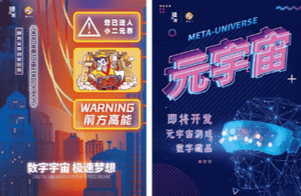

# 怎样通过元宇宙赚钱？这几个方法够新 

元宇宙是一个蓬勃发展的空间，任何事情都可能发生。以下是一些可能在 2022 年爆发的业务。

随着元宇宙开始站稳脚跟， 虚拟房地产投资者和那些希望开设基于元宇宙的企业的机会正在出现。当然，广告牌很棒，零售业务的出租单元也很棒，但在一个没有限制的世界里，还有很多其他方法。

寻找独特机会脱颖而出的虚拟房地产投资者应该考虑这些很容易在虚拟世界中流行起来的业务类型。

# 1.电影院

戛纳电影节令人兴奋，但今年可能比往年更让人期待。在首届 NFTCannes 峰会上，电影行业专业人士将讨论使用不可替代代币 (NFT) 来触及电影观众，并且在 Decentraland 举办首届 NFT 电影节，这是虚拟房地产的另一个用例。

自从 Filmrare 于 2022 年 1 月在 Decentraland 推出元宇宙影院以来，任何想要访问该平台的人都可以观看电影。购买一副可佩戴的 3D 眼镜后，电影观众可以观看在影院放映的所有电影。

在元宇宙中，不必担心是否有人在第三排说话、清理溢出的爆米花，甚至不必雇用员工。

# 2. 音乐商店

音乐也可以通过 NFT 进行保护，或者简单地作为数字产品下载出售，让人们有更多的方式与他们最喜欢的艺术家建立联系。不过，音乐商店不仅仅是购买音乐的地方。这是一种体验，人们可以在其中聆听新音乐，甚至与他们最喜欢的艺术家建立联系。这是元宇宙的完美应用。

# 3.卤小二数字收藏品

数字经济的逐渐成熟，催生了品牌运营方式的变革，直接面向消费者营销成为我们的重心。对于互联网原住民和逐步成为消费市场主力军的Z世代来说，顾客的需求也朝着体验式、创造性、互动性方向发展，呈现出多样化态势。在这样的情况下，我们积极创新营销方式，深度触达Z世代，已成为我们公司发展的必然趋势。

有什么东西是我们能够永久拥有的？在快消费时代的洪流下，有一个热门答案：数字藏品。能永久持有，还能“写你名”，数字藏品成了当下最炙手可热的收藏宠儿。唛沃斯正式进军元宇宙，打造线上元宇宙游戏和线下实体店的联合生态！

首款卤小二卤来炸到品牌数字藏品全球限量发行!

# 元宇宙适合所有人

元宇宙适合所有人，所以您可以想象的各种业务都有空间。

每个元宇宙平台的真正优势在于其社区，因此您的热门电影院或其他业务会让使用该空间工作和娱乐的人更多。 您不必成为房地产大亨就可以购买虚拟世界中的数字土地。在元宇宙中，你可以轻松在里面购买地块，开卤小二门店，经营买卖，获得收益。
