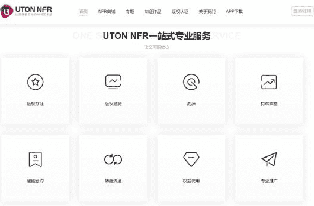

# NFT数字藏品+元宇宙，两者会擦出什么火花呢？

说起元宇宙的头把交椅，NFT自然当之无愧，这种具有独一无二、不可分割特性的通证在元宇宙领域占据了核心位置，NFT+元宇宙成为了今年发开发热点，两者的结合将会擦出什么火花？

NFT是以区块链为基础形成的一种不可分割、不可替代、稀缺的加密资产。NFT在很多时候都指代一种数字化收藏品，比如一段音频、一幅数字油画、一张数字球星卡、一个游戏道具或者一处虚拟房地产等等，未来将是元宇宙的经济基石。NFT可与实体资产一样买卖，保证了元宇宙中基础资产的有效确权。

现在， NFT数字藏品在网上交易，但在不久的将来，NFT可能就会成为我们在元宇宙中不可或缺的数字化产品。到了那个时候，NFT就不会被当成一种收藏品，而是顺理成章地成为元宇宙世界中流通的资产，为元宇宙的经济体系奠基，我们可以想象元宇宙是一个无限宇宙，而NFT是其中一部分。

据报道，UTON NFR平台是基于自主研发的和数链，打通了从艺术创作到铸造发行的全部环节，提供了完善的数字藏品管理与服务体系，致力于构建全新的数字世界，打造NFT社交元宇宙。

元宇宙的发展很大程度上得益于区块链的成熟发展。两者还会有更多新的结合方式，为数字经济发展带来全新的生态。
