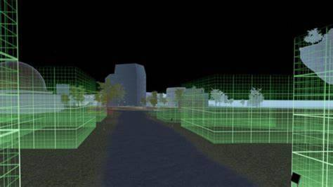

# 顺为资本布局元宇宙，构赛博获千万元人民币种子轮投资

近日，元宇宙空间技术服务商构赛博宣布完成千万元人民币种子轮融资，顺为资本独家投资。据悉，本轮融资资金将主要用于技术升级、市场推广。

构赛博成立于2021年11月，是一家元宇宙空间技术服务商，开发了一款元宇宙3D空间创作工具，可帮助用户构建、托管和管理基于Web的沉浸式3D虚拟空间。构赛博的初创团队来自于酷家乐（全球知名的在线3D室内设计软件平台）、微软、网易、爱奇艺等公司。

据了解，构赛博开发的元宇宙3D空间创作工具提供了简易通用的空间模板，用户通过PC端登录，导入图片或动图格式的素材，即可实现“可视化”操作搭建元宇宙空间设计，降低了使用门槛。

构赛博创始人付铖表示：做工具研发和做定制服务的效率和逻辑区别很大，尤其对于初创团队来说，前者能够快速抓住痛点，覆盖更多用户，且不需要太长的开发周期。截至目前，已有多个企业通过订阅付费方式（年费）使用构赛博的工具平台；如果企业所做的3D空间数量多、访问量大，平台也会收取相应的超量服务费。

顺为资本副总裁冯铮表示：虚拟世界方向的创新前沿，在于构建虚拟空间赋能实体经济。在 VR/AR 设备还不成熟的今天，基于 Web 端的 3D 体验能够大大降低 3D 空间创作、体验和传播的门槛，是非常好的切入方式。团队过去的工作经历，也一直和这个方向紧密相关，拥有丰富的技术商业经验和创建更好 3D 空间的长期愿景。
