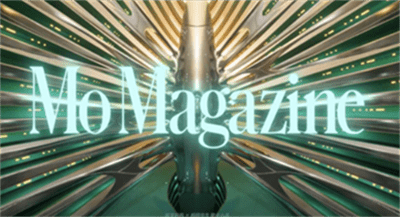
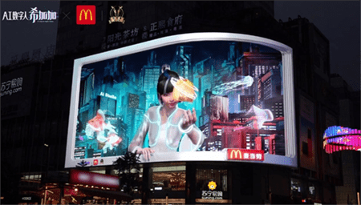
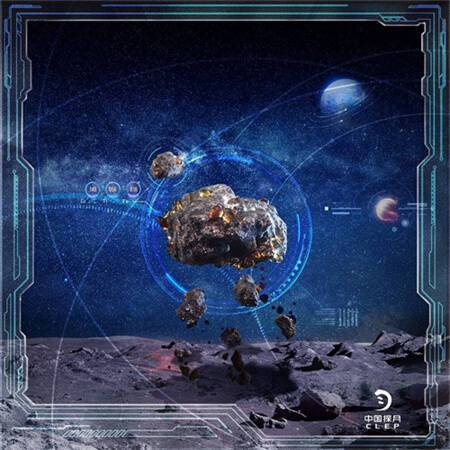
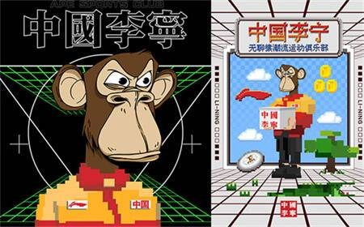
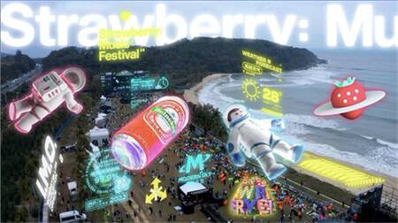
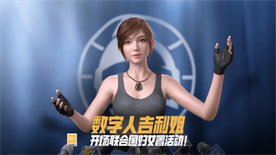
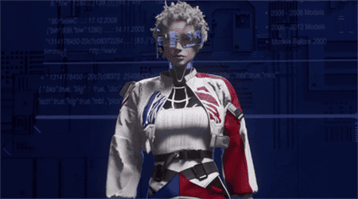

# 2022上半年元宇宙项目TOP10，打开想象的尺度

自2021年走进大众视野，时至今日，元宇宙已然是2022年的概念顶流。在巨头下场、web 3.0 加速构建的过程中，NFT作为元宇宙中的连接纽带、虚拟数字人作为元宇宙的场景入口，也备受瞩目。回看2022上半程，许多品牌继续深入探索元宇宙，开展了许多元宇宙项目，本文为大家带来2022上半年元宇宙项目TOP10。

**1、安踏冬奥×天猫超品日：打造冰雪数字灵境，首创国家队NFT数字藏品**

Brand：安踏
Agency：Creatife 介陌创意 上海

结合钱学森对虚拟现实的翻译——「灵境」，安踏打造出“冰雪灵境”沉浸式互动数字空间，首发“2022 限量高能冰雪NFT数字藏品”，其中包含助力中国冰雪国家队12支队伍的队服以及2个神秘纪念款数字藏品。借助这一项目，安踏给数字藏品找到多个具体的承载空间，让感官探索尺度得到丰富扩大。与此同时，安踏还将数字藏品的设计尽可能地与冬奥热门节点贴合，为用户打造专属的冬奥回忆。

**2、阿里妈妈×栩栩华生首推“元宇宙”杂志《MO Magazine》，数字化互动构建想象**

Brand：阿里妈妈、栩栩华生 北京

一次更内容向的尝试，一段独特的“阅读”体验。在广阔生动的异次元空间中，阿里妈妈与栩栩华生共同为读者打造了虚实结合的沉浸式体验，用户既是玩家，也是创造者。故事设定与互动体验都相对宏大完整，给观众提供了一个想象元宇宙的具体空间载体。这也是业内首本以“元宇宙”为场景设定的数字杂志，从文字到画面、视频，再到“元宇宙”，用《MO Magazine》共同掀起一场内容世界的新浪潮。

**3、百度发布AI数字人希加加，既能开车还能吃汉堡**

Brand：Baidu 百度

2月，百度发布品牌首个AIGC 的数字虚拟偶像希加加，初次亮相不仅与蜘蛛侠同框，还模仿了《三体》中叶文洁的经典台词等。希加加在4月成为麦当劳产品首位虚拟推荐官，登陆成都、大连的裸眼3D大屏，与大屏下方的麦当劳店铺相映成趣，上演全新跨维媒介互动「吃汉堡的数字人」；6月，希加加还与集度汽车合作，作为000号数字人车主驾驶集度汽车机器人概念车ROBO-01出现在其元宇宙发布会上。

既能驾车还能吃汉堡，在「人类世界的 AI 观察者」这一人物设定下，百度用希加加为大众带来无法分辨的虚实感，用数字化和个性化的活动进一步贴近年轻用户。

**4、天猫「有点东西」冲击元宇宙：一次不可复制的奥德赛**

Brand：天猫
Agency：有门互动

用外星人的「外部视角」给用户讲了一个关于NFT的故事。一部“元宇宙”主题的硬科幻大制作，不仅设置反转情节，还有多处彩蛋致敬《哈利波特》《赛博朋克2077》等经典，全方位突出了数字藏品“不可复制”的核心特性，与「有点东西」内容栏目的定位高度契合，点燃用户参与的兴趣。

**5、助力发行全球首个月壤数字藏品，百度拓展数字藏品多元发展**

Brand：百度
Agency：本邦BENBUN 北京

4月，借着中国航天日的节点热度，百度发布「月壤」数字藏品，将嫦娥五号带回的真实月壤扫描还原，打造成NFT藏品。借助数字藏品的形式，百度将中国航天精神、深空探测成就凝固到百度超级链中，以NFT的形式被永久记录、长远传承。围绕月壤数字藏品，百度还策划了AI编曲版《东方红》、太空兔数字人、火星车&太空兔数字藏品等活动，进一步强调出“中国探月航天工程人工智能全球战略合作伙伴”的品牌身份，用科技助力航天精神、致敬航空梦想。

**6、请无聊猿当快闪店主理人，李宁的NFT营销超会玩**

Brand：李宁

比起将自己的产品、形象打造成NFT，李宁选择和当红IP无聊猿联动合作，借助无聊猿已有的身份影响力创造话题影响力，焕新品牌的年轻化感知。与无聊猿形象的结合非常巧妙地点出了品牌特质，同时也有将这一形象线下实体化的尝试，丰富了NFT营销的维度。

**7、摩登天空首次推出数字藏品系列：I.M.O. 星际漫游者**

Brand：MVM design label_

当音乐厂牌摩登天空开始做设计内容厂牌，NFT的发售变成一次将品牌已经积累下来的虚拟形象、艺人资源转化成更多元展现形式的尝试。NFT只是第一步，在藏品之外，摩登天空还为藏家增设AR玩法，为用户找到了一个更可感的NFT呈现形式。在未来，摩登天空还将在草莓音乐节将推出AR体验，并计划打造虚拟草莓音乐节。品牌元宇宙的图景缓缓展开。

**8、和平精英：数字人吉莉亮相联合国妇女署， 畅谈女性实力**

Brand：和平精英
Agency：Treedom

以往，再火爆出圈的虚拟人，“营业”形式也多是停留在唱跳、采访等方面，鲜少有突破性的创新演绎方式。和平精英让虚拟人吉莉为联合国妇女署活动做开场致辞，做价值观念输出，可以说是全球范围内的一大创新。通过这次演讲，和平精英让虚拟人走上了国际化的舞台，在前所未有的平台规模、受众更广的价值观输出中，将虚拟人的影响力范围进一步扩大。

**9、全球首位唐氏症虚拟网红 Kami，不完美却很真实！**

Brand：公益机构国际唐氏综合征（Down Syndrome International）
Agency：Forsman & Bodenfors 新加坡、The Diigitals

虚拟网红与公益的结合，打开大众对数字人的又一思考角度。不完美但很真实的Kami，作为一个标志性的符号，将多元、包容的心态带到了数字空间，从公益层面引发大家的关注与思考。

**10、百事可乐打造虚拟可持续场景，亮相首季数字上海时装周**

Brand：百事可乐
Agency：Inert Plan

在今年6月中旬举办的首季数字上海时装周上，百事可乐从“可持续”的品牌愿景出发，发布3套有再生材料制作的虚拟时装。在Inert Plan的支持下，百事可乐的将环保议题以一种全新的呈现形式，融入到时尚潮流的秀场。在虚拟时装的跨界呈现中，百事可乐找到与年轻消费者对话的新渠道。品牌的可持续态度，也通过虚拟人在秀场中的交互场景，进一步传递给大众。

