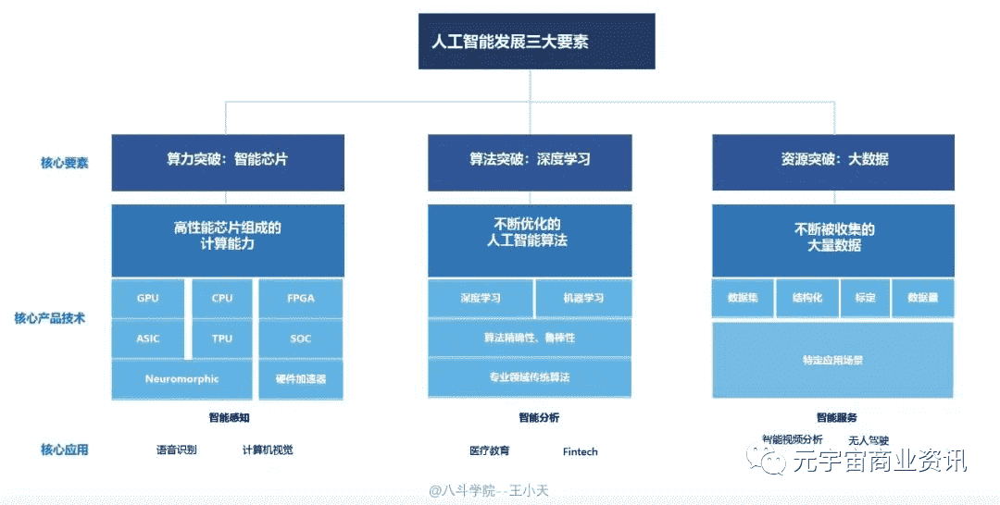
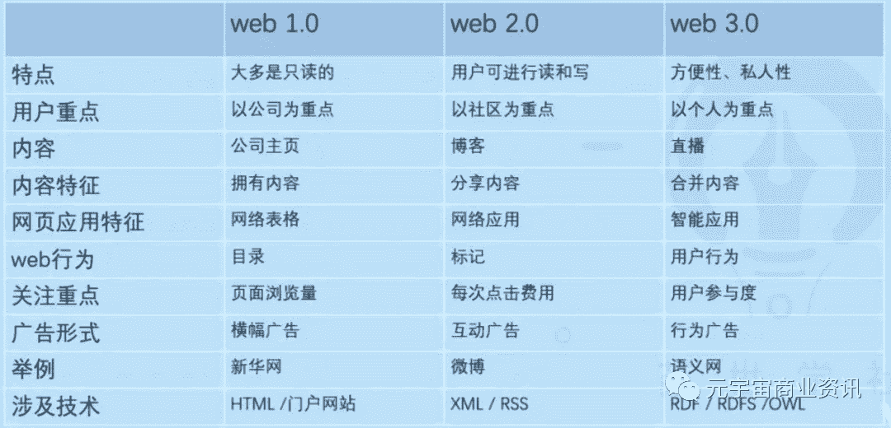
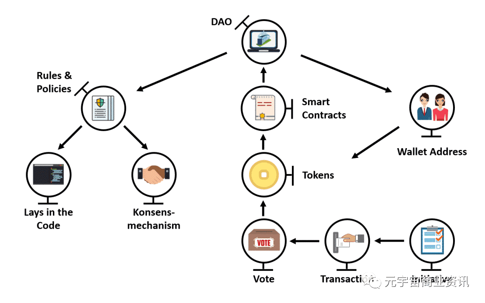
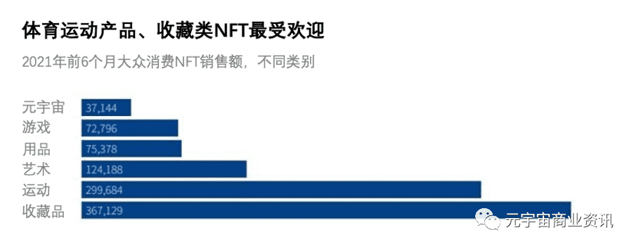
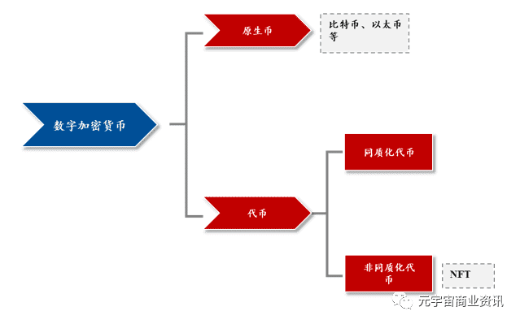
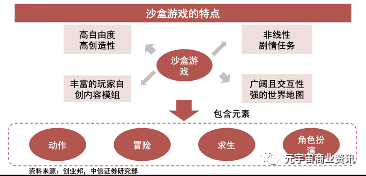
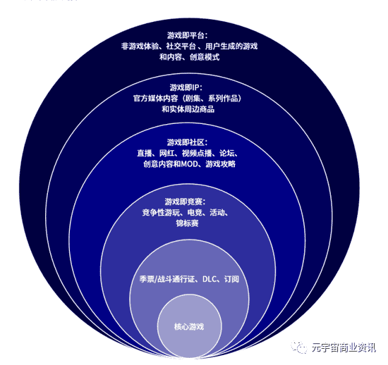
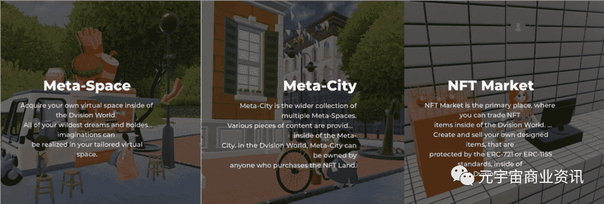
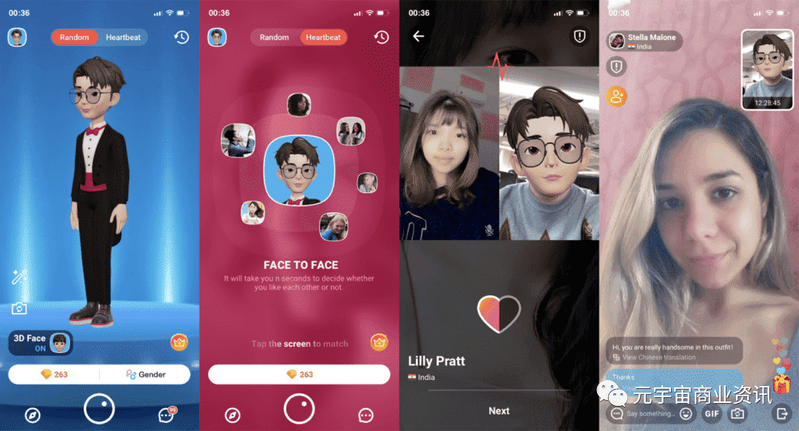

# 十大关键词，看2022元宇宙的落地应用

# 十大关键词，看2022元宇宙的落地应用

2021元宇宙概念风靡全球，互联网头部公司快速布局。2022年1月18日，微软以所谓的元宇宙为由，以687亿美元收购游戏开发商动视暴雪，称该交易将“为元宇宙提供基础”。

2021年10月28日，月活破30亿的Facebook正式官宣改名为Meta，创始人马克·扎克伯格也将赌注押在元宇宙上，并将他的社交网络公司改名为Meta。

再往前追溯，2021年3月元宇宙第一股Roblox在纽交所上市，如今市值达到了770亿美元。 普华永道预测，到2030 年元宇宙的市场规模将达到1.5万亿美元。

2020年至今，因疫情影响人们的生活逐渐被搬到线上，元宇宙概念也走入大众视野，《头号玩家》、《失控玩家》等电影的连环催化，加上互联网头部企业对元宇宙概念的积极营销，也激发了人们对“元宇宙”这一数字世界的无限想象。本文试图总结元宇宙在2022年落地应用的十大关键词，希望能为读者带来一些认知与启发。

**01. 人工智能**

作为元宇宙六大支撑技术之一的人工智能，再次受到市场的关注。无论是计算机视觉，机器学习，还是自然语言处理和智能语音，人工智能是元宇宙重要的组成部分和关键之一，它与元宇宙切口高度重叠，有了这些人工智能技术的持续加持，元宇宙未来才会从概念到场景化的落地，两者之间的紧密关系，让市场有了更多想象力和期待。

更深化的元宇宙发展势必与人工智能技术的有机结合应用脱不开关系。根据中国电子元件行业协会总结："人工智能是模拟、延伸和扩展人的智能(学习、推理、思考、规划等)，以使计算机实现人的头脑思维的技术。"当我们拆解人工智能在当前这个时代的注解，可以以三大要素高度总结，分别是数据，算法与算力，如下图所示：

在与元宇宙概念高度关联的电影《失控玩家》中，男主角是一个生活在游戏中的NPC，即人工智能，某天突然觉醒拥有了自我意识，并且发现了自己生活在游戏世界中，进而展开了对爱情和自我存在意义的探索冒险之旅。随着现实社会上人工智能分支技术的发展，机器人将会如电影中的NPC一样，拥有更加先进的计算机视觉，语音识别与自然语言处理能力，他们会通过机器学习不断增长知识与智慧，进而在各个方面越来越接近人类。这样的元宇宙人工智能，在2022年，可能以越来越多的具体案例出现。

在众多具备元宇宙雏形的小生态内，会有大量不被真实人类愿意扮演的职能型服务型角色，由人工智能承担。而人工智能技术的开发者与提供者们，在不断创新探索的同时，需要做好对人工智能的监管与控制，避免“失控"的人工智能对元宇宙秩序、人类人身安全与财产造成损害。

**02. Web3.0**

与“元宇宙”交织的“Web 3.0”概念在2021年的爆火预示着2022年更多围绕Web 3.0的实践与讨论，虽然其概念尚未最终定型，人们一般将其理解为下一代的互联网，“反垄断”、“对抗平台”、“用户所有”是其核心特质。

Web3.0最早由以太坊联合创始人GavinWood在2014年提出：“Web3.0是一组兼容的协议……这些技术为用户提供了强大且可验证的保证，即他们所接收的信息、他们提供的信息、他们所支付的信息以及他们收到的信息。通过授权用户在低门槛的市场中为自己行动，我们可以确保审查和垄断机会的降低。”换句话说，Web3.0下，网民的隐私与权利有了更强的保障，平台或巨头的力量削弱了，互联网应用形态将顺应洗牌，流量重新分发，有Web3.0，自然是因为人类已经经历了web1.0与2.0，三个代际的直观对比如下图：

Web 3.0有三大特征，分别是：
拥有10M的平均带宽。
提出个人门户网站的概念，提供基于用户偏好的个性化聚合服务。
让个人和机构之间建立一种互为中心而转化的机制，个人也可以实现经济价值。

所以Web3.0的到来一方面是综合信息技术发展到一定阶段后，技术储备支撑了下一代互联网组织形式的诞生。与此同时，长期掌握互联网用户使用时长、电商GMV与用户隐私的互联网大厂，慢慢已无法被人权意识觉醒的大众和各头部政体所容。

目前，在大洋彼岸的硅谷，高精尖互联网人才从Web2.0公司向Web3.0公司的出逃已经形成趋势，在中国，目前还少有主打Web3.0的新锐公司出现，但是伴随着2021年国家对互联网巨头公司的一轮集中整治，相信以Web3.0为主战场的中国新一代互联网公司将会如雨后春笋一般涌现出来。

**03. DAO**

DAO，中文直译为“分布式自治组织”，也时常被简称为“岛”，是一个去中心化的，以公开透明的计算机代码来体现的组织，与元宇宙相辅相成。DAO的理想化状态下，DAO的成员通过智能合约的自动化治理，达到一定程度的组织内平权，共同参与组织的决策，治理，发展，并设计规划合理的激励制度，促进DAO成员对组织的贡献，形成正循环。

DAO的孕生与区块链紧密关联，DAO组织内发生的金融交易与程序都是保存在区块链中的，可以说区块链正是DAO组织的底层技术架构。

具体而言，DAO是通过使用区块链技术提供一个安全的数字账本，以追踪在整个互联网的金融互动，通过信任的时间戳和传播一个分布式数据库来抗伪造。以太坊联合创始人V神，维塔利克·布特曾声称，只要拥有了基于图灵完备的平台的智能合约，DAO一旦启动，能在没有人为管理行为条件下，一直有序运行。其之后创立的以太坊，正是满足了DAO的底层技术要求，因此也成为了众多DAO采用的区块链。

DAO（去中心化自治组织）是适应元宇宙的组织方式。生产环境的变革催生着新的组织方式，从大航海时代到元宇宙，组织形式将不断变化演进。Web2.0时代，巨头对数据的垄断已被社会关注，而元宇宙DAO的组织规则由程序监督运行，组织规则最终的保障是代码。代码的事前约束使得DAO能在更低信任的模式下形成组织，用户在数字世界可更广泛参与全球协作。

DAO加速元宇宙落地，布局“BAND”赛道。我们预计未来5年将有越来越丰富的元宇宙网络形态出现，推动“BAND”（区块链、游戏、通信、显示技术）四大技术赛道升级，个体也将以DAO的形式更方便地参与其中。

对全球民众而言，DAO提供了一种新的社会组织与分工的可能性，即“X-to-earn”，人们有可能通过玩游戏，创作，投资，甚至学习来在DAO内合理获得报酬，与此同时，不用受到传统公司制度集权下CEO或者领导的直接管辖与控制，更自主更自由，堪称“打工人上人”。DAO与当前全球主流的各类公司制主体，形成了鲜明的对比：具体参考下图：

然而，由于DAO的运作涉及加密货币及其筹措，很难被中国当前的法律与监管系统所允许，目前在中国市场建立或参与DAO是万万不能的，请读者们擦亮双眼，避免加入心怀不轨的“DAO”组织。

**04. NFT**

NFT即“非同质化代币”。在最基本的意义上，NFT实际上是特定资产所有权的数字证书。它证明了你是原始数字或实物的唯一拥有者这一事实的真实性。

NFT的数字资产如数字艺术和收藏品等，NFT的实物资产如房地产等。因此NFT本身具有一定的金融属性，与物理社会中资产凭证的重要性一样，而元宇宙为NFT提供了更加多元的应用场景。

全球的现状NFT市场相关的趋势让我们看到了光明和多样化，而NFT的交易量更是表明了NFT未来的前景，NFT市场在2021年创造了超过230亿美元的交易。NFT这个流行词已经在传统艺术、体育、保险、游戏和其他市场等各个领域迅速传播。

.png)

除了典型的NFT应用程序（交易艺术品和游戏人物）外还有什么用途？

NFT可以表示物理对象、数字内容，甚至是诸如知识产权之类的无形概念。NFT技术将适用于房屋、汽车、品牌名称、知识产权和专利等资产，日常生活中接触的身份证、学历、医疗记录、票据…所有这些都将被代币化（即其所有权证明将被记录在区块链上）。

NFT在我们日常生活场景具体有哪些用法呢？

\1. 确保产品的真实性
NFTS可用于确保我们正在购买的产品是真实的。由于区块链可以永久存储有关该产品的信息，因此在实物产品上也将检查稀缺性和真实性。NFTS还可以用来存储有关制造过程的信息，确保一切都是公平的贸易。

\2. 房地产
NFT可以用来转让土地契约，提供所有权证明，甚至使用时间戳NFT跟踪属性值随时间变化的情况。

\3. 医疗记录和身份核实
NFT分类账储存个人病历既不泄露机密，也不冒被篡改的风险外部源，因为NFT在被永久添加到块链之前会在多个节点上进行验证，确保每条记录都是准确的。

\4. 知识产权和专利
NFT令牌允许用户证明他们对任何内容的所有权，IP的所有权可以被区分，尤其是IP的整个历史。再者NFT链不可变，因此NFT所有者可以在任何时候证明他们是作品的原始创建者。

对于专利来说，NFT也可以用来保护和证明创新或发明的所有权。NFTS还可以提供必要的数据进行验证，从而创建一个公开分类账，记录所有与专利相关的交易。

\5. 学术证书
NFTS可以提供出勤率、学位和其他重要信息的证明，这些信息将存储在NFT链上，这些信息不能被更改或黑入。NFTS可以为所选课程创建不可变的记录，为完成的每个课程颁发令牌，并验证通过智能合同验证系统获得的任何学位。

\6. 供应链
正如我上面提到的产品真实性，在食品行业验证他们来自哪里，由什么原材料构成，都是难了解的。但是通过使用区块链，NFT可以附加到产品上，给它一个不能被篡改的NFT标识符。

此外，NFT还可以使公司有能力跟踪他们的产品从制造到运输和交货。客户能够更好洞察他们正在花钱做什么，公司的供应链还保持着透明度。

NFT用例仍处于初级阶段，但相信在不久的将来会更多的使我们在日常生活受益。NFT不仅为许多服务提供了方便的使用，而且增加许多交易的透明度和强化所有权的证明。在未来的几年我们将看到这一领域的更多发展，可能在我们没注意到时NFT已经走进了我们的生活。

**05. 数字货币与钱包**

如果说区块链为元宇宙的经济系统运行奠定了基础，那么其中的原生数字货币则承载着这个世界中价值转移的功能。

数字资产深入人心。2020年以来，数字货币交易平台Coinbase的DAU实现快速增长，在2021年峰值接近1000万。与此同时，疫情背景下海外实施宽松货币政策，推动以比特币为代表的数字货币价格大涨。

Roblox在美股的上市，以及英伟达在虚拟人方面的营销及产品推广，使得二级市场投资人开始重视元宇宙的投资机会，尤其是基于区块链技术的数字资产确权及交易。

元宇宙已经成为一个可以改变加密货币世界的综合行业。

游戏与元宇宙在3D方面存在共同点，但并未涵盖元宇宙所需的一切。加密货币可以提供所需的其他重要内容，例如所有权数字证明、价值转移、治理和可操作性。但是，这些究竟意味着什么呢？

如果我们今后要在元宇宙中工作、社交，甚至购买虚拟物品，自然需要一种安全的方式来展示所有权。我们还希望这些物品和资金能够在元宇宙内安全转移。最后，如果元宇宙将在生活中扮演重要角色，我们当然希望能够参与到元宇宙的决策之中。

部分电子游戏已经采用了一些基础解决方案，但许多开发人员则选择使用更具优势的加密货币和区块链技术区块链提供一种透明的去中心化主题处理方式，而电子游戏开发更偏向中心化。

区块链开发人员也受到电子游戏世界的影响。“游戏化”是去中心化金融(DeFi)和GameFi中的常见理念。未来，两大领域似乎会有足够多的相似之处，加深彼此的融合度。

区块链契合元宇宙的关键点包括：

\1. 数字所有权证明：拥有可以访问私钥的钱包，即可立即证明自己对区块链中的活动或资产的所有权。例如，在工作期间，您可以在区块链中展示精确的交易记录，以此来体现可追责性。钱包是建立数字身份和所有权证明最安全、最可靠的方法之一。

\2. 数字收藏：就像确定某件东西的所有者一样，我们也可以证明物品的原创性与唯一性。对于希望融入更多现实活动的元宇宙来说，这一点非常重要。借助NFT，我们可以创建独一无二，永远无法完全复制或伪造的对象。区块链还可以代表实体物品的所有权。

\3. 价值转移：元宇宙需要通过一种用户信赖的安全方法来转移价值。多人游戏中的游戏内货币不如区块链中的加密货币安全。如果用户在元宇宙中花费大量时间，甚至赚取收益，他们必然需要一种可靠的货币。

\4. 治理：对用户来说，掌控与元宇宙的交互规则同样至关重要。在现实生活中，我们在公司拥有投票权，也可以选举领导人和政府官员。元宇宙也需要找到公平治理的方法，而区块链在这方面已经是一种成熟的解决方案。

\5. 无障碍操作世界各地的任何人均可在公共区块链创建钱包。与银行账户不同，您无需支付任何款项或提供任何详情。这使其成为管理财务状况和在线数字身份最便捷的方式之一。

\6. 互操作性：区块链技术不断提高不同平台之间的兼容性。Polkadot和Avalanche等项目允许创建互相交互的自定义区块链。单一元宇宙需要连接多个项目，而区块链技术已经推出了解决方案。

元宇宙的开放性与区块链技术的去中心化特征完美契合，区块链技术支持下的NFT可以为元宇宙中的数字资产实现高效确权、交易。元宇宙是一个足够开放的世界，元宇宙中的每个原住民都将参与到数字新世界的构建，既是数字新世界的使用者，也是数字新世界的建造师，包括了数字内容的创造者、爱好者、游戏开发者、消费者、收藏者等，这些创作者同时构成了社区，同时也会分享社区带来的所有收益。

因此，在未来元宇宙中，数据资产将极大丰富，一套高效的确权、交易、利益分配等机制尤为重要。未来元宇宙中的应用若构建在区块链技术基础之上，区块链技术可以为元宇宙提供一个开放、透明、去中心的协作机制，不同于现今中心化的互联网平台获取了大部分的收入与利润，在未来元宇宙中，区块链技术赋能的经济模型，必将带来巨大而深远的影响。

**06. 游戏**

游戏中的元宇宙概念：Roblox在其招股说明书中赋予了元宇宙八个基本特征：身份、朋友、沉浸感、低延迟、多元化、随地、经济系统和文明。按照这些特征来看，元宇宙是一个让用户随时随地进入其中进行自由创作，并具有独立经济系统和逼真沉浸 体验的平行虚拟空间。

Metaverse虽然广义上来讲范围很广，但现在的元宇宙结合NFT的探索主要在游戏领域，也是目前市场验证出的相对更加契合的发展路径。

游戏场景做为目前元宇宙的主要阵地有哪些应用呢？

1.游戏世界。开放世界沙盒游戏是Z世代最受欢迎的游戏类型之一，具备庞大复杂且完善的世界观、丰富的互动元素等因素的游戏是最适合做成开放世界模式，同时，这类游戏也是最接近元宇宙内核的，例如Roblox、minecraft等。

沙盒游戏中具备大量UCG数字场景。数字场景在游戏领域早已被普遍应用，沙盒游戏的独特之处在于其独特的用户自创场景和模式，玩家们享受这里的自由：没有脚本，没有人物定位，各路玩家自由发挥，如：建筑师可建房、艺术家可办展，平民可交友游玩，甚至躺着晒太阳也没人管。这种天马行空的玩法，反而造就精美的私人场景布置，绝妙的游戏环节设计，也在吸引越来越多玩家，概念款游戏很有潜力。

基于沙盒游戏内核的数字场景建设可以衍生出一系列沉浸式场景体验， 将现实行为转换为虚拟体验。例如2020 年4月，美国歌手TravisScott在《堡垒之夜》游戏中举办了“Astronomical”虚拟音乐会。虽然音乐会过程 只有10 分钟左右，却吸引了全球超过1230 万玩家同时在线观看；此外，像Gucci与Roblox合作推出了、虚拟展览，用户在Roblox平台中可以欣赏Gucci展览，并 有机会选购几款展出期间限时购买的虚拟单品 。在虚拟场景建设下， 元宇宙与现实的边界有望不断被淡化。

2.一个赚钱的地方。如果未来将现实世界的实体买卖或电商交易平移到元宇宙，搭建新的交易框架，或会形成巨大的盈利市场，NFT已经在元宇宙有了多种尝试，将来玩家同样可以从元宇宙中挣钱，像现实世界一样，有建筑师建房子，园丁种花草等等，这个世界里的所有物会用区块链标记它的唯一性，交易的合法性，模型正像概念游戏所展现的一般。甚至有影迷玩家在游戏里布置了“刘德华个人展”。

除此之外，元宇宙的现实向代表了它还会有更加不可限量的发展空间，即大众普通商家把这里作为展示平台，把现实中实物交易复制到这里来。

比如这样一种设想也未尝不可能：将你的网店搬到元宇宙的虚拟商业街上，货架上展示实物照片、下面附带淘宝格式的详情介绍，消费者可以在这里逛店、订购，那么你就成为元宇宙商家。

早期元宇宙的产品体验大多都围绕游戏产业，已经积攒了一定的用户群。游戏有很多的价值延展，所有的用户既可以是消费者也可以是创造者，可以通过购买拥有虚拟世界的物品所有权，也可以通过发行自己的NFT引导用户关注自己的作品等，双重身份驱动下，将带来指数级增量的庞大市场。

3.目前还在发展的初级状态，如概念游戏的沉浸感还比较有限，大多玩家在PC屏幕前操作。真正的元宇宙一旦附加上未来技术下的全息虚拟现实环境，将更加灵活。

元宇宙将会成为游戏的下一个阶段，会将虚拟音乐会、虚拟时装秀、IP联动，以及产品联名等非游戏体验也整合其中，由技术、消费者与游戏的互动方式来共同驱动。但除了技术层面反复提及的算力和硬件问题外，报告罗列了若干阻碍实现元宇宙这个虚拟乌托邦的现实因素。包括大量UGC内容需要更加强大且全面的安全保障和审核程序，知识产权和版权管理的现代化，在元宇宙中如何更好保护个人隐私以及新的标准协议的缺失，都是人们构建元宇宙的拦路虎。

**07. 社交平台**

“元宇宙”社交的底层逻辑，在于打造一个独立于用户既有的现实社会社交关系、基于用户的兴趣图谱的社交元宇宙，帮用户建立起一个平行世界的社交网络，从而更自由、酣畅地表达。

国内的社交企业同样跃跃欲试：腾讯、字节、赤子城、Soul纷纷亮出自己的元宇宙路线图。Facebook更名为Meta，全力进军元宇宙，在二级市场掀起高潮，给原本就热的元宇宙又添了一把火。

因沉浸感强以及代表产品Roblox的示范效应，从游戏接入“元宇宙”被赋予了更多期待。但随着玩家们对“元宇宙”认知的不断深入，关于从社交切入布局“元宇宙”的讨论越来越多 。

元宇宙在社交场景中又发挥什么作用呢？

\1. 元宇宙使得全球的用户可以共享时空、即时互动，激活陌生人社交。元宇宙打破时间、空间限制，达成随时随地即时的社交。陌生人通过同样的场景相遇、相识。并且此后在虚拟世界可以继续维系社交关系，虚拟世界的社交关系或与现实世界等同。

\2. 元宇宙打通虚拟与现实，将现实社交关系搬入虚拟世界，为熟人社交提供更丰富的交流空间。疫情期间，中国传媒大学动画与数字艺术学院2016级学生在沙盘游戏《我的世界》里复刻了校园，学生以虚拟化身齐聚一堂完成了毕业典礼。此外，协同办公也可以在虚拟世界轻松实现。

\3. 元宇宙里能建立各种社交联结。在“社交元宇宙”里，可以凭借自己的虚拟化身，并基于自己的兴趣图谱或推荐，体验多样的沉浸式社交场景，在接近真实的共同体验中一起交流、娱乐，最终找到志同道合的伙伴、建立社交连接。

\4. 元宇宙能够提供多样的场景，构建场景化社交体验。酒吧、聊天室、演唱会、比赛、派对、旅游景点......元宇宙是开放的可编辑世界，AI与UGC驱动生成庞大的地理空间与丰富的场景，可供用户选择、探索、创造。

有观点认为，“熟人社交”对虚拟形象的要求并不会太高，毕竟大家已经熟知彼此在现实社会中的形象。相反，在“陌生人社交”的过程中，虚拟形象就显得尤为重要。

陌生人社交平台更具有孕育元宇宙的土壤。放眼全球，MatchGroup、赤子城、Soul等开放式社交公司都已坐到了元宇宙的牌桌上。

在对元宇宙响应最为热烈的韩国，瞄准元宇宙产业的公司Dvision也开发了一个开放、公共、虚拟的世界Meta-City。用户可以在这款产品中获得属于自己的虚拟空间Meta-Space，不仅可以在里面定制物品，包括室内设计、背景音乐、家具等，还可以添加各种功能。

在Meta-City，拥有Meta-Space的用户可以在其中聚会、聊天等等，满足用户在虚拟世界里的社交需求，目前其虚拟世界的元素还在不断丰富。

而国内，Soul是第一个喊出“社交元宇宙”的。最近几个月，Soul的动作格外频繁。它强调与用户共同建设社交元宇宙生态，近日正式宣布推出用户共创体系。Soul的产品负责人车斌表示，6月底推出的“个性商城”板块是共创体系的一部分。

另一家值得关注的陌生人社交公司是赤子城科技。它在国内并不知名，但在海外已打入了多个市场，旗下产品进入100多个国家和地区的社交应用畅销榜前10，可谓一直在“闷声发财”。

近期，赤子城在社交应用Yumy中加入元宇宙模块MetaTown，用户可自定义3D虚拟形象，用虚拟形象进行心动匹配及视频互动等，目前处于内测阶段。据了解，这款产品主打“心动社交”，以视频为主要互动形式，强调高效、实时、沉浸，此前进入了美国、英国、法国等地的社交应用下载榜前20。

元宇宙社交将基于图文、音视频的社交形式转化为基于真人化身、可实现集体交互的社交，真实感强。用户以虚拟化身在虚拟世界生存，所有体验都围绕虚拟化身展开。开放的虚拟化身设计让用户摆脱现实中天生的外形，而追求更强的自我认同。不同的化身一方面增添了社交的趣味性，也增强了用户在自我呈现上的自信。

**08. 虚拟数字人**

2021年10月31日，一个名为“柳夜熙”的虚拟人物在抖音爆火，在元宇宙+美妆虚拟偶像的标签加持下，该视频一天内就收获200多万赞并成功吸粉130多万。从湖南卫视数字主持人“小漾”到江苏卫视跨年晚会邓丽君与周深同台演唱，从花西子到虚拟KOLLing和入职阿里的AYAYI，虚拟数字人在去年似乎成为互联网公司、消费品品牌和传媒公司的新宠儿。那么，虚拟数字人究竟将在元宇宙中扮演什么角色？普通人又将和它产生什么联系？

其实，虚拟数字人并非是在元宇宙概念之后才诞生的名词，像早期B站的洛天依实质上就是一种虚拟数字人。但在元宇宙的大趋势下，虚拟数字人的定义和应用场景会被进一步拓宽，它也因此被认为是未来元宇宙中人工智能AI的初级形态。短期内，大多数人会通过文娱和商业活动如虚拟直播、虚拟偶像、电商购物、虚拟代言人等途径接触到虚拟数字人，除了可以享受精致造型和炫酷场景的视觉盛宴，或追捧一个永远不会“塌房”的虚拟偶像，消费者还能加深对品牌的理解从而提升购物体验。

而长期来看，刨去商业价值，虚拟数字人更是未来元宇宙内不可缺少的重要组成部分，当三次元内的人进入元宇宙时，会拥有一个虚拟化身或者虚拟分身：虚拟化身会利用3D全息技术将你的真人录制成视频放到元宇宙中，而虚拟分身会利用AI技术合成和你高度相似的音频、动作和表情，简而言之，你会在元宇宙中看见一个和三次元世界中一模一样或者高度相似的路人甲乙丙或者偶像ABC。

**09. VR/AR穿戴设备**

在互联网时代，电脑和手机作为硬件设备拥有广泛的普及度，那么，在元宇宙时代，什么才将是普通人通往元宇宙的真命“硬件”？站在2022年的开端，我们不难发现这道题的答案将是XR技术，而在经历了2019年的技术突破和2021年的疫情催化后，VR/AR穿戴设备再一次被推向大众视野，被视为未来普罗大众进入元宇宙的钥匙之一。

其实，VR与AR是两个截然不同的技术路径，它们当前的服务对象和技术痛点也不同。VR强调的是虚拟环境中的深度沉浸，目前技术瓶颈是定位精度与传输速度，而AR更像是现实世界的延伸，其需要的技术目前还未突破算力和算法限制。所以整体而言，AR技术是滞后于VR技术2-3年的。同时，由于市场价格和应用内容发展节奏的不同（VR的市场价格在500-4000元之间，AR价格在2万-5万，包含游戏内容在内的VR产业链已逐渐显现），VR更加面向C端消费者，而AR目前面向的还是企业级用户。

回溯XR技术的历史，我们梳理出一条时间线：2014年脸书、微软、索尼等大厂纷纷入局开始研制VR设备，行业起步并引起广泛讨论；至2016年，市场热度达到高峰，但随后行业面临了由于技术难以突破导致的长达3年的沉寂；

2019年，技术突破，5G技术部署，市场上出现了让消费者体验感大幅提升的知名产品，如Facebook于2019年推出的OculusQuest头显一体机；2020年，VR/AR产业链的各个环节成熟度进一步提升，Facebook于2020年10月发售了OculusQuest2，这款设备的发售意义重大：一方面，硬件规格提升了，穿戴体验也更好了，而另一方面，价格直接比一代设备降低了100美元，这两个动向都在表明着VR设备在进一步向普通消费者渗透普及。

VR创企加快的步伐在市场中也得到了了验证：2020年，一些爆款VR游戏如Half-Life:Alyx也开始走红。2021年，疫情常态化下更多人对虚拟现实涌起向往，元宇宙概念火爆的同时VR/AR也备受关注。

在五年内，与普通人更加息息相关的是VR还是AR穿戴设备？答案是VR设备。Facebook、苹果、索尼这样的等大厂将会向C端不断推出性价比更高的VR穿戴设备，并且，2023年下半年更多搭配VR硬件的爆款内容与应用也将构成普通人切实体验元宇宙的最初印象。同时我们需要记住的是，XR虽将成为我们打开元宇宙大门的一把钥匙，但却不会是唯一一把。全感官设备如触觉手套、体验服或许将在元宇宙中给我们这些互联网时代的原住民们前所未有的多维度体验。

**10. 远程办公/云服务**

疫情加速了企业办公模式的变革，而元宇宙概念的火爆也引发了更深刻的思考：如果说戴起VR设备是我们掌握了打开元宇宙大门的钥匙，那么这扇门的后面，除了娱乐、社交、购物，办公是否也可以成为一个重要的应用场景？打工人的工作场景会被元宇宙改写吗？

答案是肯定的。2021年8月，Meta推出了以企业为中心的虚拟协作平台，允许用户在VR环境里举行会议。相似意图的举动还有苹果收购虚拟会议公司Spaces以布局办公场景、网易伏羲发布瑶台打造古风沉浸式虚拟会议场景。

2021年9月，Microsoft的CEOSatyaNadella在演讲中正式提出了“企业元宇宙”这一新概念，提供AI和云服务的能力或许将成为未来企业的新型核心竞争力。或许不久后的某一天，我们能通过佩戴VR设备来在和现实一模一样的工作环境中开会、打卡、和同事交流，办公楼的一角一隅都是我们熟悉的模样。

近年来虚拟现实有了很多进步，高端的头戴式装置让佩戴者看到自己走在3D的虚拟世界里面，虚拟现实也更加走入主流，OculusQuest2虚拟现实游戏头戴设备就是2020年很受欢迎的圣诞节礼物。

能够可靠证明数字产品拥有权的“非同质化代币”（NFT）所引发的兴趣大增，更可以说明虚拟经济如何运作。更先进的虚拟世界需要更好、更可靠的移动连接，第五代移动通信技术（5G）的逐渐开展，将能够实现这样的技术要求。

回顾历史，数字经济创造了大量的就业岗位，国内八家互联网企业创造了庞大数量的就业岗位，作为互联网的下一站，元宇宙也将创造大量的就业机会和收入来源。

目前，元宇宙还在早期阶段，元宇宙让我们网络和现实中的财富、社交、工作、购物、娱乐更加重叠。其实即使不戴头盔，这两个世界也已经交织在一起了，打车的时候应用程序会显示车的位置和行进情况，苹果手机上的LiDAR扫描可以立体扫描你周围的环境。十年后，你只要戴上一副墨镜，就能进入元宇宙体验。经过一家餐厅，就会跳出它的菜单、你的朋友的点评。

对普通人来说，在元宇宙里面最有用的是虚拟观看景点、博物馆、样板间。未来汽车制造商在推出新款汽车的时候，你可以在虚拟世界试驾。许多技能不用学，你也可以安全地去体验了。还有虚拟恋爱……永远都不用奔现了，在元宇宙里已经是现实，可以一起开始婚姻生活了。让我们共同期待元宇宙对我们生活的改变吧！
