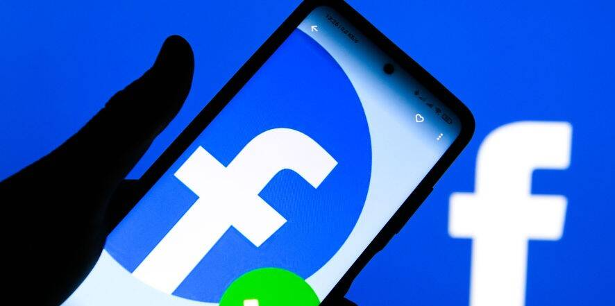
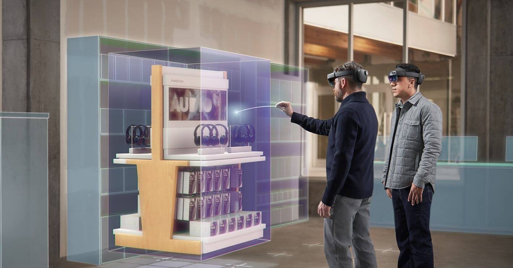

# 元宇宙是什么意思，什么是元宇宙时代？

近日，Facebook改名了，美其名日要搞元宇宙技术，但实际上就是扎克伯格为了避免众多丑闻缠身，包括避免被反垄断调查。Facebook更名主要就是个借口， 但确实元宇宙时代将会到来。 当然，全球范围内的很多平台公司也都会把元宇宙时代作为自己虚拟平台的未来发展方向，因为这是一个 技术发展的趋势。

##### 什么是元宇宙?

元宇宙就是真实的虚拟世界。相信各位朋友明白一个词儿，过去叫VR，即虚拟现实，后来就变成了AR，即增强虚拟现实，但是这两个东西其实已经都成为过去式了，都已经out了，现在是MR，即混合虚拟现实，而且MR也不是最新，最新的技术叫XR，即扩展虚拟现实。

##### 什么是元宇宙时代

如今为什么能够进入元宇宙时代，就在于现在MR以及XR都已经技术相对来说更加成熟，那么元宇宙到底是什么意思?说白了，就是要借助虚拟现实技术打造一个虚拟但现实的虚拟社会。

 比如咱们每一个人现在都活在现实社会里，但是你回到家之后，就可以穿戴一整套的特殊的个人穿戴设备，你就可以进入到另外一个超现实的虚拟现实社会。在这样的虚拟现实社会里，你可以有各种各样的职位，有各种各样的角色，有各种各样的分工，你甚至可以做任何你想做的事情。

 由此可见，未来的我们每一 个人将会生活在两个不同的空间，也就是元宇宙能够带来的是一种科技的革命， 也能够带来的是一种整 个网络空间革命。

如今很多很多朋友喜欢玩手游、网游，但是我们所玩的那些东西其实都是二维的， 顶多是三维的，真正如果你要玩未来的这种网游或手游，它完完全全就是一个真实的游戏， 你将会深入到场景之中，代入感、沉浸感才是特色，这就是元宇宙这个新的世界给大家带来的一种期待。

我们要明白一点，元宇宙实际上可以存在任意多的场景，包括现实中没有的场景也都有。比如我们现在是做电视的，你看我们这个节目叫《有报天天读》，如果用元宇宙的技术来做，观众只要带上穿戴设备，它就能够真实的去读我们提供的报纸，能真实的和主持人进行交流，这就叫元宇宙节目，而且观众可以对我们的很多节目能够提出互动性的要求，这就是元宇宙。

再举一个简单的例子，比如我们到了博物馆，如果用的是元宇宙技术，用的XR技术，你就可以和古代的某一位人士进行交流，可以和他对话，可以和他握手，这都是非常真实的事情。

再举一个例子看看什么是原宇宙?比如我们现在在网上给大家做直播，或者做一个讲座， 那么在元宇宙空间中做直播讲座的话，就会存在一个真实的虚拟讲堂，-些朋友就是坐在空间某一个座位， 或坐在前排，或坐后排，而作为授课老师来讲，就可以在讲堂上来讲，而且\听课的人之间还可以相互交流或和老师进行交流，这就叫元宇宙。

由此可见，元宇宙打造的就是一个完整的虚拟空间，而不是一个大家想象的三维空间，这个是完全不同的两个概念。所以从未来的发展来看，这种元宇宙将会成为各个行业，包括电视行业、融媒体行业都会做的一项前瞻工作。

##### 怎么样才能做到开发元宇宙技术?

方面就是技术平台要不断的提升性能，软硬件俱佳。另外方面，就是要借助5G、6G这种高速网络，要求带宽大幅度提高，也恰恰是这些技术是打造元宇宙的技术基础，不能有时延，不能有断点，这样才能够让元宇宙变成未来的虚拟现实。

当然作为每个朋友来讲，未来每个人可能会在两个不同的空间，一个真实的空间，一个虚拟的空间，来分别展现两个不同的性格，可能一个是胆小者，另个是英雄， 这个也是元宇宙技术所带来的人类社 会的巨大变化。
