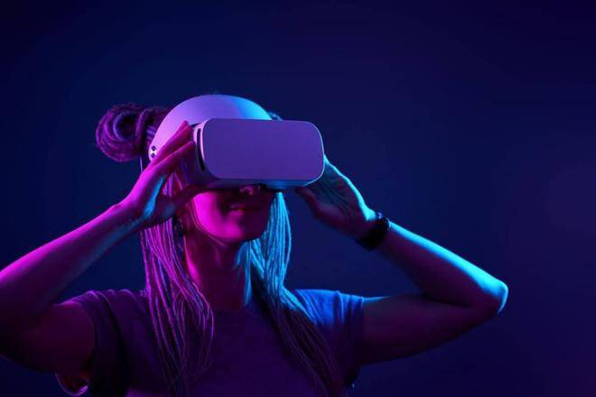

# 元宇宙的特征和应用

# 元宇宙的特征和应用

 最近全球科技新闻的亮点都集中在一个术语上，特别是“元宇宙”。共享虚拟世界的概念，承诺以数字化身的形式提供引人入胜的体验，这绝对是一个开创性的主张。由于 NVidia、微软、索尼和 Facebook 等科技界的知名人士都在押注 Metaverse，人们不禁想知道顶级 Metaverse 应用程序及其潜力。

Bloomberg Intelligence 的一份报告指出，到 2025 年，Metaverse 有可能达到近 8000 亿美元。随着越来越多的公司继续寻求 Metaverse 的真正潜力，找到一份您可以选择的Metaverse 应用程序列表非常重要在现实世界中寻找。以下讨论通过清晰的示例帮助您发现元界在不同领域的一些顶级应用。

元宇宙真的很重要吗？

识别最佳元宇宙应用程序需要做的第一件事就是简要概述元节本身。起源于 1992 年的科幻小说，元宇宙在共享的在线环境中提供了物理、虚拟和增强现实的组合。元宇宙可以在虚拟环境中以数字化身的形式实现用户之间的社会和经济互动。

虚拟环境或网络空间是现实世界的隐喻，没有任何物理或经济障碍。许多人还破译了各种元宇宙示例，作为互联网未来的开端。那么，元宇宙的哪些特征使其能够提供虚拟环境和体验呢？作为一个虚拟世界，元宇宙可以具有相当广泛的特征。但是，您需要注意以下重要特征。

权力下放

元宇宙永远不受单个实体的控制。

互动性

元宇宙应该允许用户与其他用户以及元宇宙平台进行通信和交互。

肉体

即使在虚拟世界中，元宇宙也应遵守物理定律，同时忠于资源稀缺的概念。

创客经济

最佳元宇宙应用程序中最重要的亮点之一是独立创造者经济的设施。用户可以在的虚拟世界中创建和交易新的资产或体验，同时享受完全的所有权。创作者可以在任何环境中使用他们的资产或经验，并用它们换取期望的价值。

互操作性

互操作性也是您在发现“元宇宙的应用是什么？” 因为它保证了无缝体验。借助互操作性，您可以在任何可访问的元宇宙中不受限制地创建和使用资产、头像和体验。

Metaverse 及其特征的基本概述为了解顶级 Metaverse 应用程序提供了理想的基础。随着 VR、AR 和 XR 等技术的使用与日俱增；有理由想知道如何使用它们来扩展现实世界中的元宇宙示例。

游戏和社交网络是对有关元宇宙应用问题的回答中最重要的条目。但是，在元宇宙应用程序中还有许多其他有前途的条目，展示了未来元宇宙的真正能力。下面让我们来看看元宇宙在不同领域的前五名应用。

卫生保健

“元宇宙的应用是什么？”的第一个答案之一 ”将指向医疗保健部门。医疗保健领域中元节应用的最佳示例是增强现实的使用。AR 已成为增强医学生技能和知识基础的重要技术。例如，由 Microsoft Hololens 等技术支持的外科辅助工具可帮助外科医生进行各种外科手术。

此类技术的使用展示了用于提高手术程序的精度和速度的最流行的元宇宙应用程序。除了从 MRI、CT 和 3D 扫描获得的术前图片外，AR 耳机还可以帮助查看重要的实时患者数据。因此，元宇宙可以帮助更轻松地监控患者数据，例如体温、呼吸频率、心率和血压。

Metaverse 示例还指向使用增强现实来增强静脉识别。因此，使用 Metaverse技术可以帮助解决定位静脉的问题，特别是在高度色素沉着的皮肤或微小的血管中。CT 扫描和 X 射线等基于视觉的技术也是将医疗保健过渡到虚拟世界的合格候选者。想象一个虚拟世界，让医疗从业者和医疗保健人员能够观察患者体内并找出问题所在。

房地产

Metaverse 应用程序列表中的下一个有希望的条目将指向房地产行业。虚拟现实是虚拟世界中驾驶体验的重要技术之一。它可以为客户提供逼真和身临其境的体验，这种优势可以有利于房地产中的元界应用。例如，房地产经纪人可以利用 VR 的力量为买家提供身临其境的虚拟房产之旅。

此外，元宇宙的潜力也为整合不同多媒体功能提供了更好的前景，特别是 VR 旅游。例如，VR 房地产之旅可以有环境音乐、灯光和声音效果以及旁白。在房地产中最流行的元宇宙应用程序中启用的所有这些因素都可以提供几乎实时的房产体验。

因此，房地产营销人员可以通过让客户实时探索房产来轻松提高客户的信心。客户可以在购买前对各种标准放心，房地产经纪人可以节省大量时间和金钱。最重要的是，代理商可以使用元宇宙示例来发挥自己的优势，并根据客户的口味定制旅游。

教育

近年来，元宇宙技术在教育领域的使用也开始获得动力。虚拟现实是一种很有前途的工具，可以通过强调通过视觉来学习概念来改变传统的教学方法。教育领域的顶级虚拟世界应用程序可以帮助为不同学习机构的学生创造引人入胜的沉浸式学习环境。Metaverse 如何通过其不同的应用程序帮助赋予教育权力？

虚拟现实可以支持轻松频繁地检测错误，同时提供实时编辑功能。最重要的是，教育领域最好的元宇宙应用程序可以消除教育中的学习障碍。技术可以允许将任何语言纳入教育虚拟世界平台，从而打破语言障碍。

军队

Metaverse 应用程序列表中的另一个顶级条目将带您进入军事领域。VR 和 AR 的军事应用展示了 Metaverse 支持军事应用的成熟潜力。战术增强现实或 TAR 是军事中使用的元宇宙技术的显著例子之一。它几乎类似于夜视镜，尽管功能有所增强。TAR 可以轻松地显示士兵的精确位置以及盟友和敌人的位置。事实上，TAR 被证明是普通手持 GPS 设备和耳机的理想替代品。

军事领域的元宇宙示例也指向合成训练环境。这是一个增强现实系统，专为士兵提供逼真的训练体验。合成训练环境通过在虚拟环境中模拟身体和心理密集的战斗环境，提供身临其境的训练体验。

制造业

寻找“元宇宙的应用是什么？”也会带你走向制造业。作为顶级元界技术之一，VR 应用程序可以帮助培训员工安全预防措施，同时促进参与风险场景的模拟。因此，元宇宙应用程序肯定可以在降低事故风险方面做出很大贡献。从长远来看，制造业中最受欢迎的 Metaverse 应用程序可以促进更好产品的开发。

例如，VR 耳机可以帮助制造商详细检查产品的所有元素。此外，元宇宙应用程序还有助于制造工厂的景观规划和设备的更好定位。福特是一个巨大的名字，它利用虚拟现实技术通过虚拟世界访问他们的锁定模型。

底线

Metaverse 仍在开发中，现在按特定顺序或排名确定顶级 Metaverse 应用程序还为时过早。截至目前，元宇宙技术正在推动不同行业的新一轮数字化转型。与此同时，VR、AR 和 XR 等元宇宙技术正在改变对行业最佳实践和商业模式的传统看法。
