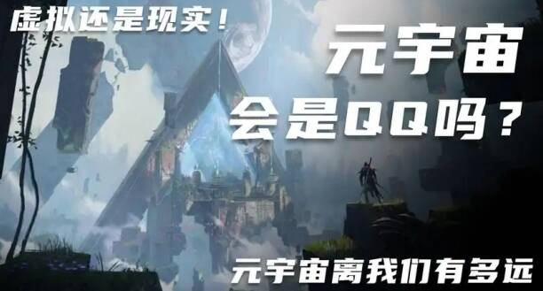

# 元宇宙时代，互联网大厂成行业主力军

## 元宇宙时代，互联网大厂成行业主力军

元宇宙自诞生之日起，就一直受到资本和创投机构的青睐。近两年，国内各大互联网公司的纷纷入局，令元宇宙再次成为科技圈的热门话题。

据脉脉网友透露，6月20日，腾讯正式成立了扩展现实（XR）部门，意在发展虚拟世界的元宇宙概念。该部门由腾讯游戏全球CTO沈黎领导，负责建构腾讯XR软硬件业务，预计拥有超过300名员工。这一举措被不少网友解读为腾讯布局元宇宙的一个重要动作。

腾讯在元宇宙领域的布局其实很早就已开始：2020年，马化腾就曾提出过与元宇宙类似的“全真互联网”概念。去年，腾讯申请注册了近百条元宇宙商标，其中包括“QQ元宇宙”、“QQ音乐元宇宙”、“腾讯音乐元宇宙”等。

与此同时，腾讯还尝试积极收购那些比较纯粹的“元宇宙企业”，以实现元宇宙布局的战略。今年3月份，腾讯曾传出将收购硬件厂商黑鲨科技，后改以投资方式进行合作。此前，腾讯还一度有意收购 Pico，但在与字节跳动竞价后选择了放弃。目前，腾讯的动作主要集中在游戏领域，通过成立XR部门，打造软硬一体、垂直的、相对封闭的生态。

与腾讯不同，字节跳动基于短视频流量优势，以社交与娱乐为切入口布局元宇宙，同时大力发展硬件设备。2021年9月，字节跳动以溢价近9倍、15 亿美元的价格收购VR软硬件制造商 Pico。2022年春节期间，Pico全渠道销售量同比增长32倍，成交额同比去年春节增长29倍。

字节跳动还大力引入VR高端人才，据脉脉网友称，前小米VR产品总监、虚拟形象社交应用“Vyou微你”创始人马杰思任Pico社交中心负责人一职，其所在的北京波粒子科技有限公司也被字节跳动收购。目前，马杰思在职场社交平台脉脉上的个人认证也已更新。

除腾讯、字节跳动外，6月15日，直播平台映客的主体公司映客互娱于宣布，将公司更名为映宇宙，正式进军元宇宙领域，公司英文名也改成了Inkeverse。6月22日，零售巨头国美也传出了将元宇宙确定为集团重要战略方向的消息，据传言称，国美目前正积极招揽相关人才，首个元宇宙项目预计在7月上线。

同时，华为、阿里、哔哩哔哩等公司也在积极布局XR、VR领域，无论是当下的互联网主流大厂，还是垂直赛道的佼佼者，都在努力抓住下一个技术进步带来的风口。据普华永道预测，元宇宙市场规模在2030年将达到1.5万亿美元。

随着大厂们纷纷入局，元宇宙赛道正在变得越发拥挤。但当前元宇宙发展仍处于探索阶段，前景如何仍未可知。未来元宇宙是否能建立成熟的商业模式，也需要更多时间来验证。
