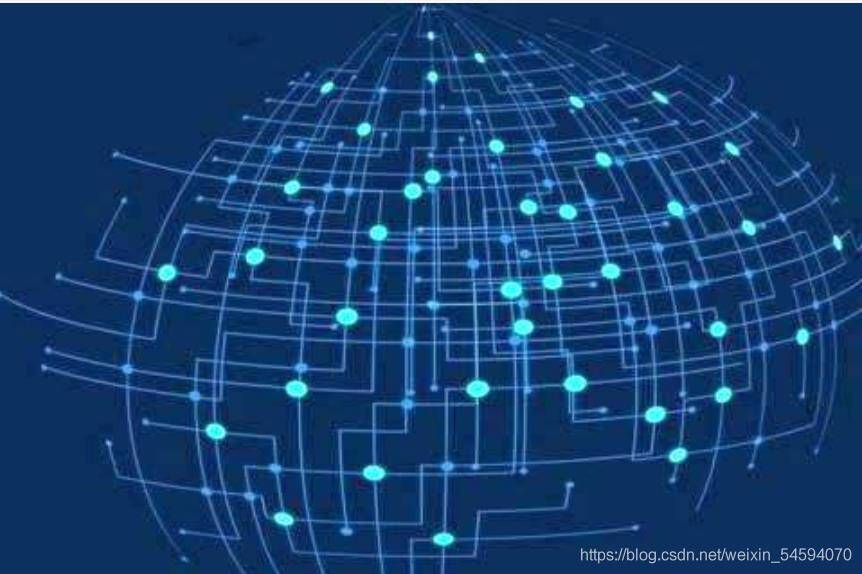

# 元宇宙应用场景

# 元宇宙应用场景

元宇宙（metaverse）有哪些应用场景？

**休闲娱乐**：元宇宙的系统里会为大家提供大量的链上娱乐项目来满足大家的精神生活，在元宇宙上游戏的体验感会更好，因此在娱乐领域会诞生大量的投资机会，如社交类游戏，RPG 游戏、棋牌类游戏、冒险类游戏、以及 play to earn 的各类链上游戏都将吸引大量用户，同时元宇宙也会增加用户粘度。

**投资理财**：随着大家数字资产的增加，就会需要金融类产品满足大家的资产配置，DEFI （去中心化金融）、保险、信托等基于链上的金融创新项目值得关注。 这里我想着重介绍一下 DEFI，它对于元宇宙的意义深远，一个去中心化且高效自主的金融系统能够加速元宇宙的构建。用户对自有链上资产各项金融活动的自由掌控，所有人的金融操作不受地理、经济水平、信任限制。DeFi 与 NFT 结合能够拓展到元宇宙的内容、知识产权、记录和身份证明、金融文件等，能够创造了一个能容纳更多样化资产、更复杂交易的透明自主的金融体系，支持元宇宙文明的构建。

通过智能合约，代码即法律，交易者基于对代码的信任，可以在信息不对称环境下安心，安全的交易。DEFI 是元宇宙创业领域并肩得到投资人的青睐。

**消费购物**：沉浸式的数字孪生电商，未来买买买更开心。

工作创业：基于区块链 token 的积木式 SAAS 系统也许是一个不错的方向，未来每个公司的办公系统都是根据自己的战略傻瓜式的搭建起来，根据企业文化会有不一样的空间形态，大家在公司自己创造的空间里自由自在的提取自己需要的资料和上传自己创造的价值。

**运动健身**：运动健身将不分天气，不需要场地的随时开始随地利用碎片化时间进行，在线机器人教练可以通过体感设备和监测指标指导你的动作，根据每个人身体情况进行指导。

**艺术收藏**：艺术收藏可以是爱好也可以是职业，在区块链上真假问题也许不再是困扰收藏者的主要问题，在链上的交易也将更加便捷。通过艺术收藏的场景应用场景下，艺术品 NFT 相关的创业项目值得关注投资人关注。

**问诊治疗**：2020 年共有 6648 万患者在好大夫平台上有过在线问诊记录，这些问诊主要是以文字和图片的形式进行的，这需要患者提供足够精准的信息，医生才能做出正确的诊断。未来我们可以使用 XR 技术扫描患者身体数据，患者在一个虚拟空间中与医生进行更深入的交流。

**教育培训**：更沉浸式的教育体验，让学生在家也能感受到在学校上课一样的感觉。将课堂打造在元宇宙上是否更能实现教育的公平和提高教育的效果？

**社交聚会**：未来通过元宇宙的入口，线上交友沟通的方式可能会改变。可以设置不同的约会场景，甚至可以根据不同的人设置自己不同的妆容及虚拟数字服装。疫情席卷全球，全息投影的开会方式能大量减少人与人的接触，也提高工作的效率。将 VR 和物联网结合起来，可以更好采集用户行为，从而给用户带来更加沉浸式的体验，用户设置可以在任何设备上用语音或者手势与元宇宙上其他玩家进行交互。
