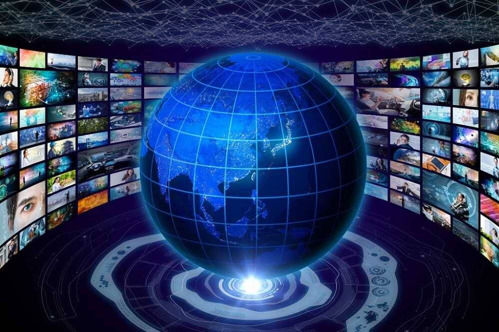

# 元宇宙的应用场景将如何发展

# 元宇宙的应用场景将如何发展

尽管电影中的元宇宙“看起来很漂亮”，但距离真正实现还有漫长的路要走。从某种程度上讲，元宇宙不是简单的技术融合，而是由所有数字技术的综合构建的系统。但是，从目前的数字应用的角度来看，元宇宙仍处于“胚胎期”。那么，如何创造成熟的元宇宙？因此，我们如何创建一个成熟的元宇宙呢？元宇宙的应用场景将如何发展？元宇宙可以给人们带来什么样的便利？

“元宇宙”本质上是第三代互联网。简单地说，“元宇宙”的虚拟融合完美地整合了数字世界和物理世界的集成，并将为人类未来的工作，学习，娱乐和社会建设一个新的空间。它是未来生活方式的主要载体，也是每个人都参与的新数字世界。“元宇宙”将集成应用区块链，5G虚拟现实，增强现实，人工智能，物联网，大数据和边缘计算等最前沿的数字技术，使每个人都能真正摆脱物理世界的束缚。基于资产和身份的可信数字化在新的融合空间中实现更好的自我意识并最大化其价值。

元宇宙改变了生产和生活方式，游戏和社交可能成为第一个登陆场景的元宇宙应用场景。我们可以进入元宇宙的日常生活，例如社交，游戏，消费和学习；它还可以提高原型的生产效率和精度并降低其生产成本，如元宇宙+医疗保健，元宇宙 +工厂，元宇宙 +航空航天等。随着元宇宙相关技术的不断突破，上述场景将逐步落地。其中，游戏平台和社交平台最容易实现全数字化，更易于构建元宇宙世界。国内外许多公司也已经开始在这两个领域进行努力。
