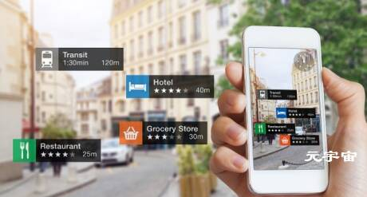

# 元宇宙时代已经到来，你愿意承认吗？

## 元宇宙时代已经到来，你愿意承认吗？

最近一段时间，“元宇宙”概念突然火了，而在更早之前，世界最大社交平台脸书创始人扎克伯格就表示要全面向“元宇宙”转型，紧接着，腾讯、谷歌、英伟达、EPIC、字节跳动等国内外互联网巨头也纷纷大手笔投资“元宇宙”相关企业和项目，生怕落后一步，就永远错过了这一新时代。不管我们愿不愿意承认，元宇宙时代已经真真切切地到来了！

其实，元宇宙的兴起也是社会发展到一定阶段的必然现象。随着时代的发展，如今创作者的数量和受欢迎程度不断增长，对于全新社区参与方式、以及与创作者的交互方式的需求也越来越高。众所周知，元宇宙可以给创作者和粉丝提供创新、独特的交互体验，通过重构传统创作者和粉丝之间的社交关系，让双方可以获得比过去任何时候都更加紧密、更加高度参与的沉浸式感受。

**那么元宇宙中的社交元素具体是如何体现的呢？**

首先，互动是社交中最重要的元素，如果互动体验不佳，肯定无法吸引更多人使用。元宇宙通过3D和虚拟实现等技术基础，为用户提供了表达自己的另一种工具，将虚实结合，可以让每个人看到不一样的自己和朋友。这种突破了文字和传统社交的方式，用全新的自定义的手段赋予了用户更好的社交体验。

在一些元宇宙里，俱乐部、博物馆、商业区这些现实生活中的场景得以重现，玩家可以轻松地进行各种有趣的互动。不仅如此，有些元宇亩还上线了虚拟房屋游戏，用户可以对虚拟房屋进行装修、摆放各种数字藏品以及视频、图片，也可以将房屋作为社交场所，邀请朋友做客、参观，甚至虚拟的会议、展览和聚会，和全球的用户进行社交，在家里就能体验到与来自世界各地的用户交流、互动的纯粹乐趣。

其次，元宇宙中还可以轻松构建创作者、品牌商、粉丝“三位一体”模式。诸多知名品牌都已经开始加速探索元宇宙的商业用例了。在这种全新的商业模式中，品牌自由度变得更高、变现也更加容易，商家可以在其中打破地域、市场等传统限制，拉近品牌商和用户之间的距离，为消费者提供更好的虚拟体验。

而在区块链技术、虚拟现实等新一代信息技术的铺垫下，元宇宙则以“社交“为突破口，打造一个完全自由的虚拟社交空间，用户可以自定义在其中的生活状态、社交行为以及自己的3D虚拟形象，同时也可以创建他人的虚拟形急。在元宇宙里，用户可以拥有虚拟住宅、虚找物品、虚拟好友进行社交活动、也能拥有虚拟生活和发展虚拟社交文化。不仅如此，在这个绝对个性化的空间里，用户可以使用、炫耀、交流和交易自己的虚拟资产，让用户拥有身临其境的虚拟社交体验。

不仅如此，在基于虚拟社区的基础上，元宇宙还能让用户拥有身临其境的虚拟社交体验。更重要的是，它还能带来更加去中心化的社交数据，而其它不管是公域流量社交平台，还是私域流量社交平台，最大的问题就是”中心化“带来的单向交流，用户缺失存在感，继而导致“弱关系”社交问题。相比之下，元宇宙不仅是去中心化的公域流量平台，而且还能兼顾私域流量的属性。人们在元宇宙中可以轻松地建立“强关系”。

**闲侣元宇宙社交**

以娱乐社交为触点，打造专属于年轻人的沉浸式元宇宙社交平台，带领Z世代年轻群体玩转社交新时代。有别于传统的社交模式，闲侣APP将依托交互传感技术，搭建一个真实的、可以感知的第二平行世界。人们在现实世界中的很多幻想将在这个虚拟世界中实现，人与人之间的交流方式也将完全不同。

不过从历史来看，虽然互联网经过了几次行业升级，但许多为网络达人提供的平台仍然是高度中心化，可以这么说，元宇宙的关键”元素”就是社交。当离开社交属性，元宇宙将无法获得成功。

也许社交不是元宇宙唯一的应用场景，但一定会是推动元宇宙成为主流的最佳场景，反之，元宇宙也是推动社交迭代升级的反作用力。

