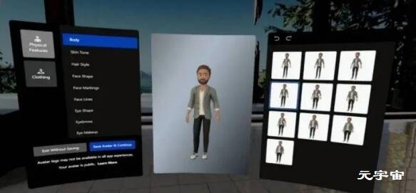
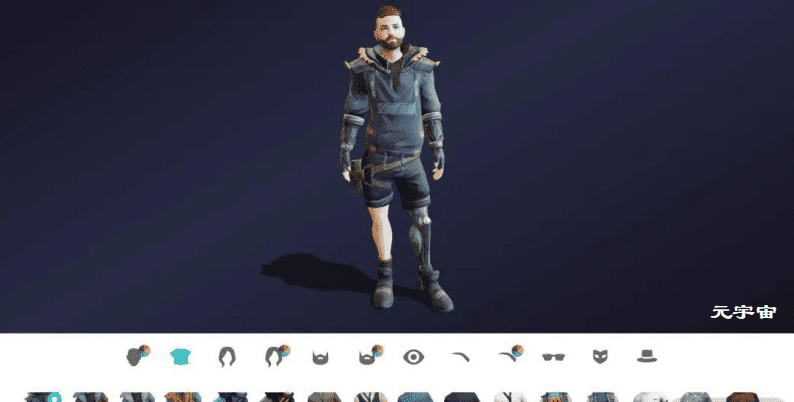

# 元宇宙中“身份认同感”将超越虚拟化身

# 元宇宙中“身份认同感”将超越虚拟化身

对于Meta来讲，虚拟化身将成为未来AR/VR、元宇宙的重要组成部分，其早在2019年就公布了高保真3D虚拟化身系统Codec Avatar，尽管这项技术从未正式应用，但Meta多年来一直对其进行优化。尤其是近期推出的移动端3D面部表情动态捕捉方案，让我们看到了未来低门槛3D虚拟化身的理想形态。

那么，Meta如何看待虚拟化身技术，未来又将如何布局呢？

在近期的播客中，Meta CTO Andrew Bosworth邀请到Meta元宇宙产品部门Avatar和身份业务的总经理Aigerim Shorman，共同探讨虚拟化身和虚拟身份对于元宇宙的重要性、发展方向，以及身份系统从2D到3D的过渡。

据了解，Shorman此前也曾负责2D应用的身份系统，而现在她的团队正在负责构建虚拟化身，并为元宇宙构建底层身份系统。

在这次谈话中，Shorman和Bosworth提到了以下几个观点：

1. Meta将统一旗下VR和非VR平台的虚拟化身系统，并进一步开放自定义选项；
2. Meta Avatars SDK的发展方向是提升跨平台能力；
3. 在元宇宙中，身份将超越虚拟化身；
4. 虚拟化身系统需解决冒名顶替的问题。

## **Meta统一虚拟化身**

去年底，Meta Avatars SDK正式上线，其作为Meta系统级的虚拟化身系统正式向第三方开发者开放，意味着基于此SDK的应用可以将Quest 2系统级的虚拟化身直接应用到第三方App中。

Bosworth表示：相比于元宇宙，虚拟化身是一个更直观、更容易理解的概念，它可以在元宇宙空间中为人们带来一种具象化的存在感。

对于Meta来讲，完善虚拟化身系统的关键步骤就是统一Facebook、Instagram、Messenger和Quest平台的虚拟化身系统，与此同时也要为广泛的人群提供多样化的自定义选择。因此，未来虚拟化身将具有连续性，这也是未来Meta Avatars SDK的发展方向。

Quest 2内设置虚拟化身

短期来看，Meta虚拟化身项目的计划是在旗下各个平台推出统一的3D头像，提供更多个性化选项（比如加入轮椅等道具）。通过Avatars SDK，Meta将与开发者合作拓展虚拟化身生态。

目前，不同的数字平台通常采用独立的身份系统，这意味着平台之间难以建立联系，不利于形成元宇宙。虚拟化身也许可以解决这一问题，通过提供多样化、丰富的选项，未来用户只需要创建一次高保真虚拟化身，就能在各个平台使用。

在此之前，已经有第三方公司就在这么做。Ready Player Me是一款低成本、跨平台通用的3D形象创建工具，其兼容的平台达1000个左右，包括Mozilla Husbs等WebXR应用，以及Animaze、Immersed、vSpatial、SideQuest等。

Ready Player Me虚拟化身

实际上，Ready Player Me已经在实践跨平台AR/VR头像系统，尽管其视觉效果和细节还不够完善，但足以受到人们欢迎。比如此前，3D虚拟化身平台Ready Player Me宣布，VR社交应用《VRChat》的用户已经利用Ready Player Me创建了50万次自定义3D形象。

VR飞镖游戏《ForeVR Bowl》开发商表示：虚拟化身对于我们开发高质量社交VR游戏至关重要，定制的虚拟化身，有助于营造玩家和朋友聚会的氛围。

不仅如此，在元宇宙中身份（身份认同感）将超越虚拟化身，虚拟身份的定义将包括你在元宇宙中的体验、拥有的虚拟物品、居住的虚拟空间。甚至还可以通过用户生成内容，在元宇宙中制造影响力。

Meta虚拟化身支持更多玩法

未来的虚拟化身系统，将从多方面复制物理元素，包括各类饰品、体型、肤色、发型等等，可帮助人们创建数字版的自己。

而元宇宙身份系统的组成部分将包括：虚拟化身、好友列表、学习生活的场景、拥有的物品、所在的社区等等。这些元素在现实生活中也有对应的体现，也就是说，身份系统包含了一切定义你本人的东西。

## **需要解决的问题**

不过未来，虚拟化身需要解决用户冒名顶替的问题，避免其他人复制你的形象和用户名，假扮成你。此外，也需要避免用户滥用虚拟形象，采用令人反感、不礼貌的元素。面对这些问题，潜在的解决办法包括：身份验证机制、关联Meta其他应用账户等等。

此外还谈到了虚拟旅行，Bosworth和Shorman不认为VR将取代实际的旅行，VR旅行的意义是拉近人们在线上的距离，提供一种可多人互动的虚拟空间，打破地理位置的限制。此外，虚拟旅游也有助于宣传景点，或是帮游客预先为旅途做准备。

总之，元宇宙、虚拟旅游的优势是打破地理位置限制、拉近人与人之间的距离、自由探索世界。未来结合AR眼镜技术，将进一步提升虚拟旅游的沉浸感，将你周围的物理空间变成其他场景、景点。
