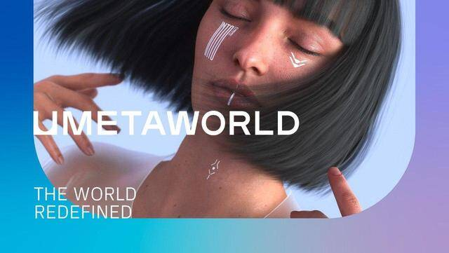

# 社交媒体元宇宙项目Umetaworld宣布推出新网站和应用程序

有史以来第一个社交媒体元宇宙项目Umetaworld宣布推出新网站和移动应用程序。这两款产品的推出标志着元宇宙向普通用户开放，用户现在不仅可以与他人互动，还可以改造数字景观。

该网站将在2022年7月的第二周上线，其应用程序预计将在2022年7月16日发布。

元宇宙项目Umetaworld的愿景是创造一个积极的虚拟空间，让用户可以摆脱他们在现实世界的烦恼和责任。其不同之处在于，它把元宇宙作为一个纯粹的社交空间来关注。在Umetaworld中，用户可以使用高端的化身与对方互动，这些化身通过对他们的脸部进行扫描识别后创建。Umetaworld还拥有能力创建和定制私人房间的功能，这些房间可以进行装饰，专门用于用户选择的任何主题。虚拟活动也可以在Umetaworld中举行，如音乐会、会议、聚会，甚至购物。

DTSocialize的创始人兼首席执行官Daniele Marinelli表示，作为Umetaworld的创始人之一，这个元宇宙项目的创建是为了刺激Web 3.0的积极发展。同时他将于2022年7月16-17日在法国巴黎举行的Metaverse峰会上发表演讲，向Web 3.0社区的其他成员正式介绍Umetaworld。到目前为止，该元宇宙项目十分受欢迎，其原生代币UMW已经在主要的去中心化交易所上市。
