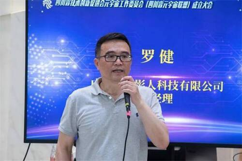
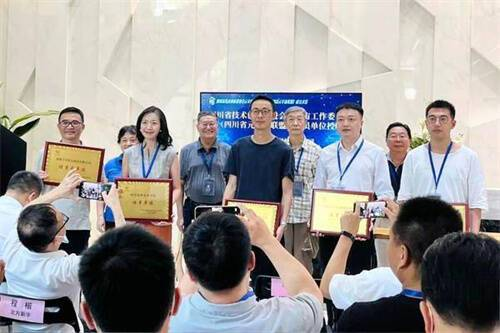
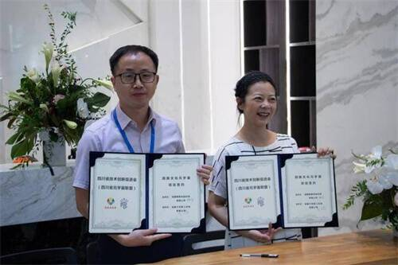

# 四川省元宇宙联盟成立，签约多个元宇宙项目，开启元宇宙时代新篇章！

全生态产业链跨界融合、打通软硬件领域的科研、开发、应用和服务的企业及学校人才端口、同时4个元宇宙联盟项目集中落地签约、开启数字历史文明新纪元，在为行业带来统一量化的行业标准，促进行业的发展的同时，也是联盟成员单位实现资源互补、技术互补的一个缩影。7月8日，四川省技术创新促进会元宇宙工作委员会(四川省元宇宙联盟)成立大会(以下简称“四川省元宇宙联盟”)在四川成都举行，并在现场签约多个元宇宙项目。

元宇宙的元代表什么？四川省元宇宙联盟理事长罗健对元宇宙的定义作了诠释，“元宇宙的元代表0,即从0做起，从头开始。”他认为，目前从全国来看，四川的元宇宙产业知名度还未打开，成立四川省元宇宙联盟的初衷就在于为四川元宇宙产业发声，让全国看到四川元宇宙产业发展，“我们的任务就是要从0跨越到1。”提到元宇宙未来5年的发展，罗健非常有信心，他相信通过12家设备先进、技术娴熟企业的相互合作，以及四川省技术创新促进会对项目的全力支持，四川省元宇宙联盟能够推出真正的产品，“让大家一看就觉得‘元宇宙时代真的来了！”

四川省元宇宙联盟理事长、成都子非影人科技有限公司总经理罗健教授发言

会上，举行了元宇宙工作委员会企业单位授牌仪式。四川北方新宇科技有限公司成为四川省元宇宙联盟副秘书长单位。

工业与文创研究中心主任、四川北方新宇科技有限公司总经理程楷代表接受授牌

四川省元宇宙联盟将重点促进联盟内企业的技术及生产成果市场化落地，“四川元宇宙应用技术研究院”、“熊猫元宇宙项目”、“中国航天镜月项目”、“民族文化元宇宙项目”4个联盟合作项目现场完成签约，其中，“民族文化元宇宙项目”由四川省元宇宙联盟牵头、成都子非影人科技有限公司与成都数智宇创科技有限公司强强联合，互通合作，推动民族文化经济与数字新经济加速深度融合与集成创新。

数智创品总经理周良维代表公司与联盟签订“民族文化元宇宙”合作项目

未来，四川省元宇宙联盟将重点促进联盟内企业的技术及生产成果市场化落地，探索并计划通过四川本地企业，在全国率先打造出元宇宙行业的全新生态产业链。

未来已来，你来不来？

