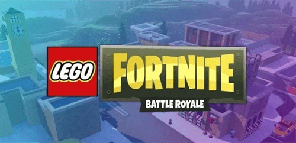

# Epic游与乐高合作 推出儿童元宇宙项目

近段时间，关于元宇宙的话题从未停歇过。现在，Epic游戏宣布将与乐高集团建立长期合作伙伴关系，两家公司将共同开展一项针对儿童和家庭的元宇宙项目。

在这份合作声明中，两家公司表示将分享各自丰富的经验，以确保下一代互联网的设计将以儿童健康为核心。尽管声明中没有透露该项目的具体细节，但声明中提到了乐高集团和Epic游戏达成一致的三条原则：

- 把安全和福祉放在首位，保护儿童的游戏权利
- 以孩子的最大利益为先，保护孩子的隐私
- 给孩子和成人提供工具，让他们能够控制自己的数字体验

这并不是Epic游戏第一次着眼于面向年轻用户开发产品和服务，早在2020年，Epic游戏就收购了SuperAwesome，这是一家为儿童游戏提供安全数字参与的技术公司。此外，乐高集团还致力于为儿童提供数字体验，如与联合国儿童基金会合作的行业标准数字儿童安全政策，以及2016年为儿童推出的直播社交应用程序。

我们还不清楚这个项目会是什么样子，也不清楚玩家会如何接受它。目前，关于元宇宙项目可行性的争论仍在继续。

健康预览：

