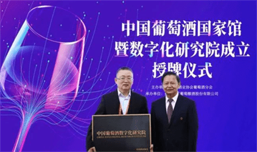

# 元宇宙项目最新消息 中概股投资酒类元宇宙项目

元宇宙概念的持续火热，让各界都开始瞄准元宇宙项目。现在元宇宙这股风又吹到了酒业，并引来中概股投资。

智通财经消息，东方文化(OCG.US)旗下的经营性可变利益实体Jiangsu Yanggu Culture Development Co., Ltd.(简称Yanggu)已与Noble Family New Retail、Beijing Wen Jiao Technology以及两位投资者签署增资投资协议，以收购Beijing Jiu Yu Ling Jing Technology(简称“JYLJ”)的股份并增资。

JYLJ为全球葡萄酒和酒类产品的商家和客户提供一系列服务。目前，该公司正在开发一个“葡萄酒和烈酒”的元宇宙项目，该项目是东方文化进军元宇宙领域的重要战略举措，也是Yanggu投资JYLJ并成为其股东的主要原因。

技术的发展让酒类的生产、流通过程变得公开透明，消费者拥有方便、简单、可靠的溯源方式，能够自主地判断酒的真假伪劣，这是我们愿意看到的酒业健康发展方向。而国内的头部葡萄酒集团也在去年行动起来。

2021年4月，中国葡萄酒数字化研究院宣告成立，张裕、中粮长城、威龙、王朝、中葡、茅台葡萄酒作为首批酒企加入研究院。成立中国葡萄酒数字化研究院，除了推动中国酒业区块链技术的运用，研究院将通过大数据指导中国葡萄酒行业的产品口味、包装、广告营销，消费者习惯培养等。
