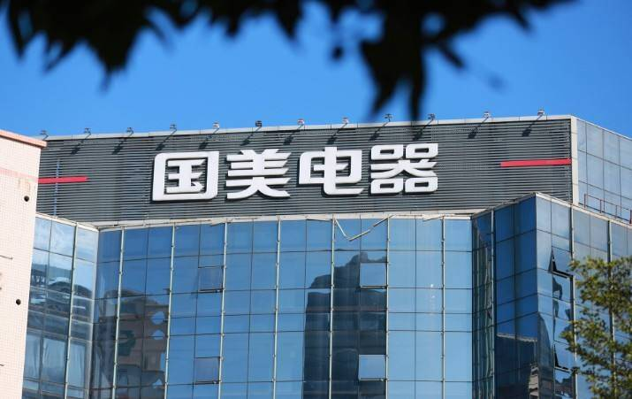

# 国美涉足元宇宙：定为最重要战略，已招揽人才成立元宇宙项目组

近日，国美已将元宇宙定为最重要的战略方向，元宇宙项目总负责人已于6月入职，正积极招揽人才。一位知情人士对界面新闻记者表示，该元宇宙项目或将于7月初部分上线。

另外，来自职场社交平台脉脉的公开信息显示，上述元宇宙项目业务范畴包括元宇宙世界、元宇宙电商、数字人、虚拟偶像、数字藏品等。对此，国美方面回应称，公司确实在做元宇宙方向的初步尝试，真快乐App即将推出元宇宙功能。

“国美”曾指代国美电器，现一般指代国美控股集团有限公司，包括零售板块、地产板块、投资板块。大众熟知的国美电器目前隶属于国美零售。 2021年，国美全力构建“线上、线下、供应链、物流、大数据&云、共享共建”六位一体的全零售生态共享平台，全速开启“家·生活”战略第二阶段。 历经35年的发展和积淀，“国美”秉承“商者无域，相融共生”的理念深入人心。

2017年，国美零售为积极参与到解决“人民日益增长的美好生活需要和不平衡不充分的发展之间的矛盾”，正式开启了“家·生活”战略，以“国美·家美·生活美”为己任，迅速开启战略转型，从电器连锁零售向“家·生活”这个更宽更大的赛道拓展。经过三年多时间的建设投入，国美零售完成了线下线上数字化、融合化等改造升级第一阶段任务，内部零售基建已夯实稳固。

秉承新发展理念， 2021年国美零售洞悉行业趋势、整合自身优势，全新出发，通过系统打造“线上、线下、供应链、物流、大数据&云和共享共建”六位一体的“全零售生态共享平台”，全面开启“家·生活”战略第二阶段。 

多年来，国美始终秉持“商者无域，相融共生”的理念，提出“全零售生态共享平台”战略目标， [45]  倡议与全行业共建生态网络、共享发展成果，为万千中国家庭的美好生活贡献国美力量，助力在高质量发展中促进共同富裕的新征程。

