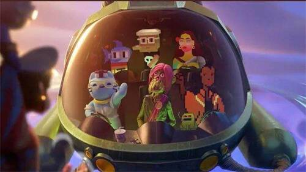
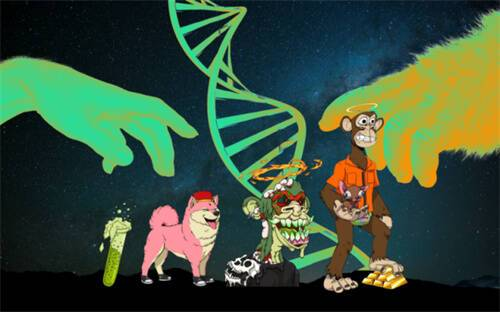

# Yuga Labs元宇宙项目Otherside已完成第二次负载测试

据官方消息，Yuga Labs 元宇宙项目 Otherside 已顺利完成第二次负载测试，近 2000 名玩家参与本次测试。
此前报道，Otherside 将于美国东部时间 7 月 6 日和 7 月 9 日进行两次负载测试，其目的是让 Improbable 团队了解平台极限并找到潜在断点问题。

**Yuga Labs的元宇宙版图**

Yuga Labs最广为人知的原创IP系列是“Bored Ape Yacht Club”（下称“BAYC”，中文名为“无聊猿”），这个系列被许多名人持有，例如亿万富翁、达拉斯小牛队老板马克·库班（Mark Cuban）、NBA著名球星斯蒂芬·库里（Stephen Curry）、美国歌手麦当娜（Madonna Ciccone）以及新加坡华人歌手林俊杰等。

很多人可能对NFT一知半解，但对于一个蓝色猿猴的图片却不陌生，这是因为斯蒂芬·库里所持有的BAYC是一只蓝色的猿猴形象，并将这只猿猴换成了自己的推特头像，推动BAYC快速出圈。

BAYC是Yuga Labs手中的王牌，也是目前NFT市场上的“蓝筹”项目。全球最大的NFT交易平台Opensea数据显示，过去30天，BAYC的总体交易量为第一，总交易市值将近7万个ETH，折合约2.2亿美元。

3 月 12 日，Yuga Labs 从 Larva Labs 手中收购 Crypto Punks 和 Meebits两大IP。目前，除了BAYC，Yuga Labs还掌控6个NFT项目，这个“全家桶”包括Mutant Ape Yacht Club（下称“MAYC”）、CryptoPunks、Meebits、CoolCats、World of Women 以及 Nouns，其中，Mutant Ape Yacht Club为BAYC的衍生项目。

根据Dappradar数据，上述资产当前的总价值约为81.7亿美元，其中三个项目超过10亿美元，分别是BAYC（36亿美元）、CryptoPunks（21.6亿美元）和MAYC（15.8亿美元）。

收购完成后，Yuga Labs 对外展示了自己作为NFT第一IP平台的愿景，并推出一系列举措，核心是一个叫做“Otherside”的元宇宙项目。对于收购的新项目，Yuga Labs宣称，要对Crypto Punks 和 Meebits两大IP的持有者赋予和BAYC持有者相同的权利。

简单来说，Crypto Punks、Meebits的持有者不等于版权持有者，而收购完成后，持有者即版权持有人。

对于自身原创IP项目，Yuga Labs针对BAYC的会员推出了Apecoin，并正与其投资方Animoca联合开发一款名为MetaRPG的游戏。

值得注意的是，美国《时代》杂志已经宣布，接受以Apecoin支付订阅费。

从已有的宣发材料看，MetaRPG可能会是一款超级游戏，结合P2E（边玩边赚）+NFT头像+Roblox+交易平台+The Sandbox和真实地产。

MetaRPG将支持玩家将赚取的代币兑换为ApeCoin，Apecoin是这款游戏的系统货币；游戏不仅限于BAYC会员，它将允许用户带着其他的NFT形象接入，或者创造游戏内资产。

另外，这款游戏将为开发者提供SDK，使得开发者可以基于平台创作，游戏中的土地将与现实世界的土地结合，体系里可能推出一个自有的交易平台。
