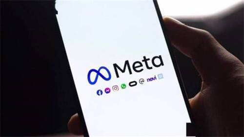
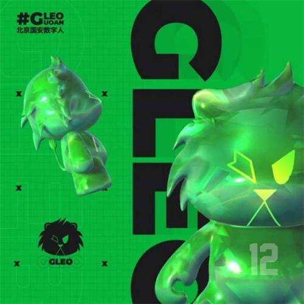

# Meta将关闭数字资产钱包项目Novi、前漫威创意总监加入元宇宙项目

根据彭博社的报告，Meta的数字资产钱包Novi将于9月1日关闭，并从7月21日起阻止用户添加资金，Meta建议Novi用户尽快提取他们的资金。

Novi于2021年10月首次为美国和危地马拉部分地区的客户推出，最初允许用户交易稳定币Pax Dollar（USDP）。领导Novi项目的前Meta员工David Marcus在10月份说，Novi是为了给USDP提供一个真实世界的用例。

尽管Meta公司正在废除其数字钱包协议，但其也表示，计划在未来的产品中使用Novi技术，包括其元宇宙项目。

公司团队将利用多年来在区块链上为Meta整体构建的能力，推出新产品，如数字藏品。用户可以在Web 3.0领域看到Meta更多的东西，因为这些技术能给在元宇宙中的人和企业带来的价值。

7月6日，工体元宇宙Gongti Metaverse （简称“GTVerse”）正式发布。

据了解，这是以数实融合体验消费为核心场景，以工体区域客流和北京国安观众球迷私域流量为核心锚点，以地理位置服务LBS为核心基石，以数字底座、智能中台、全域数据、5G专网、混合云和多形态智能终端为核心要素，由中赫携手入驻工体机构、北京国安合作伙伴等生态伙伴建设运营的新型B2C混合现实互联网社交平台。

此外，北京国安足球俱乐部发布了北京国安数字人(9.020, -0.29, -3.11%)GLEO。具体来说，G代表北京国安，LEO则是拉丁语狮子的意思，北京国安也由此成为了国内首批进军元宇宙领域的职业足球俱乐部。

据财联社报道，超级英雄元宇宙游戏《Cosmos Heroes》宣布，前漫威娱乐授权和推广创意总监Mike Thomas将作为创意顾问加入该元宇宙项目。

凭借其丰富的经验，Mike将助力打造Cosmos Heroes NFT。

7月5日，据元力社报道，数字机构Blink Digital与印度Yashoda医院在Decentraland元宇宙中购买了一个地块，以建造一家医院。

通过与Blink Digital的合作，Yashoda医院将能够在元宇宙中实现病患与医生之间的互动交流，为元宇宙用户提供医疗保健服务。

据Itnews报道，麦肯锡最新主题为“Value Creation in the metaverse”的报告显示，2022年，全球对元宇宙兴趣激增，截至目前已有超过1200亿美元投资于元宇宙赛道，是2021年570亿美元投资额的两倍多。

麦肯锡认为，领导者们已经看到区块链点燃去中心化的创造者经济，并成为当前最具前景的技术。

在相关投资中，投资者主要分为3类，分别是大型科技公司（比如Meta、微软、英伟达、苹果和谷歌）、风险投资机构（Paradigam、Coatue、Yuga Labs等）、以及正在投入资源的企业和品牌商。

近日，市场研究公司IDC发布的一篇文章指出，以牺牲盈利能力为代价来推广低成本硬件的战略是不可持续的，如果Meta的战略保持不变，从长远来看，它可能会在混合现实市场中失去竞争力。

IDC研究主管Ramon Llamas指出，苹果推出头显的消息吸引了很多人的关注，他预计苹果的头显产品将比Meta的产品要贵得多，未来该产品品类的平均售价可能会被抬高。

7 月 6 日，据 36 氪报道，元宇宙空间技术服务商「构赛博（Builtopia）」近日完成千万元人民币种子轮融资，投资方为顺为资本。本轮融资过后，资金将主要用于技术升级、市场推广。

据悉，构赛博初创团队来自于微软、网易、爱奇艺等公司，已开发了一款元宇宙 3D 空间创作工具，其特点在于构建效率高、使用门槛低。

近日，网易已向波兰VR工作室 Something Random 投资数百万美元。

据悉，这是网易首次进军波兰市场，Something Random由前Superhot开发者Cezary Skorupka、Jakub Witczak、Anna Żurawicz-Skorupka和Piotr Goguś在2021年设立。

Something Random首席执行官Skorupka表示：VR 游戏的未来充满活力，潜力巨大。虚拟现实是我们有经验的领域，全球投资者不仅赞赏我们迄今为止取得的成就，而且还赞赏我们的成就，投资我们目前正在开发的游戏。

