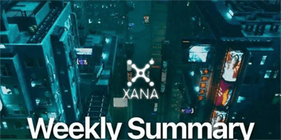
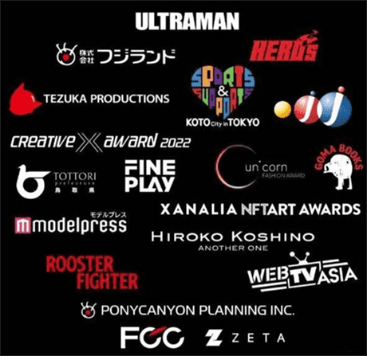
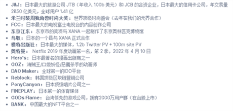

# 奥运会元宇宙项目是什么？元宇宙项目XANA介绍

XANA是一个社区驱动的去中心化NFT /NFR元宇宙项目——由Ethereum（以太坊）和Polygon（马蹄）区块链驱动的虚拟现实社交平台。在XANA中，用户可以角色扮演、构建和交易NFT /NFR内容，如虚拟土地、资产、形象，甚至是创造属于自己的游戏。

XANA 是为元宇宙定制的以太坊侧链。兼容所有流行钱包，与所有主要区块链桥接。

**KOL**

在早期阶段让 KOL 参与特别交易（收入分成），以提供土地并建立他们的标志性世界，组织虚拟活动，为他们提供可视化的主题，以便与他们的追随者互动，加入 XANA 访问他们的土地。他们还根据社交活动的数量来激励他们。微影响者也有机会通过为元界带来的社交挖掘活动获得奖励，从而为元界带来流量。

**创造**

XANA 将激励游戏创建者/环境创建者/头像创建者使用 SDK 或 XANA 平台和接口的构建器开发 NFT 游戏、有吸引力的新闻或事件、可爱的头像和可穿戴设备，以快速完成他们的项目开发和代弊化。

**视频**

关键功能之一是创建像 Tik-Tok 这样的元宇宙/头像短片。它激励 KOL 或普通用户使用他们的头像和表情（姿势）发布有趣的内容。这获得了无限的机会，让他们中的任何一个人在社交媒体上变得病毒式传播，因为这比仅仅将他们的个人资料图片更改为 PFP NFT 之一的影响者更引人注目。

**重量IP顶级机构加持**

如图所述，其中包括东京奥运会，FCC日本知名电台，J&J日本知名旅游公司，奥特曼等知名动漫机构参与，差不多可理解为是一个日本顶级项目了。

**TOKEN经济：**

发行量：50亿

代码：XETA

目前在Dao Maker平台公售轮中，参与需要有KYC过的号，无需咨金投入报名中签即可，在上一轮公共轮约四分之一的中签概率，份额为200刀每份，没有赶上的可以参与第二轮。
