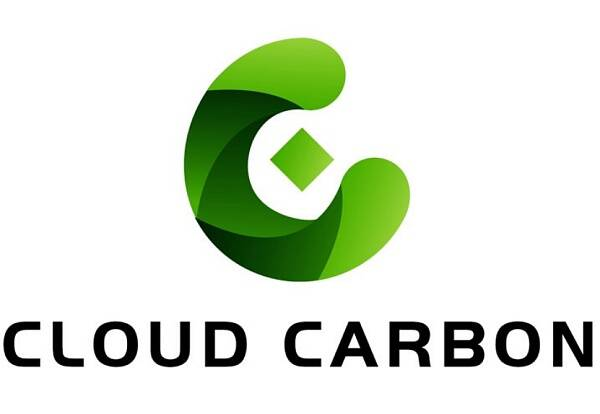

# 云碳CC元宇宙项目上线 带你坐享低碳金融收益

云碳CC——碳中和+元宇宙的完美概念结合的元宇宙项目，打造去中心化交易所，解决企业发展的环保问题，势必引发全球强烈关注，升值潜力空前高涨！

**云碳CC：投资低碳生活大未来**

助力低碳生活，云碳CC项目历经四年精心筹备，全新打造区块链+元宇宙+碳中和+DeFi概念模式，全新定义去中心化绿色生态布局，全球DAO布道，社区自治，资源共享，每天固定产出，自动做市商！云碳CC，不仅是一个区块链数字交易所，更是人类未来发展的生态路由器，投资云碳CC，就是投资人类命运远大未来！

云碳CC交易所，云集全球碳排放量交易，通过CC币进行碳排放指标贸易。碳排放量已经被设定了恒量天花板，使用一点就少一点，越来越珍贵。当碳排放权日益成为珍稀商品，全球企业必然会抢夺、持有CC币，进而获得生产所必须的碳排放指标，CC币受到追捧的程度也将快速攀升！

**创新收益机制的云碳CC带你坐享低碳财富**

云碳CC重点关注绿色生态板块，实现环保商业的人人获益。碳中和是全人类共同目标，碳汇和碳积分碳交易更应该是全人类共享同等权益。因此，云碳CC利用最新科技，立足全球生态治理节能减排的战略蓝图，助力环保四大生态版块布局建设，全民资源共享，全民财富升值！

具体而言，云碳CC采用自动做市商模式AMM，恒量发行8800万枚每天固定产币3013枚，算力按全网持有量去自动分配，持续产出80年。在8800万枚云碳CC币中，有8600万枚币是基于币安链挖矿而产出，其余的200万枚用于底矿和市场推广。

**掌握碳排放市场！云碳CC未来生态规划蓝图**

云碳CC计划花3年时间，打造涵盖全球各产业的碳排放数字化交易市场，提升市场份额，掌握碳排放定价的话语权。第一步，云碳CC推出CC币数字通证，挂钩碳排放指标，利用折扣费率吸引各企业参与；第二步，形成体系，推出碳债、碳险等碳相关金融产品，同时利用云碳CC进行交易的企业数量与交易额进一步提升；第三步，打造生态，更多降碳排、固碳等相关技术与设备的贸易也将通过云碳CC平台与通证进行，整个碳中和目标相关的交易、技术、产品、服务、企业，被云碳CC连接为全球整合的庞大生态。

其中，斯坦福技术团队持续提供区块链技术与平台的运营、优化，以突破性的自动做市商（AMM）在碳交易中的应用，以及高性能的预言机，支持数据毫秒级动态灵敏捕捉以及交易撮合，赋能云碳CC生态蓝图的稳步推进。

作为未来全球企业必须持有的碳排放权益通证，CC币受到全球日益狂热追捧，价值连城。云碳CC，以最新科技带动空前低碳财富机遇人人共享，开启低碳商业新阶段。
