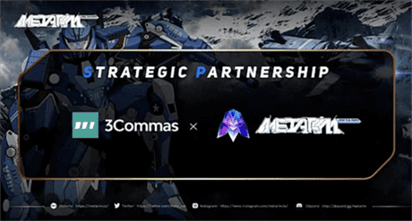

# 宫崎骏授权元宇宙项目MetaRim

Meta Rim 是一款融合了 NFT 艺术和 GameFi Play2Earn 经济模型的元宇宙项目，全球最知名的动漫大师宫崎骏也助力Meta Rim NFT的发展。

其机甲的美术设计基于风格化图纸和现代机械美学，并融合了世界上 10 个国家和地区的不同地形、生态、神话和社会等多维度元素，这些地方涵盖了五大洲。

MetaRim是一款融合了 NFT 艺术和 GameFi Play2Earn 经济模型的元宇宙项目，全球最知名的动漫大师宫崎骏也助力Meta Rim NFT的发展。希望以机械人唤起人们的归属感和地方感，并激发人们的好奇心和冒险精神。按照目前的进度6月份游戏将与大家见面测试。

加密曙光战略投资Web3板块优质项目MetaRim，全球最知名的动漫大师宫崎骏也助力Meta Rim NFT的发展并同意 MetaRim 将宫崎骏所创造的十部作品当作素材推出相关 NFT，MetaRim是一款融合了 NFT 艺术和 GameFi Play2Earn 经济模型的元宇宙项目。

机构和名人的加持为Meta Rim NFT注入无限流动性的同时，还助推其社区规模呈几何式增长的态势，一度引爆局部市场。当然，元宇宙项目Meta Rim能强势入局Web3，并掀起惊涛骇浪的 根源离不开其内核的叙事价值支撑。

在顺应发展潮流的同时，Meta Rim创新性地将艺术品NFT 的叙事逻辑与 GameFi P2E 的叙事逻辑相结合，构建出一套全新的叙事逻辑。没有掺杂任何其他背景，全新的叙事逻辑所带来的叙事价值是新颖的，也具备强烈的吸引力，这也是人们

对Meta Rim寄予厚望的原因。因而，虽然这只是 Meta Rim 产品更迭踏出的一小步，却是迈 向Web3这片充满新机遇领域的一大步，所有人可以在这里构建未来、拥有所有权、合并数字身 份、启用开放金融。
