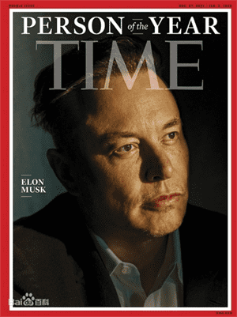
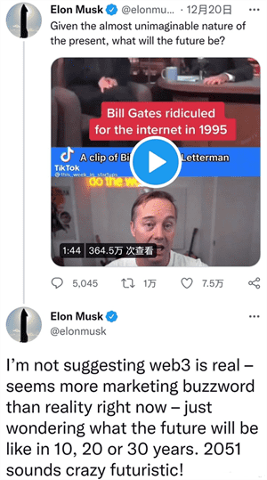

# 扎克伯格元宇宙项目曝光 马斯克看衰元宇宙

自从2021年10月28日，Facebook正式宣布，将把公司名称改为“Meta”之后，全面启动元宇宙开发进程。对此，外界很多人认为，这仅仅只是停留在PPT层面的元宇宙。但事实上，Meta开展的元宇宙项目Codec Avatars已经暗中发力，打造出逼真虚拟角色。

2021年12月10号，Meta开放了自家的虚拟世界平台Horizon Worlds。用户通过登录Horizon Worlds平台，需创建3D虚拟化身（Avatar），即可在这个虚拟世界中参与互动。遗憾的是，目前系统中的avatar仍未完善，表情僵硬、动作呆滞。与《头部玩家》、《黑客帝国》等科幻电影里逼真化身形象相比，Horizon Worlds还有十万八千里的差距。

其实，虚拟化身堪称元宇宙交互核心，Codec Avatars通过能够捕获和表示用于XR逼真头像系统，实现技术在虚拟空间投射。特别是基于3D捕捉和AI技术，Codec Avatars提供给用户创建各种虚拟化身的支持。

马克·艾略特·扎克伯格自从把Facebook高调更名为Meta后，带动元宇宙风靡全球，相关概念热度持续升温。但是，并不是所有人都看好元宇宙，比如扎克伯格的老对手马斯克，就是公开看衰元宇宙。

2021年12月19日，特斯拉CEO马斯克在当地时间周日晚间，发布推文看衰元宇宙，称目前被资本市场炒得火热的“元宇宙”，目前只能说是个“营销流行词”。

就在刚刚过去的12月13日，埃隆·马斯克被评为《时代》周刊2021年度人物。马斯克可以说是继比尔盖茨、乔布斯之后，美国新一代科技界领军人物。

马斯克出生于南非，同时具有南非、加拿大和美国三重国籍。这位天才型企业家，接连创办多家高科技公司，任太空探索技术公司（SpaceX）CEO兼CTO、特斯拉（TESLA）公司CEO 、太阳城公司（SolarCity）董事会主席。

从马斯克的经历其实不难看出他是位见多识广的科技狂人，对技术发展具有高超的前瞻性，才能准确把握多个创富机会。因此，马斯克对元宇宙的质疑，也极具代表意义。

马斯克认为，许多人认为元宇宙是巨大的投资蓝海，我认为现在元宇宙看起来更像是流行的“营销术语”，而不是什么现实。说实在的，虽然不用着急否认元宇宙，但这个未来确实有点远。

事实上，马斯克和扎克伯格一直被视为未来两大科技派系代表，前者是飞船派，后者是元宇宙派。

马斯克对科技的探索，更多是通过打造飞船，实际星际航行。而扎克伯格则通过科技，让人类沉浸到虚拟世界中，通过精神创造属于自己的宇宙空间。

因此，两个人互怼也不是什么新鲜事。只不过，从目前来看，两者分别从对外、对内进行不同方向探索，谁胜谁劣，目前暂未有定论。
