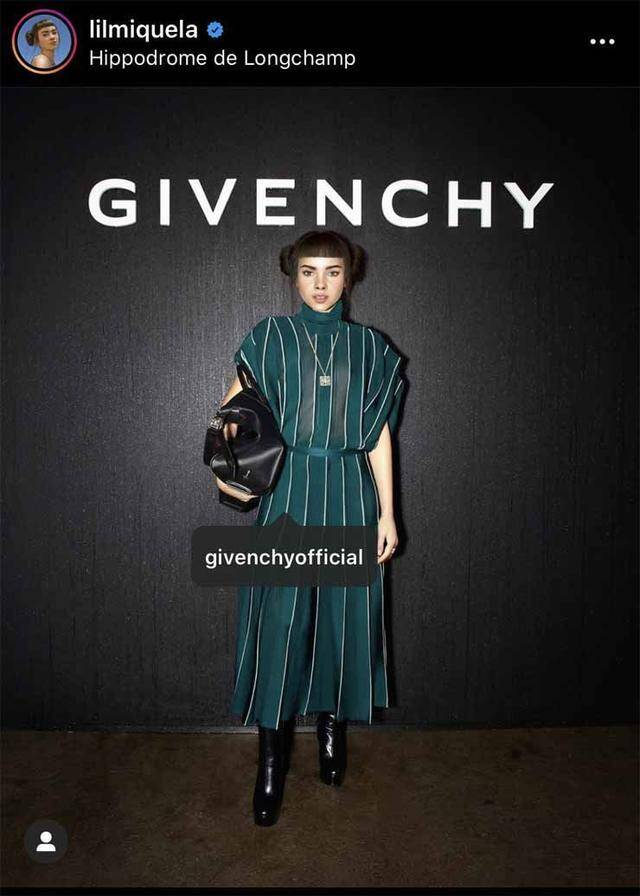
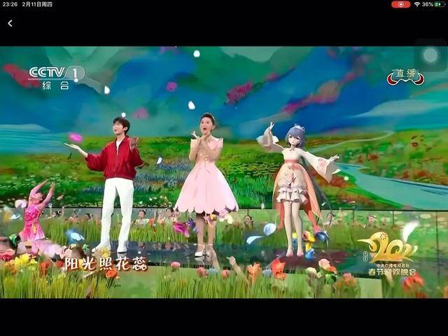
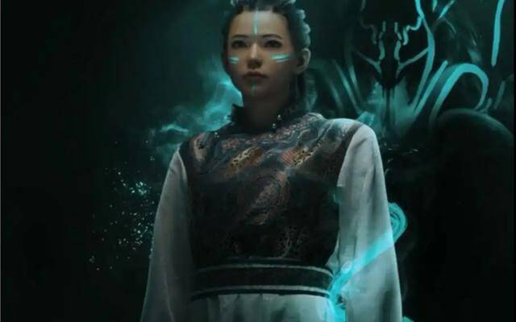
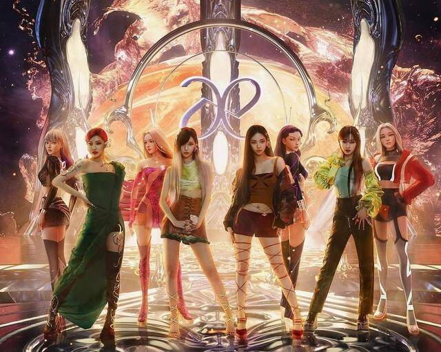

# 虚拟人内卷和塌房并存，怎样破圈才能成为元宇宙最后赢家？

5月20日是**AYAYI**的生日，这位银色短发、面容精致的长腿美女刚满1岁。她乍看上去与其他年轻美貌的博主无异，仔细分辨才能看出3D建模的痕迹——AYAYI是一个凭空“捏造”出来的超写实数字人。

2021年5月20日，AYAYI在小红书发布了第一篇笔记“hi，第一次见面”，配图的一张正面大头照十分惊艳，后来在网上铺天盖地地流传，截至目前这篇笔记有将近11万点赞，直到现在还不断收到评论。

AYAYI

然而如果仔细翻看近期的评论，就会发现有不少前来“考古”的新粉丝，不无遗憾地表示“高开低走”、“（和现在）差距太大”、“（现在的脸）不够精致”。遗憾之处不止于此。过去的一年间，AYAYI发布了一百多篇笔记，有生活照、有杂志大片、也有广告代言，点赞和评论量肉眼可见地减少，今年5月20日发布的笔记只有寥寥一百多赞了。

尴尬还发生在其他虚拟人身上。打出“永不塌房”口号的虚拟偶像顶流组合**A-SOUL**，比预想中更早迎来塌房。日前，成员**珈乐**宣布“直播休眠”，即终止日常活动，原因疑似珈乐的真人扮演者（圈内称为**“中之人”**）遭遇公司压榨和不公平待遇。此后公司宣布与珈乐的中之人解约，引发巨大风波，不少粉丝表示“世界塌了”，A-SOUL的B站账号一夜掉粉6万。珈乐离去之后A-SOUL的形象和商业价值变成未知数。

A-SOUL

## **虚拟人如何做网红？**

去年虚拟人在国内存在感爆棚，一方面是技术逐渐成熟，制作和运营公司涌入市场，另一方面也和选秀节目停播、多位明星网红爆出丑闻有关。外形完美、业务能力过硬的虚拟人趁势抢夺起爱豆和网红的饭碗。

尽管虚拟人概念新，但商业运作套路其实相当“传统”。要么是以打造网红博主的方式，快速吸粉快速变现，流量枯竭之后再快速抛弃；要么是以打造艺人偶像的方式，把饭圈的那一套养成、虐粉等运营逻辑移植过来。

AYAYI这样的完全靠AI生成的虚拟人，凭借与真实人类极为近似的外貌靠脸吃饭。他们以博主的身份活跃在社交平台，大多数从时尚、美妆、穿搭等门槛较低且流量大的领域切入，发布一些“日常生活”的照片或视频来丰富人设并保持关注度。待流量积累到一定程度后，便可以接广告代言了。

这类虚拟人中的佼佼者非**Lil Miquela**莫属。这位自称住在LA的19岁机器人仅在Instagram上的粉丝就超过300万，坐拥**Prada**、**Chanel**、**Supreme**等时尚大牌代言，据估计其年收入在200万美元左右，商业价值超过1000万美元。

Lil Miquela“出席”纪梵希活动

然而国内的网红生态和内容消费习惯与欧美市场大相径庭，好看的博主千千万，即便是虚拟人，如果没有更多才艺，想要维持粉丝的粘性就很困难。但超写实虚拟人的表情、动作变化都要经过大量的计算，制作时间长、成本高，导致它们很难进行复杂的“表演”，也无法高频率地更新内容。这也是文章开头提到的AYAYI尴尬现状的原因之一。

与之相对，以A-SOUL为代表的动作捕捉类虚拟人，人格特征和表情动作都更为灵活丰富，也能满足实时互动的需求。因此，目前这一类虚拟人经常活跃在直播平台，直播的时长、频率、内容等都可以做到与真人主播无异。A-SOUL成员**贝拉**是B站首个达到万舰成就的虚拟主播（舰长即B站主播的付费VIP，单价198元），折合收入超过200万元人民币。

虚拟爱豆有一定的人气之后，也就打开了衍生品的市场。虚拟爱豆中的前辈**初音未来、洛天依**等，凭借多年的积累，通过开演唱会、IP授权、周边产品变现，并且成功从二次元小众文化圈走向了主流平台。

洛天依登上央视牛年春晚

与真人爱豆和网红的生存环境类似，虚拟人的圈子也卷得厉害。自2021年虚拟人概念炒热以来，在抖音和小红书等平台上，每月都会新增几十个虚拟人账号。他们无论是名字、外形还是发布的内容都大同小异，很快就隐匿在互联网的洪流之中。而一些想要长线经营虚拟人IP的从业者，开始探索差异化的运营方式。

## **始于颜值，忠于才华**

前面提到，国内的网红生态与海外不同，消费者对**「famous for nothing」**的捏脸换装式虚拟人并不买账。借用饭圈的一句话，要“始于颜值，忠于才华”。

因此，人设最终要落到有价值的内容产出上。和真人偶像或网红相比，虚拟人的人设是一张白纸，创作团队可以从零开始设计人物的背景，甚至敷演出一套世界观，这是其最为明显的优势。基于此，虚拟人背后的运营方八仙过海，尝试探索不同的方式。

火出圈的**柳夜熙**，定位为“会捉妖的美妆达人”，开创了虚拟人演员出道的先河。这位美妆博主不做试妆也不做教学，而是“拍电影”。柳夜熙的抖音短剧集**《地支迷阵》**有宏大的世界观设定，辅以悬疑惊悚的情节和精良的特效制作，上线6集累计3亿次观看，让粉丝发出了“我竟然在抖音看电影”的感叹。其制作团队甚至规划了一个漫威式的宇宙观，计划让不同宇宙里的虚拟人互相联动，并统合在一个母宇宙之下。

不过，这种模式风险极高。柳夜熙的一支视频单集制作成本超过100万，口碑却时常有起伏，拿捏观众口味成为最大难题。团队推出的第二个虚拟人犹卡塔娜更是处于不温不火的状态，人设、建模、故事设定等方面都受到部分网友诟病，尽管靠着与柳夜熙“连宇宙”而获得了一些关注，却也无法复制前辈的神话。

柳夜熙的“师妹”犹卡塔娜

还有一些虚拟人在更硬核的内容领域掘金。抖音上最近热度迅速攀升的国潮虚拟人白知来，抢占知识类博主的赛道。**白知来**承袭中国传统文化的世界观，是**“隐居人间的上古神兽白泽**”。其发布的视频通过白知来的日常生活片段来解读传统文化，其中不乏硬核的冷知识。这种寓教于乐的形式吸引了一批对传统文化有研究、有兴趣的年轻人。最近白知来团队还推出了另一个虚拟人**春神句芒**，上古神仙宇宙似乎也在逐步搭建起来。

与美妆、穿搭等赛道不同，白知来团队选择切入知识赛道，运营难度更高。知识是否准确、掌握资料是否全面、观点是否中肯，是所有知识科普类博主都要面对的问题，虚拟人也不例外，因此需要专业的团队精心打磨。在内容变现层面上，也比其他领域难度更大。不过，垂直的深度内容也可以成为虚拟人的壁垒，产生差异化价值。这类内容的不可替代性更高，难以被其他团队快速复制；被内容吸引的消费者也更容易产生粘性，并且在互动中创造更多优质的UGC内容。观察白知来的抖音评论区就能发现，观众中不乏对传统文化、古代典籍颇有见地的高手，他们也是白知来宇宙的重要参与者。

白知来

## **打开元宇宙入口，然后呢？**

业界一个观点是，虚拟人是元宇宙的入口。然而，如今从业者面临的境况是，入口立起来了，房子还看不见踪影。

元宇宙本身处于摸索阶段，落地场景和商业模式都不成熟，还未到虚拟人大施拳脚的时机。因此，无论是哪种技术、哪种运营模式，现在的虚拟人大多数还是要依附于Web 2.0的平台，那么其商业逻辑也无法跳出现有媒介的规则，比如算法推荐，比如电商带货。这也是为什么在今天的许多消费者看来，虚拟人有点新瓶装旧酒的意味，与传统的爱豆网红“除了脸没有太大的差别”。

如果仅仅沉溺于在现有的媒介上捞流量变现，那么虚拟人从成本上考虑并不是一桩性价比高的生意。为什么还要坚持？一些有想法的从业者把眼光放到了更长远的地方。

财大气粗者如韩国知名娱乐公司**SM**，布局XR、区块链、NFT等技术，构建了一个元宇宙空间**KWANGYA**，并推出“元宇宙女团”将现实世界与元宇宙世界强关联起来。其虚拟人团体**ae**的成员和真人团体**AESPA**一一对应，双方共同补全整个世界观，可以说的确起到了元宇宙入口的作用。

AESPA及其数字分身

更多从业者还是站在产业链上的一个环节推动虚拟人生态的发展。白知来运营团队**有吉互动**的创始人**梁宁宁**在接受硅兔赛跑采访时表示：**“希望通过发力虚拟出版赛道，借助虚拟人把原生的虚拟内容带入元宇宙，形成垂直领域的丰富生态。”**她认为，今天在Web 2.0里运营虚拟人，解决的是温饱问题，眼光还是要放在未来，搭建通往元宇宙的通道。即便未来元宇宙的形式与今天不同，如果白知来能成为开路人，依然值得自豪。

今天，无数虚拟人与他们背后的团队一起描摹着元宇宙的样貌。如同Web 2.0时代刚刚来临时，一些尝试在后人看来可能是失败的、可笑的，但正因有了不断试错才塑造出今日的繁荣。未来虚拟人将往何处去？想象力可能是它最大的边界。

**=完=**
