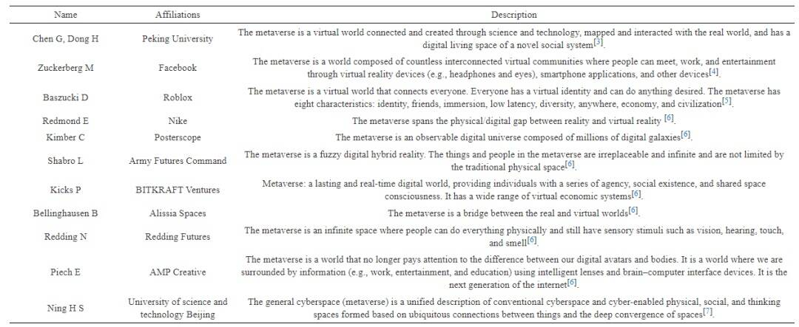
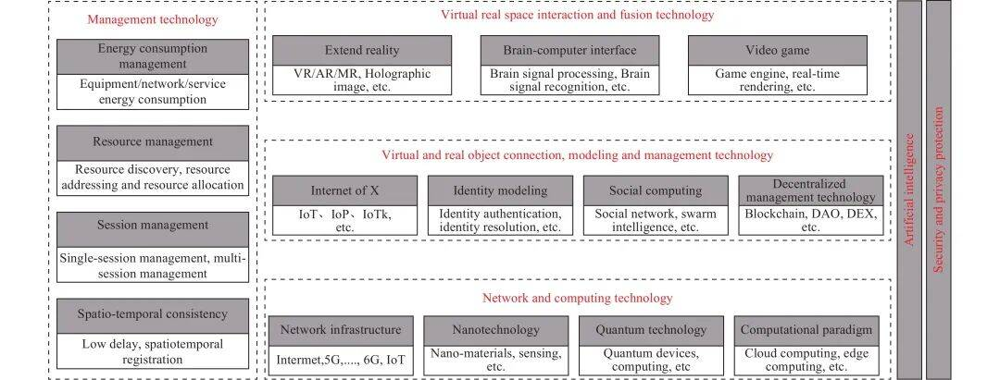
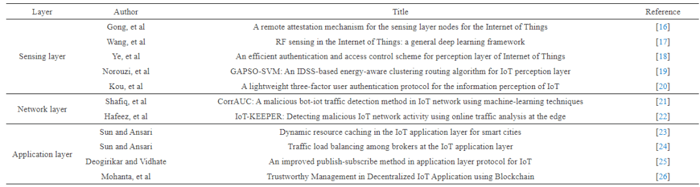
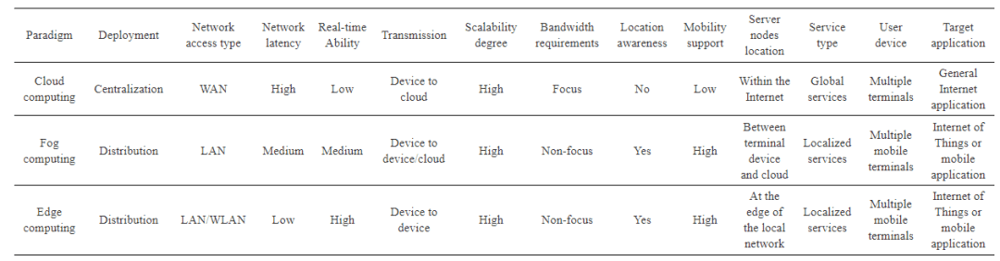
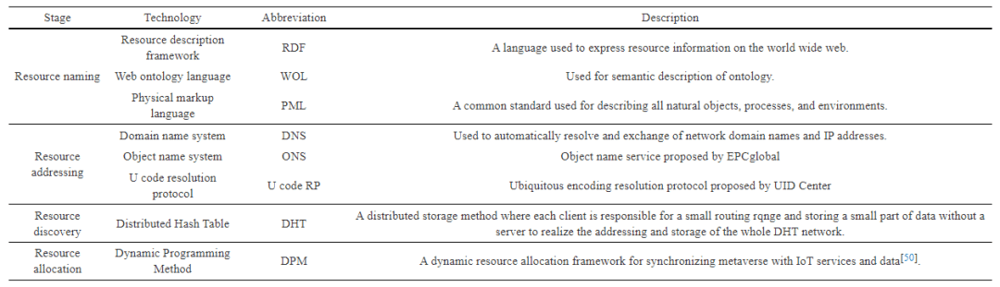
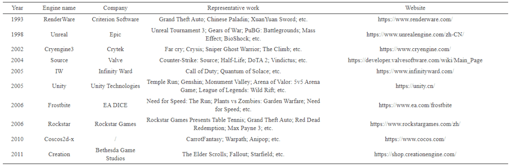

# 元宇宙技术综述

**〢摘  要：** 元宇宙作为一个新兴的概念受到了产业界、学术界、媒体界及公众的广泛关注，国内外众多公司也纷纷在“元宇宙”领域布局，但布局的背后离不开强大的技术支持。本文从技术维度深入剖析元宇宙。首先，从科学与技术的角度论述元宇宙的概念及内涵，并总结了目前从业者、专家以及学者对元宇宙的不同见解。其次，概述了元宇宙相关关键技术，包括网络及运算技术（5G、6G、物联网、云计算、雾计算及边缘计算）、管理技术（能耗管理、资源管理、会话管理及时空一致性管理）、虚实对象连接、建模与管理技术（X联网、身份建模、社会计算、去中心化管理技术）、虚实空间交互与融合技术（拓展现实、电子游戏技术、脑机接口技术）等。元宇宙不宜称为新技术，而是IT新技术的综合运用。技术的进步与发展，将为元宇宙的实现和应用奠定坚实的基础，同时元宇宙的发展也会促进现有技术的升级换代。最后，展望了元宇宙发展面临的诸多挑战，以清晰认识、理智决策、稳步探索元宇宙。

 

**全 文 阅 览**1992 年，美国著名作家Neal Stephenson在《Snow Crash》中提到元宇宙（Metaverse）一词，他这样描述：“戴上耳机和目镜，找到连接终端，就能够以虚拟分身的方式进入由计算机模拟、与真实世界平行的虚拟空间。” 其实Metaverse这个概念的思想源头是由美国数学家和计算机专家Vernor Vinge教授在 1981 年出版的《True Names》中描述的通过脑机接口技术进入并获得真实感官体验的虚拟世界。在元宇宙时代，人类的生活方式会受到较大的影响。其一，传统的哲学与科学会受到巨大的冲击，需要不断挖掘和研究新的理论与方法；其二，元宇宙的兴起将推动人类社会迈进一个新阶段，相应地，时代的演变又进一步为技术的发展添砖加瓦。元宇宙技术在融合已有技术的同时，也将不断衍生出更多的新技术。本文先从科学与技术的角度论述元宇宙的概念及内涵，并总结了目前从业者、专家以及学者对元宇宙的见解；其次，从技术维度深入剖析元宇宙，即从网络及运算技术、管理技术、元宇宙虚实对象连接、建模与管理技术以及虚实空间交互与融合技术四个方面阐述元宇宙中涉及的关键技术。最后，对未来元宇宙技术发展所面临的挑战进行归纳与总结。

**1.元宇宙概念与内涵** 元宇宙作为一个新兴的概念，受到了产业界、学术界、媒体界及公众的广泛关注，但对于元宇宙的定义及概念还不够统一和明确，不同从业者、专家以及机构给出了对元宇宙的见解，如表1所示。

**表 1** 从业者、专家以及机构对元宇宙的不同看法与见解为进一步理解元宇宙的概念及内涵，本文从科学和技术的角度对其进行剖析，具体如下：从科学角度上说，元宇宙的诞生是多学科融合的结果。元宇宙将促进信息科学、量子科学、数学和生命科学等学科的融合与互动，创新科学范式，推动传统的哲学、社会学甚至人文科学体系的突破。元宇宙，实质上就是广义网络空间，在涵盖物理空间、社会空间、赛博空间以及思维空间的基础上，融合多种数字技术，将网络、软硬件设备和用户聚合在一个虚拟现实系统之中，形成一个既映射于、又独立于现实世界的虚拟世界。从技术角度上说，元宇宙不宜称为新技术，而是现有IT技术的综合集成运用，它是信息化发展的一个新阶段。因此，随着元宇宙的发展不仅会促进现有技术的升级换代，而且也会促进新技术的出现。本文将从技术维度对元宇宙中涉及的关键技术进行概述，如图1 所示。

**图 1** 元宇宙技术路线图**2.****元宇宙中的网络及运算技术** 网络及运算技术是元宇宙的基础设施，可为元宇宙提供高速通信、泛在连接以及共享资源等功能，本节主要介绍5G、6G、物联网、云计算、边缘计算、互联网等在元宇宙中的作用。

**2.1  高速无线传输——5G、6G**无论是远程执行计算繁重的任务、访问大型数据库、还是在用户之间提供共享体验，都离不开网络与通信，元宇宙时代所需要的沉浸式体验，要求网络具有低延迟、大带宽、高可靠性等特点。5G作为新一代信息化基础设施的出现，为元宇宙的沉浸式体验提供可能。为了满足不同行业和市场的需求，国际电信联盟（The International Telecommunication Union, ITU）将5G划分为超可靠低延迟通信（Ultra-reliable low-latency communication, URRLC）、增强移动带宽（Enhanced mobile broadband, eMBB）和海量机器类通信（Massive machine-type communications, mMTC）, URRLC 和 eMBB 恰好可满足元宇宙对沉浸感体验的需求，众多学者近年来不断为 URRLC 和 eMBB 做研究，以提高 5G 的通信效率，减少能源消耗。例如，Kumar和Ahmad[11] 提出基于 ANFIS 的 5G 新空口技术（5G New radio, 5G NR）中 URRLC 和 eMBB多路复用反应策略，为 URLLC 流量提供高优先级，同时保证了 5G 蜂窝网络场景中其他 eMBB 流量的可靠性。Malik等[提出一种干扰感知无线资源分配方法，并与传统的循环调度算法作比较，结果表明，提出的算法比传统的循环调度算法在链路可靠性和延迟降低方面有明显的改善。Buccheri等提出混合重传策略，以满足URRLC需求并最小化消耗资源。6G 作为 5G 的必然演进方向，6G 将打破时间、虚实的限制，为元宇宙的实现提供网络基础。6G 的出现，更多地实现现实世界与虚拟世界的交互和未来的共存共生。中国移动通信研究副院长黄宇红表示，未来不仅会有物理世界，也将有数字世界，一方面是物理世界的孪生世界，另一方面会演变成元宇宙和平行世界 。未来，元宇宙将不仅是对现实世界的模拟与仿真，更重要的是物理世界与虚拟世界的融合与交互发展，6G 将对其发展提供强大的驱动力。东南大学尤肖虎教授团队[在“6G 的最新进展及发展趋势”一文中，提出 6G 无线通信网络有望提供更高的频谱、能量、更高的传输速率、更低传输时延、超大连接密度、更高覆盖率和亚毫秒级的时间同步，6G 所具有的特征将在元宇宙中大显身手。在 5G、6G 网络环境下，利用量子通信保障通信安全方面，Chowdhury等[提出基于量子不可克隆性定理和测不准原理，量子通信通过应用量子密钥提供了强大的安全性。

**2.2  虚拟世界与现实世界的联接——物联网**物联网（Internet of Things, IoT）在元宇宙的网络基础设施的实现和发展中将发挥重要作用。虚拟世界与现实世界的泛在连接，离不开大量传感器、智能终端等物联网设备实时采集和处理数据，故物联网可为用户提供真实、持久且顺畅的交互体验，是虚拟世界与现实世界的联接和桥梁。物联网经典的三层架构，即感知层、网络层和应用层，与元宇宙的建立紧密联系。表2 列举了近年来部分学者对物联网三层架构的研究成果，将来为物联网技术在元宇宙中的应用做好铺垫，支撑元宇宙的发展。

**表 2** 近年来典型的物联网研究以支持元宇宙的发展从物联网的三层架构来看，要想支撑元宇宙的发展，仍存在一些瓶颈，例如，存在于感知层的数据爆炸与有限感知资源之间的不平衡问题，Shi等[27]提出了将人工智能与选择性感知相结合的解决方案；传感器/制动器性能不佳问题，Ning和Liu[28]提出使用纳米技术用于改善传感器/制动器的性能（例如，更高的灵敏度和选择性、更短的响应时间和更长的使用寿命）。因此，纳米材料（如石墨烯、纳米线等）的应用将为元宇宙的感知与通信领域提供可选性。存在于网络层的连接爆炸与高效通信之间的问题[29]；存在于应用层的应用爆炸与精准服务之间的矛盾[30]，都是现在正面临的问题。未来随着科技的进步，解决上述“卡脖子”问题，将为构建元宇宙提供进一步的支撑。另外，触觉互联网也是支撑元宇宙发展的一种新的物联网形式。触觉互联网是由Fettweis[31]提出，它允许人和机器能够在移动中和特定空间通信范围内，通过触觉实时地与周围环境进行互动。触觉互联网有潜力使元宇宙更具有沉浸感。5G 关于低时延、高可靠性的研究客观上是为触觉互联网作了铺垫，Saches等[32]描述了 5G 在触觉互联网（Tactile internet）中发挥的基础作用，并展示了 5G 新空口技术（5G NR）和 5G 长期演进技术（5G LTE）如何实现有保证的低迟延无线传输，提出了基于分布式云平台的 5G 系统架构，以满足触觉互联网对可靠性和低延迟方面的苛刻通信需求。Antonakoglou等[33]关注 5G 如何结合触觉数据通信协议、双边远程操作控制方案和触觉数据处理，让触觉应用发挥作用。

**2.3  云计算、雾计算与边缘计算赋能元宇宙**有十余年发展史的云计算，成为元宇宙中可以大量赋能的领域。元宇宙所需要的身份建模、现实世界与虚拟世界的交互以及多元宇宙之间的互动，都会产生难以想象的海量数据，这离不开云计算的支持。本节将从数据处理和数据存储两个维度论述云计算的重要作用。

**(1) 数据处理。**具有算力动态分配的云计算是元宇宙最重要的网络基础设施。元宇宙的构建需要一个强大的算力系统处理数据，当前的算力架构依然无法满足元宇宙对于低用户门槛、高体验感的需求，云计算一定程度上能够推动算力发展。日前，元宇宙借助游戏技术来展现，大型游戏采用的客户端与服务器结合的模式，其对客户端设备的性能和服务器的承载能力有较高要求，并且在全球范围内集中部署的云数据中心，旨在处理来自物联网设备的传感数据或基于嵌入式设备的实时视频、图像等非结构化数据。例如，Zhang等提出了用于嵌入式设备实时视频处理的流式云平台，并对该平台的处理速度、功耗和网络吞吐量等进行评估。

**(2) 数据存储。**在云上存储数据，即云存储（Cloud storage）,一般不用考虑存储容量、存储设备类型、数据存储位置以及数据的可用性、可靠性和安全性等繁琐的底层技术细节，按需付费就可以从云服务提供商那里获得近乎无限大的存储空间和企业级的服务质量。近几年来学者们一直在云存储方面的研究，如Sharma等综述了区块链技术在云存储安全方面的应用；Qiu等提出了基于可逆小波变换的以用户为中心的云存储数据保护方法；Doan等提出云存储系统中数据一致性维护的虚拟服务器解决方案。元宇宙在构建过程中产生的大量数据需要云计算按需调配资源，以进行海量数据处理及存储，但若把所有的资源都集中在云端，那对于元宇宙的沉浸感体验、负载均衡以及能量消耗将带来巨大的挑战。对此，需要在本地部署带有计算和存储功能的设备，以缩短终端用户到计算和存储资源的距离，这就需要雾计算来支撑。雾计算由终端用户层、雾层及云层构成，雾层的存在极大地降低传统云计算的时延，可以自己向用户直接提供服务，还可以利用云层强大的算力和存储能力协同进行服务。另外，雾计算中更加靠近边缘终端的部分，称之为边缘计算（Edge computing）。边缘计算可将元宇宙计算所需的大型服务分解为小巧且易于管理的子任务，并将这些任务分散到边缘节点去处理。边缘计算在物理上更接近终端用户，进一步将迟延时间最小化，为用户流畅、优质的体验提供保障。另外，当元宇宙的内容涉及多个用户时，会大大增加网络流量负载，Kim提出了一种在边缘网络中基于云 VR 的服务配置和部署方法，这只是对其的初步探索。由于云计算、边缘计算以及雾计算各有优缺点及特性，如表3 所示，故利用云边协同策略降低网络时延及流量负载受到关注，为元宇宙关键技术的研究提供一种选择。

**表 3** 云计算、雾计算和边缘计算的比较

**2.4  元宇宙≠下一代互联网**元宇宙将用户与互联网交互的界面（体验感）从“二维”上升到“三维”，将对互联网的技术和发展起到推动作用。值得注意的是，元宇宙是互联网之上的应用，二者不宜等同起来，更不能将元宇宙简单地看成下一代互联网。对行业、企业来说，互联网的“升维”将催生新的生产力，但是找到“入口”仅是第一步。还要在技术层面上，提供更多的连接与通信方式，以及基础设施。硬件设施也要不断适配升级，这也将是一个相对艰难的探索过程。

**3.元宇管理技术 **元宇宙管理技术保障虚拟空间（即赛博空间）与真实空间（含物理空间、社会空间及思维空间）的泛在连接与空间融合所需要的软硬件环境，主要包括能耗管理、资源管理、会话管理、时空一致性管理等。

**3.1  能耗管理**节能环保一直是信息系统所追求的，未来的元宇宙一大挑战便是能耗。元宇宙中能耗管理的目标和理念是实现最低能耗和绿色能源占比最大化，提高能源利用效率。在元宇宙中，传感器设备、网络及通信基础设施（如，5G、6G、云计算系统等）、虚拟世界与现实世界的交互（如，VR/AR/MR、脑机接口等）等需要大量的能源消耗。许多学者提出了能源监测的方法。例如，Somula 和Sasikala提出基于物联网的方法监控负载消耗并以高效的方式节约能源。Bi等]创建了 Elman 递归神经网络模型和指数电力预测模型，帮助减少电力损耗、节约成本。能源可持续发展既是元宇宙的核心约束也是投资机遇。元宇宙中节能环保的目标是建立绿色元宇宙。这需要我们做到两点：一是不断创新与发展先进的能源基础设施，实现对能源的自动测量、收集、存储、分析等智能化处理，以提高能源的高效循环利用率为目的，研发能源循环设备，加速能源网络的变革；二是优化能源管理的算法与模型，通过对物理空间、社会空间及思维空间的资源创建虚拟资源以便实现能源重组织与优化，提高能源利用率。未来，随着纳米及量子等技术的成熟，将研发出新型材料并应用于高性能设备、装备或平台，以获取纳米级别或量子级别的网络，从而增强高性能能源使用率、降低能耗。

**3.2  资源管理**元宇宙，本质上就是广义网络空间，在涵盖物理空间、社会空间、赛博空间及思维空间的基础上，共享资源。资源管理主要包括资源描述、资源寻址、资源发现和资源分配等，以满足元宇宙的低延迟、高度沉浸等需求。目前，在资源管理的四个典型阶段上已经有了一些较为成熟的技术，如表4 所示。

**表 4** 资源管理列表

**3.3  会话管理**元宇宙的会话管理，是管理异构网络中无处不在的资源和资源用户之间的交互。在元宇宙中，会话管理主要针对具有动态特性的长时间、持久性交互，特别是针对具有多个资源用户参与的会话。会话管理需要解决切换延迟、瞬时数据包丢失、端到端通信延迟以及跨异构网络的无缝会话切换等问题，以提高用户的沉浸感体验。例如，针对5G网络基础设施，学者们研究在5G网络上的会话管理方法，以尽可能地满足未来元宇宙对实时性、低能耗等需求，如，Kim等提出了一种有效的5G系统低延迟通信会话管理方案，并且避免了移动设备的网络资源浪费和电池消耗。Park等探讨了如何在5G无线网络环境中实现用户的高性能会话管理。另外，元宇宙中的会话管理还应预防会话过程被攻击的情况发生。Nadar等研究了一种针对破坏性身份验证和会话管理攻击的防御方法。Marlinspike等研究了Sesame算法，对异步消息进行加密，提高会话过程中的安全系数。

**3.4  时空一致性管理**在物理空间、社会空间及思维空间中的实体与赛博空间实体映射过程中离不开时空一致性管理。元宇宙实质上是广义网络空间，它是一个虚实结合的世界，人在现实世界中，时间、空间的连续和唯一是严格按照物理规律，若要在虚拟世界中享受到沉浸式体验，故也需要考虑时空一致性管理。现在已有学者提出一些管理时空一致性的方法，例如，时间同步法、目标定位法、时间配准法及空间配准法等时空一致性管理方案。一致的时空数据对现实世界和虚拟世界之间的映射非常重要，Atluri等综述了时空数据的挖掘方法。

**4.元宇宙虚实对象连接、建模与管理技术** 现实世界中的人和物以另一种虚拟身份的形式存在于元宇宙，这将构建成一种新型的虚拟社会，并在新的虚拟社会中重塑数字经济体系、社会关系等。然而，虚实对象的映射与连接、虚拟社会的构建与管理离不开X联网(Internet of X, IoX)、身份建模、社会计算、去中心化管理技术的支持。

**4.1  IoX**X联网包括物联网、人联网和思维联网。物联网（IoT）在物理空间和元宇宙之间建立虚实对象的泛在连接，将物理对象映射到虚拟世界中。人联网（Internet of People, IoP）描述的是由各种人类节点组成的互连网络。节点的互连离不开人与人之间的社会关系、以物为媒介的社会关系、与时空属性相关的社会关系等。在元宇宙时代，IoP在人类社会和元宇宙之间建立了虚实对象的泛在连接，从“社会关系的数字化”过渡到“人与世界的关系数字化”。在元宇宙内容不断丰富的过程中，不仅仅要赋予虚拟原生人与数字人身份，还要考虑其认知与思维。思维联网（Internet of Thinking, IoTk）强调思维创造的过程，进一步深化思维空间与元宇宙之间的互动，使得元宇宙中的对象拥有自动获取、处理、学习和思考知识的自适应感知能力，克服时间和空间的限制，可在不同的地点和时间交换思想，实现准确、高效及便利的合作与交流。

**4.2  身份建模**随着多种技术的融合以及新兴技术的出现，进入元宇宙的对象数量和种类将急剧增长，如何对物理对象的身份标识进行建模及解析，以实现物理对象在与元宇宙的感知和映射，这将是未来发展元宇宙的核心问题之一。物理对象身份标识主要包括唯一标识法和非唯一标识法。其中，唯一标识法采用外界赋予对象的标识号，标识身份并应用于对象的网络身份/资源的发现、寻址和访问等，除了使用Bar Code技术、QR code技术、RFID技术等外界赋予的对象身份，还有利用对象的生物属性、时空属性等自身属性信息进行身份标识，典型的有利用虹膜、人脸、指纹等生物特征标识与解析技术等。除元宇宙中映射的物理对象外，存在于元宇宙的人类也需要身份标识，其被称为“虚拟数字人”。“虚拟数字人”是元宇宙的重要参与者，也是大众最能接受的元宇宙表现形式之一。在未来，元宇宙用户分为两类：虚拟原生人和数字人。虚拟原生人（如，虚拟偶像、虚拟主持人、虚拟记者等），与现实世界不存在映射关系，脱离现实世界而存在；数字人则是指现实世界中的人类在虚拟世界的数字分身。无论是虚拟原生人还是数字人，都需要身份标识以便对其管理及研究。目前，身份建模与解析在物联网领域比较常见，如Verma等提出了基于区块链的身份管理系统建模；Ning等综述了身份建模与解析现状，以及其未来的发展趋势与挑战; Bouras等提出了一种基于轻量级区块链的物联网身份管理方法。未来，随着身份建模与解析技术应用领域的扩大，也将是元宇宙时代重要的研究领域。

**4.3  社会计算**首先，通过身份建模技术，对数据、信息以及属性进行描述，构建出进入元宇宙的实体对象。进一步，通过IoP、社会计算等技术进行实体的关系建模与行为形式化，从而实现实体的关联及行为挖掘、理解与分析。社会计算具体包括社交网络分析(Social network analysis)、群体智能(Swarm intelligence)、人工社会(Artificial society)等。社交网络分析指的是利用图论、代理模型等方法对个体之间通过社会关系结成的网络体系进行研究。群体智能指的是在集体层面表现得分散的、去中心化的自组织行为。人工社会指的是通过对复杂社会问题建立计算机模型，进行实验分析并提供决策支持。社会计算以处理社会关系为导向。元宇宙的出现，虚拟社会关系不会取代现实中的社会关系，但会催生线上线下一体的新型社会关系。通过社会计算研究人类的行为、新型社会关系能够预测元宇宙的运行规律及未来发展趋势，同时在元宇宙中更容易收集用户的位置、年龄、偏好等数据信息，进行深度挖掘以更好地构建元宇宙中的社会运行机制。

**4.4  去中心化管理技术**元宇宙中的对象在身份建模、IoP、IoTk、社会计算等技术的支持下，拥有独立的身份、思维、行为及社会关系。根据需求，可在元宇宙中组建社区、城市，共同构建区别于或类似于现实世界的法律法规，衍生出新的虚拟社会文明。但实现这一切的前提是，元宇宙需要拥有独立的经济系统和经济属性。元宇宙的每一块组成部分信奉的是去中心化概念，需要借助去中心化底层技术来重塑元宇宙的数字经济系统。去中心化技术的典型代表区块链，借助区块链加密算法、共识机制、智能合约等技术，可能会为元宇宙发展提供新的金融体系，为用户提供保险、交易、证券化等虚拟资产的金融服务，也可实现虚拟世界与现实世界经济体系的联动。但是元宇宙经济系统不等价于互联网经济系统，它不是互联网经济系统的复制品。需要说明的是，独立的去中心化金融体系，与现实社会中的国家治理、主权货币等机制往往是矛盾的，这也许是元宇宙未来发展的制约。区块链技术主要包括点对点传输、数字加密技术、分布式存储、共识机制和智能合约等，这也决定了基于区块链的经济系统将为元宇宙经济系统的实现奠定基础。因为，数字加密技术在区块链中具有核心地位，可以保证元宇宙用户身份信息和交易数据的安全，文献中简要介绍了哈希函数、对称加密算法、非对称加密算法、数字签名等加密技术原理；分布式存储系统（例如，Storj, IPFS），将数据分布式存储于各个节点，可以保证数据的安全与隐私；虽然共识机制在公链和私链/联盟链上有很大的差别，公链上使用的POW/POS共识机制，私链上使用PBFT及其变种算法的共识机制，但元宇宙将会基于区块链形成自己的共识机制，去约束去中心化网络中的每一个分散节点，并验证每个节点的身份产生信任，保障元宇宙的去中心化价值网络；基于以太坊的智能合约，一旦写入无法篡改的特点及其可追踪性，为元宇宙用户提供可信交易。除此之外，还有一些去中心化交易载体、组织机构也为元宇宙经济系统建设增砖添瓦。目前，去中心化交易载体——数字货币，币种已达21种 ，包括MANA, AXS, SAND, CHR, TLM, SLP, ILV, ALICE, STARL, GHST, DPET等。另外，非同质化代币（Non-fungible token, NFT）的出现引爆了元宇宙，可充当元宇宙激励环节的媒介。它表示独特物品所有权的代币，包含特定商品或资产的独特信息，实现虚拟物品的资产化，由于自身的数字稀缺性被率先应用于收藏、艺术品以及游戏场景。去中心化自治组织（Decentralized Autonomous Organization, DAO）将组织的管理和运营规则以智能合约的形式编码在区块链上，从而在没有集中控制或第三方干预的情况下自主运行。去中心化交易所（Decentralized Exchange, DEX）将资金保管在用户的钱包中，交易平台只负责提供数字货币流动性，撮合交易由智能合约来完成。现在DEX比较著名的有基于以太坊网络的Uniswap、Sushiswap、IDEX、Bancor、Kyber，基于币安智能链的Pancakeswap，基于Heco链上的MDEX 。去中心化管理技术不仅在构建元宇宙经济系统上起到了关键性作用，而且去中心化数据传输、存储与管理等方面至关重要。如，数据传输和存储过于集中，会出现单点故障和数据安全问题，文献提出了基于区块链技术、门限代理重加密技术以及IPFS技术的去中心化数据共享方案；文献提出了基于分布式账本的去中心化存储系统框架，以提供可靠的数据存储服务。因此未来去中心化管理技术将作为核心技术之一，保障元宇宙数据及经济体系的安全，同时也能保障元宇宙中用户的信息安全。

**5.元宇宙虚实空间交互与融合技术** 虚实世界的交互、虚实世界视觉、听觉、触觉、嗅觉的统一，是元宇宙虚实空间融合的基石，这离不开扩展现实、电子游戏及脑机接口等技术。

**5.1  扩展现实技术——从“二维界面”到“三维场景”**在较长的一段时间，人们与机器的交互拘泥于键盘、鼠标及显示屏等外部设备。随着科技的进步，扩展现实技术诞生，将人机交互从二维界面过渡到了三维交互，大大增加了人们的沉浸感体验，这逐步变成了构建元宇宙技术支柱之一。实现其中的交互效果，XR及全息影像将承担重要角色。虚拟现实 (Virtual reality, VR)是一个先进的、理想化的虚拟现实系统，为用户提供了完全沉浸式的体验，让他们感觉自己置身于现实世界。增强现实 (Augment reality, AR) 通过设备识别和判断（二维、三维、GPS、体感、人脸和其他识别对象）将虚拟信息叠加在基于识别对象的位置上，并显示在设备屏幕上，从而实现虚拟信息的实时交互。混合现实 (Mix reality, MR) 是一种结合现实世界和虚拟世界的新型可视化环境。在新的可视化环境中，物理对象和数字对象实时共存和交互。VR/AR/MR的边界将在未来变得模糊，成为一种融合产品。目前，元宇宙采用的主要交互方式是为用户创建高度交互的虚拟世界。全息影像是通过光学的手段呈现物体真实的三维图像的记录和再现技术，是计算机技术和电子成像技术结合的产物。利用相干光干涉，记录光波的振幅信息和相位信息，得到物体包含形状、大小等的全部信息。全息影像技术是真正的三维立体影像，用户在不借助可穿戴设备的情况下，就可以在不同的角度裸眼观看全息影像。随着技术的发展，全息影像技术可以模糊现实世界和虚拟世界的边界，这将为真正实现元宇宙打下坚实的基础。

**5.2  电子游戏技术——游戏“泛化”打造元宇宙应用场景**电子游戏技术，是元宇宙的最直观的表现方式，不仅可以为元宇宙提供内容创作平台，还可以实现娱乐、社交场景的聚合。元宇宙产品实质是游戏的泛化（娱乐游戏、严肃游戏等），比如，美国著名歌手Travis Scott在《堡垒之夜》举办元宇宙演唱会；GUCCI与Roblox推出的“元宇宙GUCCI品牌展览会”；欧莱雅发布的全球首个品牌虚拟代言人“M姐”等等。游戏开发中，最重要的是游戏引擎，类似于制造机床的母机床，这也将是大规模元宇宙平台的“卡脖子”技术之一。游戏引擎的出现降低了游戏设计者及开发者建立虚拟场景的难度，使他们无需从基础的代码做起。其发展决定了元宇宙中NPC建模、场景实时渲染、用户操作与交互等方面的质量及性能，让用户有更加接近于真实世界的体验。目前，比较知名的游戏引擎如表5 所示。

**表 5** 典型游戏引擎概述

**5.3  脑机接口技术 — 助力元宇宙“虚实相生”**脑机接口(Brain-computer interface, BCI)是通过识别大脑信号，对大脑活动过程中脑信号进行编码和解码。用户通过脑机接口进行操作，如玩游戏、打字等。脑机接口技术通过将个人的大脑信号解码成计算机设备可识别的命令，将人类的神经世界和外部物理世界连接起来，其过程主要包括：脑电信号采集、脑信号处理、设备控制及信息反馈四个方面。脑机接口技术让人类突破身体、可穿戴设备的限制，特别是可以帮助残障人士以一种新的姿态重新融入到社会中。这种姿态是意识与思维的融入，将真正达到虚实空间融合，助力元宇宙虚实相生。BCI目前已经有了许多可行的方法，Abiri等[73]综述了基于脑电图的脑机接口方法，其他学者基于人工智能算法的脑机接口进行了研究。根据传感器和计算设备的部署方式，可以分为侵入式接口和非侵入式接口，由于侵入式接口会对生物体造成一定的损伤，而且考虑到元宇宙的沉浸式体验，未来元宇宙研究将重点关注非侵入式接口的研究，为元宇宙虚实空间融合奠定基础。

**6.元宇宙发展的四大挑战** 2021年被成为元宇宙元年，自此，“元宇宙”概念和应用不断地出现在我们视野中，国内外许多科技公司（例如，Facebook、英伟达、字节跳动等）开始布局元宇宙。随着各种信息技术的逐渐成熟，元宇宙时代已经悄然来临，并被应用于房地产、服装、娱乐、会议、教育等应用场景。当前元宇宙正处于一个起步发力阶段，潜力巨大，但它也会面临诸多挑战，具体如下所示。

**6.1  伦理与道德**元宇宙是否能够被社会所接受，以及接受之后随之而来产生的伦理与道德问题，比如，人机相处、虚拟婚姻家庭、虚假身份和信息、知识产权等[76]。也许在未来，会有公司/研究机构开发道德与伦理的数字协议，作为底层的技术来支撑元宇宙的运行。元宇宙概念构建的是一种高自由度、高包容度的“乌托邦”世界，如何在去中心化的框架中构架元宇宙的伦理与道德共识并被真实社会所接受，这需要从多视角进行探索。另外，元宇宙的法律法规建设问题也需要同步研究。现实世界里用法律法规来约束正常的社会秩序，而元宇宙还处于初步探索期，是继续沿用现实世界的法律还是依靠群体共识来约束元宇宙中人的行为及社会治理，都需要进一步研究。

**6.2  安全与隐私**元宇宙的发展，会带来众多的安全与隐私问题。其一，国家信息平台整体安全问题。元宇宙作为新兴的数字生态，其将遭受网络攻击。网络攻击既可针对元宇宙的最终用户和设备终端，也可针对元宇宙的运营商或关键服务提供商，这将会影响国家的关键基础设施。而且，元宇宙促进虚拟世界与现实世界的融合，将扩大网络攻击的危害性，严重影响国家信息平台的整体安全。另外，由于元宇宙的技术发展模式，造成元宇宙产品蕴藏较多的设计缺陷和漏洞，这将威胁用户在元宇宙中的“化身”资产，加大数字内容治理难度。其二，用户数据的安全与隐私保护问题。元宇宙的出现，收集个人数据的数量以及丰富程度是前所未有的。在未来极有可能是多个公司/机构一起打造一个或多个元宇宙，那么公司/机构之间如何进行数据协调消除“数据孤岛”问题以及不同元宇宙之间如何进行数据交互，保障元宇宙中用户的隐私及安全成为亟待解决的问题。例如，Zhang等[77]从人工智能的角度概述了用户访问认证、网络态势感知、危险行为监控和异常流量识别等方面的研究，为优化元宇宙安全与隐私保护手段提供参考；Falchuk等[78]也提出了在元宇宙中面临的隐私问题。

**6.3  技术的挑战**当前的技术远不能实现概念中所描述的理想元宇宙，现在进入元宇宙空间主要依靠高沉浸感的XR(VR/AR/MR)设备，但当前的虚拟实现技术很难将设备小型化、便携化以及低成本化，供用户随时随地的进入元宇宙，而且长时间佩戴XR设备会让人感觉不舒服。元宇宙将会大量使用人工智能（Artificial intelligence, AI）算法（如机器学习、深度学习、强化学习等）。AI三要素，即数据、算法及算力，对元宇宙的建立及发展具有关键性的作用，助力实现超越现实世界限制的社会和经济活动[79]，但人工智能还存在诸多缺陷[80]。利用计算机视觉、智能语音、自然语言处理等技术可以产生逼真的视觉、听觉等感觉。不管是硬件发展水平，还是数据、算法、算力的发展水平使得元宇宙目前远不能达到高沉浸感体验，而且体验过程中，对于可靠性、稳定性及舒适度等方面具有较高要求，这些都还需要继续和深度研究。

**6.4  对现实国家主权的挑战**元宇宙强调了去中心化管理、用户定制内容和高沉浸感等特点，尤其是去中心化的社会和经济模式，一方面，包括货币、交易、资产、司法等都严重依赖现实世界的相应机构进行约束；二方面，去中心化模式发展的天花板是现实世界的各种限制，尤其是超大规模的元宇宙平台实际上挑战的是国家主权。因此，需要辩证地看待元宇宙的发展：小规模的元宇宙应用（平台）可能会发展很快很广泛；中等规模的元宇宙平台（如社交网络、购物平台）受投资规模及运营风险等限制，进入的门槛还是很高的；至于超大规模的元宇宙社区，挑战的是现实世界的国家主权，发展一定会受到限制。

**7.结论** 元宇宙的诞生将促进现实世界与虚拟世界的联接与融合，可能会成为人类社会发展的新形态，改变人们的生活方式。在元宇宙的发展初期，技术是根，技术的发展与创新是重中之重，本文概述了元宇宙涉及的网络及运算技术、管理技术、虚实对象连接、建模与管理技术和虚实空间融合技术，为研究人员提供参考，推动技术创新来带动产品、场景和应用创新。但是，“元宇宙”概念的爆火，其发展速度、终极形态，甚至对哲学、文化、社会及经济治理，以及对人类的影响都还未知。随着元宇宙应用雏形的落地，赋能实体经济也将成为热点方向，在政府坚持以技术赋能实体经济的政策导向下，其在“元宇宙”时代仍将适用。当下“元宇宙”概念逐渐回归理性，行业开始逐渐显现出脱虚向实的趋势。此外，随着元宇宙的发展和应用的逐渐落地，其安全与监管问题，也将逐步提上日程。总之，无论处于何种趋势，我们要清晰认识、理智决策、稳步探索元宇宙！
