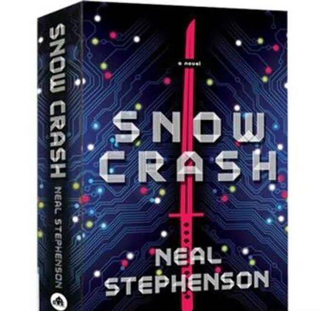
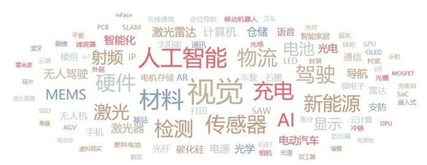
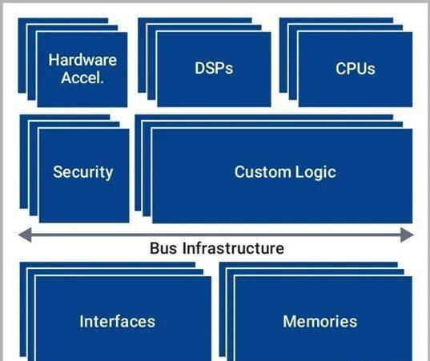
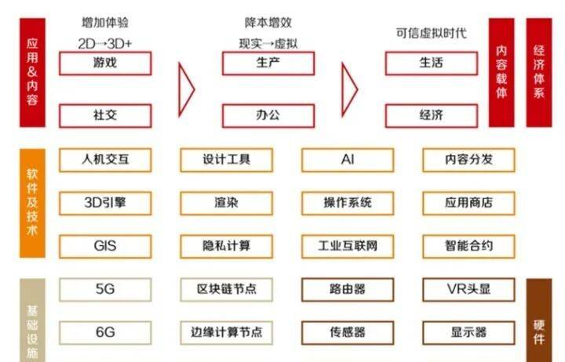
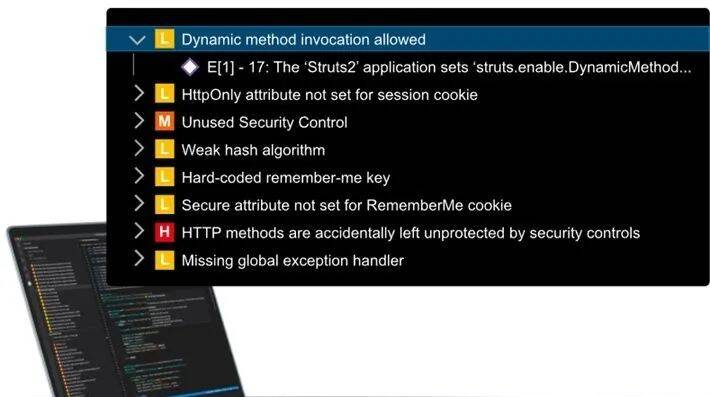

# 为什么说元宇宙会是下一个技术风口？实现需要哪些技术突破？

**1、什么是元宇宙？**

如果说近年科技领域最热门的探索方向，那么非元宇宙莫属，去年也被认为是元宇宙的元年。元宇宙一词最早出现在1992年的科幻小说《雪崩》中，一直以来，元宇宙类似的概念不断出现在各种影视剧中，但一直没有明确的定义，直到最近，科技公司纷纷入局元宇宙，才有了一个初步的雏形。

元宇宙是整合5G、AR／VR等多种前沿技术而产生的新型虚实相融的互联网应用和社会形态。将虚拟世界与现实世界在经济系统、社交系统、身份系统上密切融合，并且允许每个用户进行内容生产和世界编辑。

短期来看，元宇宙或许只是资本的游戏，离我们普通人很遥远，但在当前互联网平台形态已经内卷化的今天，元宇宙的发展是必然。未来的人们也一定会像今天沉迷直播购物和游戏一样，沉迷元宇宙给我们生活带来的巨大改变。

**2**

**为什么说元宇宙会成为下一个技术风口？**

新的技术风口是需要多种因素共同促成的，而元宇宙已经开始具备了初级阶段的基本条件。

**从技术的角度看**

看看2021年的科技热词图吧！包括芯片、5G、物联网、云计算、AI、脑机接口、机器视觉、区块链……而元宇宙几乎融合了现阶段科技的热门方向，作为芯片行业的从业者，我坚信芯片一定会为元宇宙提供硬件实现的基础。

所有的新兴科技产品都是由前沿技术推动的，新技术的发明一定会带来新的产品变革，越来越强大的芯片为元宇宙提供算力支撑，物联网技术为元宇宙万物链接及虚实共生提供可靠技术保障，交互技术为元宇宙用户提供沉浸式虚拟现实体验等。

**从用户角度看**

当前的互联网模式发展已经遇到了瓶颈。高清视频、电子游戏、移动支付等已经满足不了人们的新期待，甚至很多人因为玩太多的手机导致手指腱鞘炎。而沉浸式的体验、社交、游戏，可多人协作的开放式可编辑的世界，无疑颠覆当前的互联网形态，也极具科幻力，必将引爆市场。如果说技术是元宇宙发展的内因，那么市场则是外因。

**从资本的角度看**

资本一定是趋利的。短期来看，不乏一部分人利用元宇宙的概念在套利，但长期来看，资本也一定不会离开元宇宙，原因无他，只因为元宇宙具备巨大的商业潜能。沉浸式的游戏体验、在虚拟空间协同办公、场景化的社交、线上聚会和购物，这不正是人们所设想的未来吗？

**3**

**需要哪些技术突破**

对用户来说，元宇宙一个重要的入口就是AR和VR。

AR眼镜和头盔已经出现了好多年了，几年前我就想买一个玩玩，但AR当时并不成熟，体验比较差。直到今天VR／AR也未能大规模普及开来。所以，VR和AR设备在用户群体渗透率不足的问题，会限制元宇宙的发展。提高VR／AR设备的表现，成为技术突破的要点。

AR／VR可穿戴设备的核心硬件支撑是SoC芯片，包含图像处理、任务处理，通信控制、功耗控制等。强大的SoC芯片，会是提高VR／AR可穿戴设备体验的保障。SoC芯片设计一个重要的实现方式就是模块化再集成，就像搭积木一样。比如有些IC设计公司提供成熟高性能的IP，节省了芯片设计的成本，降低了难度。相信可穿戴设备芯片这一块假以时日，实现突破是没有问题的。另一方面，就依靠各大入局互联网公司为AR／VR提供更多的、可适配的应用了。

从元宇宙的架构搭建来看，所涉及的数据相比移动互联网则是呈指数级的上升。

元宇宙的底层由基础设施与终端硬件设备组成，包括但不限于：区块链、5G、6G、游戏渲染、画面渲染、云计算、AI、操作系统、工业互联网、DPU；从用户端来看包括路由器、传感器、芯片、VR 头显、显示器、脑机接口等。

从以上分析来看，5G、6G以及路由器对通信芯片提出了更高的要求，复杂的硬件组合以及庞大的系统需要更强的CPU，游戏渲染、画面渲染需要GPU提供强大算力，尤其是元宇宙未来的图像全部都是3D的，对算力的要求也是呈指数级上升，必须有强大的芯片来支撑。在目前以二值逻辑为运算基础的硅基芯片中，EDA的智能设计优化、X86和ARM阵营芯片架构的更新、还有台积电三星工艺的进步都能让芯片在性能，面积和功耗方面取得可观的进步！

元宇宙所建立的虚拟世界固然美好，但隐私和安全非常重要。个人的信息、社会关系、财产的安全都面临着风险，对公司来说也同样如此。所以在软硬件开发层面、元宇宙实现全方面应该考虑在软件开发的整个周期中建立可靠的安全措施。举个例子，新思科技的Code Sight集成开发环境可以快速而准确地检测到代码中的安全缺陷，当发现安全问题时，Code Sight会准确地显示哪些代码需要更改，通常只需单击一下，它就可以自动修复安全问题。

元宇宙不是游戏，也不是虚拟世界，所以不代表着逃避现实与沉迷游戏。元宇宙仍是一个不断发展且不断丰富其自身内涵的概念。元宇宙的未来充满着不确定性，但技术的演进将成为元宇宙时代的确定性趋势。网络的速度会越来越快、芯片的算力会越来越强、AI也将变得更有效率。元宇宙的为社会带来新的发展形态，物理世界与数字世界的进一步融合必将在未来几十年改变人类的工作和生活。
