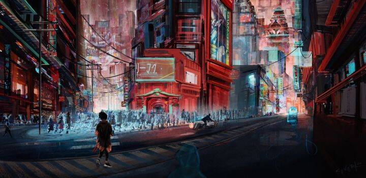
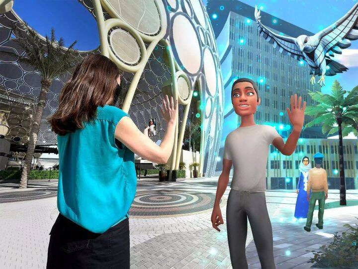

# 元宇宙不就是虚拟世界么？为啥换了个名字就变得这么火?

元宇宙的英文是Metaverse，这是个合成词，前缀「Meta」（也就是Facebook集团的现有名）词义是「Beyond」，后缀「verse」是「Universe」的缩写，直译「Universe Beyond」，不过在目前的语境里一般用来特指**完全沉浸式**的、和**现实世界并行**，**可交互的**的**虚拟环境**。

所以就这个问题而言，严格意义上，元宇宙应该属于「虚拟世界」的一个子集，因为它要求这个虚拟世界与现实**并行**，**完全沉浸**，**可交互，（或者世界具备唯一性）**这四项基本特征，从另一方面，它也需要基于此诞生相应的「数字文化」。所以完整的「元宇宙」愿景在短期内是完全不能实现的，而半成品「虚拟世界」已经有了很多实现实例。它们的区别可以从「虚拟世界」的演进看出来。

1. 「虚拟世界」的六个发展阶段「虚拟世界」其实是一个大而泛的定义，如果回顾历史，「虚拟世界」经历了六个发展阶段：
 
**Step 1 [文字]** : 多用户地下城（multi-user dungeons，MUDs），这是一种多人即时虚拟类游戏，通常以文字描述为基础，所构建的虚拟世界也大多以幻想为背景，和现实世界的时间不并行。这时候，与其说MUD是一种虚拟世界，不如说它是一种多用户共享的**幻觉**，很多人以共享幻觉为基础探索并不明确的「虚拟空间」。

 **Step 2 [2D]** : 1984年左右，卢卡斯影业曾经推出了一款叫做Habitat的电子游戏，中文译名栖息地，它是一个图形化的MUD，被认为是现代 MMORPG 先驱。每个玩家在栖息地拥有自己的角色，可以和周围的用户互动，交流。栖息地甚至还有自己的法律规范，所有用户当时通过调制解调器和电话线路连入栖息地，**这是2D版本的「虚拟空间」**。

 **Step 3 [3D]** : 1990年左右，随着图像技术不断发展，可视化也正在从2D到2.5D，再到3D逐渐进化。1996年，OnLive!Traveler出现，这是一个 3D 聊天程序，允许用户通过拨号连接进行实时语音聊天，这在当时是革命性的。每个用户拥有一个3D替身（120-350 个多边形，而离其他人越近，声音越清晰。当时世界上出现了很多OnLive!Traveler服务器，甚至不同服务器内部有不同的社交规则，**这是3D版本的「虚拟空间」，但是在这个版本里，受限于资源，玩家并不能和环境交互**。

 **Step 4 3D 可交互世界 + 虚拟经济体系** : 2009年，Avatar Reality发布了名为 Blue Mars的3D虚拟世界平台，当时很多人都拿它和游戏第二人生做对比，因为用户可以在其上自定义（**创造**）环境内容，从而和环境开放交互。Blue Mars甚至有一套虚拟经济系统，用户们拥有公民身份和财产权，甚至可以用货币来**购物和租赁世界里的地段**，这就是之前很多人说的「赛博地主」的由来，**人与环境的交互催生出一套新的经济系统**。
 
  **Step 5 3D 可交互世界 + 开源虚拟世界**：代表作是Solipsis, OpenSimulator等，他们的主要特征是以**去中心化**开发，和**服务器与客户端**的解耦，正是因为去中心化，保证了虚拟资产在特定领域的唯一性，也正因为没有中心管理者（中心服务器），而且**代码开源**，从技术上来讲，**这个世界就可以被认为属于所有维护者**，用户在该世界中是自由的，随着维护者群体越大，虚拟世界的资产就会越安全。
  **Step 6 XR可交互世界 + 虚拟经济体系**: Facebook所期待的Metaverse，其实更偏向于Step 1 - 5的虚拟世界的内在特征再加上虚拟现实或者增强现实所带来的真实感体验，从而吸引用户在这个世界里开展社交，这也正是Facebook的传统强项。
 
 
 
2. 「元宇宙」 是「虚拟世界」的子集我们在过去的很多「虚拟世界」项目里都可以很容易观察到一个现象：虽然包括「第二人生」在内的3D虚拟世界项目非常多样，但它们大都会经历一个共同的，从崛起到衰落的过程：在进入世界的不长时间内，这些「虚拟世界」的居民都会逐渐**离开**，把这个现象归因于3D技术的沉浸感不够，从而认为可以构建「元宇宙」的虚拟世界需要满足这几个特征：**真实感和沉浸感** ： 这个虚拟世界需要足够真实，让世界居民可以「某种程度上」模糊虚幻和现实的边界；**泛在性和唯一性**：这个虚拟世界需要保证用户在大多情况下都能够接入，并且从现实世界到这个虚拟世界的映射（在需要的时候）应当具备唯一性，这样可以使虚拟资产具有稀缺性；**互操作性**：这个虚拟世界需要标准化，来保证和其它虚拟世界的交互性，保证数字资产可以互换，以及用户和世界本身的互动（比如创造和毁灭）。**伸缩性**：承载虚拟世界的计算资源需要按需取用，当然，目前这部分资源云计算就可以满足。

    《Snow Crash》中的元宇宙，图片来自网络而另一种人把未来的元宇宙当做是很多个虚拟世界的合集，XR等虚拟/增强现实技术只是元宇宙的一种显示方式，用户可以通过文字、2D、3D等等客户端接入，从不同的显示层面使用「持久存在的虚拟空间」，甚至可以「部分」把虚拟世界的投影通过AR映射到现实。说到这里有一个有趣的例子，2020 年迪拜世博会搭建了一个**占地 4.38 平方公里，包括 192 个独特的国家馆的「增强现实区域」**，通过利用GPS完成的AR云锚定（AR Cloud Anchor），让所有来到这个区域，拥有Anroid手机的用户都可以通过手机内置的AR服务，体验一个崭新的数字世界。虽然这种人工搭建的数字世界还不支持用户本身进入，但是依然可以看到这类「元宇宙」愿景的雏形。
     

 3. 一个错误理解--XR 并不等同于 「沉浸感」如果在当前语境下讨论元宇宙，很多人会直接想到Facebook，会想到他们的「元宇宙社交」，会想到他们基于Oculus开发的VR世界Horizon World。正因此，很多人默认追随扎克伯格的思路--只有当你在 VR、AR 中，头上绑着一个XR头盔或者眼镜，才能真正沉浸于数字现实里，而元宇宙需要的「真实感和沉浸感」（我们在上一节里提到过）只能通过XR来解决。这个想法其实有误。简单来说，一个虚拟世界的「沉浸感」主要来自**用户对这个世界的心理和情感投入，这种投入会让用户模糊虚拟和现实的边界**。XR确实**有望**提供超越3D技术的「真实感」，让用户拥有360度视野和自由的感官，但在「沉浸感」这个命题下，技术其实只起到一部分作用，而**更多的是给用户足够「自由度」之后，所繁衍生息的「衍生艺术」和「数字文化」才是用户长期居住的理由。**在可见的未来里，我们都不可能创造出足够以假乱真的虚幻世界，一味增强现实细节或许不是提升「沉浸感」的最佳途径。这里有一个最直接的例子，「我的世界」。

      在我的世界里，其实并没有用到XR等等虚拟现实技术，视觉展现也仅仅使用3D+方块的形式进行表达，从表现力这个角度上来说，「虚拟世界」本身和我们现在所处的真实相距甚远，但是这并不妨碍它成为目前「沉浸感」最强的虚拟世界之一，截至2021年5月，《我的世界》拥有2.38亿销量，1.4亿月活跃用户，这个活跃人数甚至超过了世界上大多数国家。而《我的世界》也不需要任何昂贵硬件，它可以在老旧的电脑，甚至是树莓派上运行，任何人都能够以极低的成本（25美元）接入，创造自己的服务器并且畅游。可以说除了数字资产的唯一性，《我的世界》具备其它所有的元宇宙特征。那它是元宇宙吗？这其实是个好问题，有的人觉得是，有的人觉得不是。当然，我在这里并不是在否定XR和元宇宙的关系，只是在说虚拟世界的沉浸感并不来自于更先进的技术，当然，如果有更先进的技术，它确实可以提高沉浸感的上限。从目前来看，用Facebook的话来说，XR的现状和沉浸感上限依然有很长一段路要走。我们或许更应该关心，在十年以内XR技术能否走完它该走的路（简易的创造工具箱，极高的拟真自由度等额定）。

     ![v2-90c1aef3259bfc26165a014202e42840_720w]v2-90c1aef3259bfc26165a014202e42840_720w.jpg)

 4. 泛在和唯一---现实世界中人类的两大特点是否能在元宇宙中继承？其实如果回顾网上元宇宙支持者的言论，就会发现大家的普遍愿景是希望构建一个和现实世界并行的虚幻世界。这个虚幻世界既有可能大而唯一的，也有可能是很多个虚拟世界集合在一起。那如果我们需要在这里考虑现实世界的一些特点作为对比。首先，现实世界对每个人来说都是无处不在的，因为我们身处其中。我们每天呼吸空气，衣食住行，观看电视电影，探亲访友，这些都是在与世界的一部分交互，这些所有交互集合起来构成了我们认知中，**世界的「真实性」---**世界对我们来说总是是泛在的，也是可以互动的，虽然说有的互动可能并不友好，比如往墙上打一拳受伤的其实是自己，但是世界中的所有元素都可以使用。
     而对现实世界中的每个人来说，「自己」在这个世界中却又是唯一的，因为我们始终需要声明对这个世界某一部分物品的所有权。这其实要求，如果真的有「元宇宙」存在，它将具有两个方面特点，可以随时随地接入，拥有声明虚拟物品使用权的公信力。鉴于目前AR已经广泛在手机上边部署，所以在可见的将来，我们或许并不需要过于担心XR设备是不是足够多，但不论如何，用户们同样会一直期待通过比如网页，文字，或者3D等等不同设备，**在任何时间，任何地点都接入这样的一个「元宇宙」**，并且相信「元宇宙」的建造者不会依靠权利牟利。这对目前的来信息基础设施来说，无疑是一个非常巨大的挑战，在近期其实并无太大实现可能。

     

  5. 如果真的存在元宇宙，那它需要什么样的计算资源支持？首先，从架构上来说，云-端架构最适合元宇宙应用，而一些需要保证唯一性的实体可以放在云上或者区块链上，来保证用户访问的一致性。为了保证同时在线人数，以及用户体验上的统一，基于虚拟世界的地理位置划分区域是目前比如「第二人生」所采用的区域划分方式。但是，这种方法其实并不一定适合一个丰富的元宇宙。如果我们考虑每个区域实体，其实包含两类: **用户和该区域内可交互对象**。
       但是虚拟世界不同于常见在线的游戏服务器，各个区域内可交互对象数目，和渲染的细节程度很有可能被不同。**当一个区域内可交互对象个数提升，因为单个服务器的计算资源是有限的，同时支持的在线用户数据会随之降低**。而当一个角色进行跨区域活动的时候，会消耗大量额外资源。那么，另一种方式是**对单个世界内不同的交互对象或者服务**使用不同服务器，这些子系统分离可以在一定程度上减轻了某些区域的负载，但系统间协同依然会存在比较严重的问题。从计算机系统来说，如果能够成功把用户相关的服务和虚拟空间相关的服务分离为两个不同的维度，将用户状态和环境内可交互对象状态分离，就有望成功解离服务，进一步节省资源。所以，在计算资源的扩展性在这一点上，目前还没有任何可行，稳定，并且能够被广泛使用的参考实现，Google的世博园项目和「我的世界」所采用的架构与我们现在讨论的「可稳定伸缩」的「大范围虚拟世界」并不相同，所以不具备足够的参考价值。

       

  6. 从现在的虚拟世界到未来的元宇宙，我们还需要走多远？虚拟世界并非一个突然而来的事物，事实上它已经稳定发展了很多年，在过去的三十年里，从基于文本的MUDs到3D虚拟世界已经取得了相当大的进展。如果我们在30年前想这件事，这些先进的虚拟世界只会存在于文学想象中。目前引起大范围关注的「元宇宙」，确实是虚拟世界的一种，但是从概念上来说更偏向于虚拟世界的一种复杂形态，它需要具备**沉浸式环境**，具有**日益逼真的XR技术**、**世界改造工具**、**标准化接口**和足够好的**数字经济规则**。
       这些特点们让「元宇宙」的成功，不仅仅依赖于技术实现，也依赖于生态和数字文化建设。如果我们从目前的虚拟世界技术发展来看，正如之前所说，一个重大挑战是 :**如何从完全独立的沉浸式环境（比如单机VR/AR，或者「我的世界」中的一个一个服务器），过渡到一个超大规模的虚拟世界集成网络，从而为人类互动和文化建立一个平行的环境。**目前来看，这个技术基础并没有办法满足。因此，我们现在即使可以实现一些虚拟世界，它也是离散且难以互通的。我们其实正在站在通往Facebook期望中的「元宇宙」的道路起点，道阻且长。

       

         **=完=**
