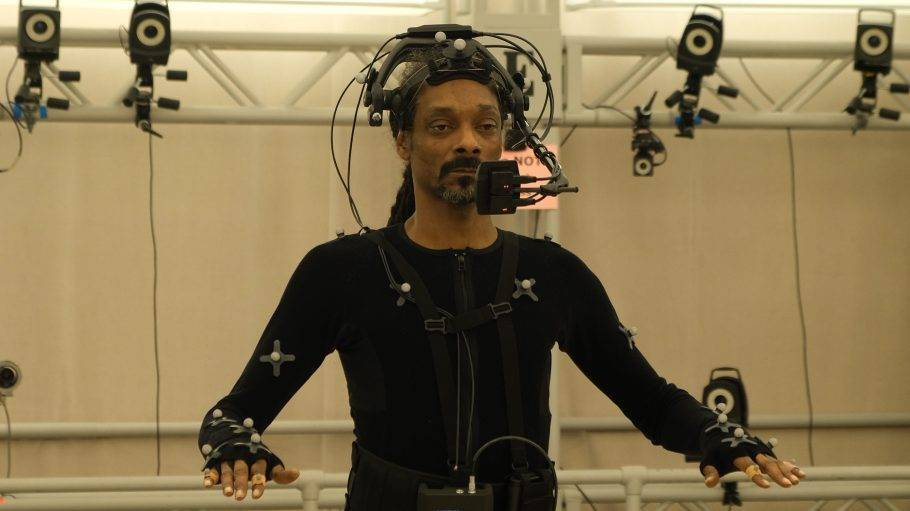
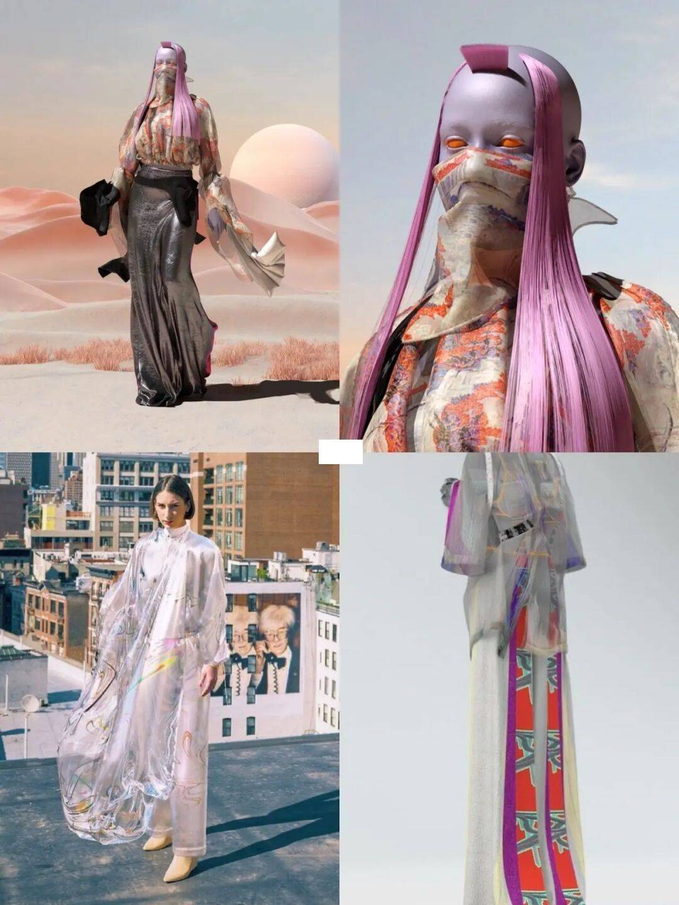

# NFT中国：巴黎时装学院在元宇宙中开设“时装虚拟化”课程 

NFTCN海外讯：巴黎时装学院正与 Stage 11 合作——一家将在线音乐表演与游戏、混合现实和数字收藏品相结合的科技初创公司——**以电影的形式将他们的数字创作带入生活，该电影计划在下一届巴黎时装周期间首次亮相。**

“鉴于虚拟化技术对时装产品的设计和分销过程的影响，法国时装学院希望通过创建一个新的‘时装虚拟化’课程，在自愿的基础上向硕士生开放，以加强其在该领域的教学；

”学校院长 Xavier Romatet 说：

> “我希望通过我们的合作伙伴关系，为我们的设计专业学生提供一种具体的可能性，让他们可以在虚拟对象上工作，以便为未来的世界做好准备。”

来自 IFM 的 Master Accessories 项目的 14 名学生将制作 5 种实体配件和一种数字配件，Stage 11 专家将在那里指导和利用其高科技专业技能。

Stage11由音乐行业资深人士乔纳森·贝洛洛 (Jonathan Belolo) 创立，聚集了来自耐克公司、LVMH酩悦轩尼诗路易威登、微软和 Facebook等公司的高管，他们已经确认与 Martin Garrix、Snoop Dogg、David Guetta 和 Ne。

首批“沉浸式音乐活动和体验”将于明年初登陆数字平台。音乐驱动的故事长度约为 30 到 45 分钟。

“媒体开辟了新的艺术，”贝洛洛说，他将 Stage 11 对视频游戏技术的使用比作剧院与流行音乐融合的数百年创新。“创造者经济有可能由此产生。”

贝洛洛说：**和时尚有着千丝万缕的联系。“只要你有艺术家表演，你就可以看到他们穿着东西，所以你进入了时尚、自我表达和艺术的领域，”**

有计划在该网站上销售数字服装和配饰，Stage 11 还发现通过该平台与NFT一起销售实物商品的潜力。

贝洛洛拒绝透露姓名，**但表示他正在与各种品牌建立合作伙伴关系，所有品牌都渴望吸引涌向游戏应用程序、音乐以及协作和交互式数字格式的 Z 世代受众。**

Romatet 将 Stage 11 的合作伙伴关系描述为“我们行动的延伸，为我们的学生提供了解这个向时尚开放的新虚拟世界的钥匙。”

