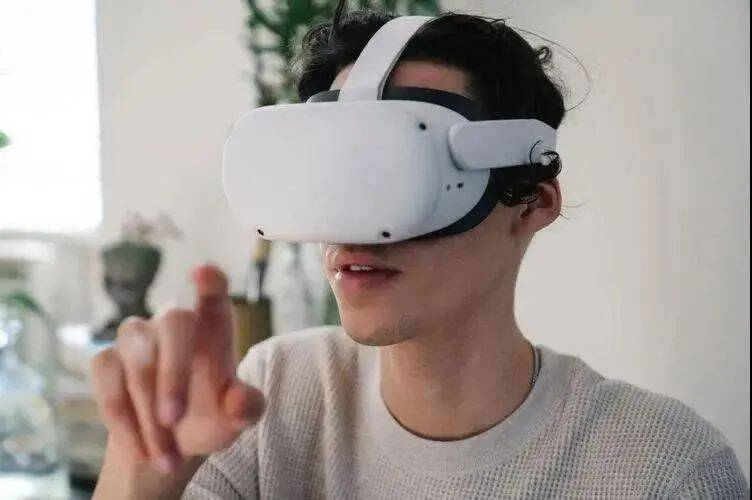
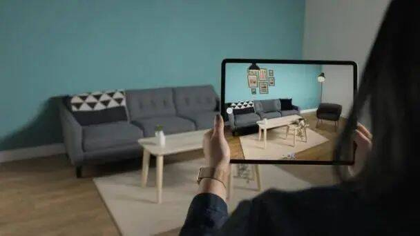
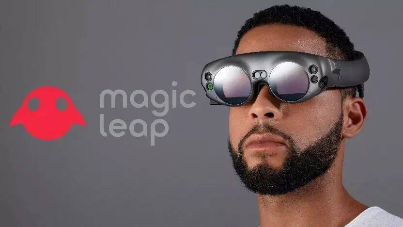

# 元宇宙和电商结合：虚拟世界该如何交互？

阿里巴巴早在2016年就推出了Buy+购物计划，本身也有在买买买当中。2021年的云栖大会上则是向大众展示了其在AR/VR领域的布局以及应用。随着科技圈刮起元宇宙风潮，阿里巴巴也在达摩院中成立了XR实验室，专门研究元宇宙相关技术。

国外有“All In”元宇宙的社交巨头Meta公司。芯片设计巨头英伟达也宣布推出工程师元宇宙平台Omniverse，且展示在元宇宙相关的强大算力。

阿里巴巴早在2016年就推出了Buy+购物计划，本身也有在买买买当中。2021年的云栖大会上则是向大众展示了其在AR/VR领域的布局以及应用。随着科技圈刮起元宇宙风潮，阿里巴巴也在达摩院中成立了XR实验室，专门研究元宇宙相关技术。

阿里巴巴Buy+购物计划2016年11月1日，淘宝的VR购物Buy+计划正式上线。阿里巴巴积蓄已久的VR购物终于正式走向消费者，同时也在VR圈内掀起了一阵热潮。Buy+是利用计算机图形系统和辅助传感器，生成可交互的三维购物环境。用户可以直接与虚拟世界中的人和物进行交互。甚至将现实生活中的场景虚拟化，成为一个可以互动的商品。 

在Buy+中曾经开放的目的地包括美国的 Macy’s 梅西百货、COSTCO （好市多）百货、Target（塔吉特）百货、日本的 Supature松本清药妆店和Tokyo Otaku Mode 周边专卖店。2021年7月，阿里巴巴更新了其Buy+技术。淘宝造物节上用HTC Vive展示的Buy+是基于PC端的3D建模虚拟购物场景。该展示更偏向于探究极致体验，对用户的硬件设备要求较高。而双11中的VR会场更偏重实战应用，只要下载了淘宝应用的用户都可以体验Buy+购物。

---

2021年10月，阿里巴巴趁着元宇宙这波风潮，在旗下的达摩院研究所中建立了XR实验室，并召集了李宏华、谭雄、施家栋在内的专家团队。XR实验室是由谭平亲自坐镇。谭平不但是3D模型和全息技术的大佬级专家，还曾任360人工智能研究院副院长。他的主攻方向是三维建模和全息技术研发。除了上述成果，XR实验室也成功研制应用于IDC机房的智能运维机器人。该机器人通过视觉、触觉融合算法，用于数据中心的巡检、换硬盘、资产盘点场景，已经在阿里云数据中心中测试运行。

面对整个行业的大浪潮，许多公司都纷纷沟通元宇宙相关产业的公司。而阿里巴巴也在默默布局自己的元宇宙，开始招兵买马。阿里巴巴直接与元宇宙领域挂钩的投资可以追溯到2016年，阿里巴巴先后参与了AR独角兽Magic Leap C轮和D轮融资。当中Magic Leap C轮融资是由阿里巴巴集团领投，投资金额达到7.935亿美元。

阿里巴巴的业务核心在于电商。目前根据已经披露的资料来看，阿里巴巴围绕淘宝、天猫等电商平台以及支付宝支付平台为主，逐渐打造自身的元宇宙平台。其根本原因在于这两大平台都为阿里巴巴聚集了大量的用户体系和内容生态体系。而在实现方面，阿里巴巴透露将分4个层级来实现。

L1：全息构建，在虚拟世界构建地图/人/物模型，并在终端硬件上进行显示，诸如现在市面上已有的VR看房等应用。实际应用：XR实验室与天猫已经合作构建了全息店铺。

L2：全息仿真，虚拟世界的人/物模拟现实世界的动态，让虚拟无限逼近真实世界，诸如现在市面上已有的VR游戏、数字孪生的应用等。目前阿里巴巴没有实际例子，但目前已经有不少公司在做虚拟人模型。

L3：虚实融合，虚拟世界的信息叠加到现实世界显示，技术本质是构建整个世界的高精度三维地图，并在这一地图上准确地实现定位、虚拟信息叠加等。实际例子：XR实验室与松美术馆合作搭建了AR艺术展。

L4：虚实联动，虚拟世界的行为可以在现实世界产生反馈，通过改变虚拟世界来改变真实世界。实际例子：XR实验室做出了一款苹果采摘机器人。XR实验室硬件及系统负责人施家栋表示：“我们可以让机器人接收来自虚拟世界的任务指令，让它到物理世界执行各种任务；也可以在执行任务过程中，为虚拟世界模型更新提供实时数据。”

---

**元宇宙+电商购物平台**

各个电商平台可以直接入驻元宇宙，在虚拟世界里建立自己的交易平台或者虚拟商城，比如京东、天猫等可以直接入驻元宇宙，形成自己在虚拟世界里的电商平台，抢占元宇宙电商平台的蓝海空间，这个电商平台是面向全世界元宇宙用户的，打开了另一个全新世界的巨大的交易空间。说不定未来，阿里的双11和京东的618都会在元宇宙的世界中同步联动了。

2021年4 月份天猫上线了一座 3D 版天猫家装城，类似于元宇宙的某种初级形态。商家可以在其中搭建属于自己的 3D 购物空间，消费者则可以在其中体验“云逛街”。为此，阿里自研了一套免费的 3D 设计工具，商家通过上传多张商品实物图，AI 就能自动生成高清货品模型，建模更为简单，消费者获得的购物体验也更好。

不仅是阿里巴巴，众多零售商都在 Roblox 和其他类似的虚拟游戏世界中探索更多的可能。Gucci 成立一百周年时，把线下的 Gucci Garden Archetypes 展览搬到了 Roblox 上，推出了为期两周的虚拟展，5 个主题展厅的内容与现实展览相互对应。在Roblox里，小型的经济体世界正在形成，玩家购买内容创作者生产的虚拟商品，让虚拟的创作实现了货币化，收益将在 Roblox 和内容创作者之间分配。据悉，顶级创作者每年的最高收入已经超过 100 万美元——以现实世界的现金形式。

虽然这一天的到来还很早，但有不少企业在新技术上的落地上已经迈出了脚步。宜家成功地采用增强现实技术，让客户可以使用其 Studio 应用程序设计空间。Gucci 开始销售虚拟服装，推出由创意总监 Alessandro Michele 设计的 Gucci Virtual 25 运动鞋，每双售价为 12.99 美元。美妆巨头欧莱雅打造了完整的虚拟化妆品系列。想知道新鞋适不适合自己的风格，Wanna Kicks可以进行虚拟试穿。Warby Parker 能体验不同款式的眼镜虚拟试戴的效果。

“元宇宙”概念的提出，为人类社会实现最终的数字化转型提供了新的路径，更繁荣的数字经济将不再只是想象。在新的交互式环境中，电商也会产生颠覆性的变化，全新的互动式购物体验将加流畅。

在现实生活中，你其实已经能窥见它们的身影——初音、洛天依等虚拟偶像，各大直播平台上24小时不停播的虚拟主播，以及花西子、雀巢、天猫、华为云等纷纷推出的虚拟代言人、虚拟员工，不少品牌还开始公开售卖的虚拟物品……在海外，LV、Burberry、Gucci等奢侈品品牌以及以Facebook为首的科技平台，已经围绕虚拟人、虚拟物品等进行了一系列尝试，例如，开发游戏和应用软件、展开虚拟人演唱会、售卖独一无二的NFT产品。

已经窥探到元宇宙+电商融合潜力的企业，正在加码他们在增强和混合现实方面的能力，不仅开发相关设备，也在创建用于按需消费的资产。虽然“元宇宙”的概念仍在探索阶段，但全球增强和混合现实行业正在以 54% 的复合年增长率保持增长，到 2026 年将达到 3720 亿美元。

---

**泡沫成分终成幻影？**

由于许多国外企业已加入了元宇宙的“狂欢”，不少国内企业早已坐不住了——他们要么在评估自身的发展阶段是否适合加大数字资产方面的投入，要么就已经在暗潮中行动起来。企业为什么要构建属于自己的数字资产？首先是受疫情影响，许多品牌产品物料的拍摄筹备以及线下门店的扩张不得不暂缓甚至无法实行，只能将自身的品牌价值和宣传理念诉诸于不受物理空间限制的数字资产化和虚拟人格化；由此引发的元宇宙、全真互联网等新兴概念的兴起，让品牌都想试着建构品牌数字化标签，当然也不乏会有“借热度”的考量，以提升当下的品牌影响力。

再次回到虚拟人这个主题——它们本质上是元宇宙最表面也是最底层的组成部分，却也是目前离消费者最近的产品。但不能否认的是，随着技术的进步和观念的发展，许多以前只出现在科幻片中的场景正在一步步走进人们的现实生活，下一代互联网已经近在咫尺了。元宇宙不应该只是游戏性的、娱乐性的，虚拟人也不应该只是一张漂亮的皮。更加智能化的虚拟人应该穿梭在更多现实的场景里。

不管这样的时代应当被叫作元宇宙还是全真互联网，亦或是别的什么名字，这样的未来并不遥远。如果一个新兴赛道或者一个新行业出现，起初阶段，掌握了流量资源的一方，一定会先树立标杆，把流量和曝光度集中到头部身上，让大家知道做这行有前途，但到了后期阶段，平台要做规模，就会拿出相对普惠的机制。

网红流量聚合再分散，网红主播们也走到了十字路，是整个直播带货行业“去KOL化”。此外，主播们的问题还没解决好，迅速崛起的元宇宙也成为关键变量之一。高质量的内容、日趋成熟的技术、不会翻车的主播再加上元宇宙的概念等等，抖音、B站上的虚拟主播已经逐渐升温。

社交，与用户高频交互，强化情感连接；娱乐，多重玩法，为品牌吸引流量；服务，提供附加价值，长期运营的重要支点，这都能帮助品牌更深入地向用户种草虚拟形象，占领用户心智。

虽然目前元宇宙还处于概念阶段，但从技术角度来看，一旦实现，对主播的颠覆速度会非常快，当虚拟偶像们活跃在直播间时，目前直播行业过度依赖人的种种弊端也会迎刃而解。
