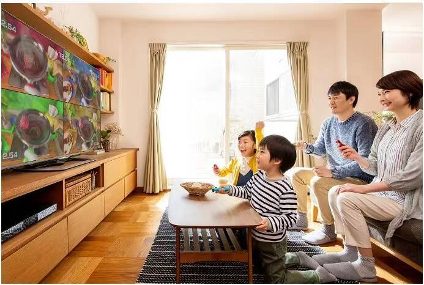

# 又一只元宇宙概念股来了，精密制造商致尚科技冲刺创业板！

A股或将又迎来一只元宇宙概念股。

深圳市致尚科技股份有限公司（下称“致尚科技”）创业板IPO正处于上会前夕。本次公司拟融资13.02亿元，公开发行股票不超过3217.03万股，保荐机构为五矿证券。

公开资料显示，致尚科技2009年成立于深圳，专注于精密电子零部件的研发和制造，公司目前产品形成以游戏机、VR/AR 设备的精密零部件为核心，以电子连接器、光纤连接器为重要构成的布局，并在2021年获得深圳市“专精特新”企业认定。

**元宇宙业务突出，供应商地位稳定**

致尚科技的精准定位控制器(Joy-stick)在2020年通过 Facebook（现更名为Meta） 认证，用于 Facebook旗下 Oculus 品牌 VR/AR 产品的控制手柄，并于当年12月开始实现批量供货。

精准定位控制器是 VR/AR 相关产品控制手柄的核心器件，使用频率高、易磨损且对产品灵敏度要求极高，而致尚科技的精准定位控制器显著改善了产品漂移问题，并已在国内及日本取得专利授权，具有2000万次以上使用寿命。

Oculus被Facebook视作通往元宇宙的重要桥梁。IDC最新报告显示，2021年全球VR头显出货量破千万，Oculus份额达80%。这意味着，致尚科技登陆创业板后，将成为A股的又一只元宇宙概念股。

根据市场机构预测，未来三年全球VR/AR市场规模将保持90%的增长速度，而国内市场规模增速亦将达到40%以上。

此外，致尚科技也一边在开拓国内 VR/AR 市场，目前已收到字节跳动精准定位控制器产品开发需求，相关产品将应用于字节跳动旗下Pico系列产品。

致尚科技的另一主要产品是滑轨，招股书显示，公司为日本知名企业N公司旗下游戏机（Switch）主流型号产品生产左右两套滑轨，分为公端和母端，分别位于手柄与主机，起到结构连接、电路及信号传输作用。据推断，N公司即为游戏巨头任天堂。 

尽管作为世界三大主机厂之一的游戏公司，任天堂对元宇宙的态度显得有些低调，但事实上，任天堂堪称元宇宙的鼻祖。如今任天堂的很多产品，和元宇宙概念极为接近。比如风靡一时的《动物森友会》，玩家可以完全按照自己想法建房、买卖、社交及创业。拥有丰富内容、IP的任天堂注定是元宇宙天生的重要参与者。

相较于其他消费电子行业，全球游戏主机市场则更加集中，主要产品市场被任天堂、索尼和微软等三家垄断。其中下游市场高度集中且任天堂市场占有率最高。根据 New Zoo预测，预计未来三年全球游戏主机产业将保持稳定增长，预计2022年全球游戏主机市场规模将达到608亿美元。

报告期内（2019年-2021年），致尚科技的营收分别为4.62亿元、4.99亿元和6.15亿元，复合增长率为15.34%；净利润分别为3464.73 万元、6258.26 万元和 9190.27万元，复合增长率为62.87%。

其中，包括精准定位控制器和滑轨在内的公司游戏机零部件产品整体收入不断增长，这两项业务都与元宇宙紧密相关，成为了公司主营业务收入主要来源。2021年，其游戏机零部件营收4.13亿元，占比67.71%。

值得一提的是，任天堂对其供应链上游企业实施严格的合格供应商管理制度，供应链内企业需通过其合格供应商认证后，才能进入其供应链。同时，除对供应商进行认证外， 针对重要零部件产品，任天堂还会进行单独的检验或认证，公司最新一代游戏机（Switch）滑轨产品初次认证导入周期共16个月。

合格供应商主体及产品的“双重认证”对新进入者形成了较高的“认证壁垒”，意味着一定程度上保障了现有供应商的盈利水平。

同样，Facebook也是执行严格的合格供应商管理制度，除非发生重大质量或交期问题，一般不会轻易改变已经使用且质量稳定的产品，也不会轻易放弃与现有供应商的合作关系。

**与富士康长期合作，客户集中度较高具有行业普遍性**

致尚科技的终端客户主要为任天堂、索尼、Facebook等品牌商，直接客户主要为富士康、歌尔股份等制造服务企业，公司生产的精密零部件产品通过富士康及歌尔股份等集成其他功能件后形成整机产品，并最终配套供应终端客户。

据了解，由于电子产品终端品牌商及制造服务商的高度集中，致使电子产品零部件领域的生产企业销售客户往往会呈现出相对集中的情况。这个情况在致尚科技身上也有所体现。

报告期内，致尚科技的前五大客户合计销售额占营业收入的比重分别为 82.00%、 78.38%和 82.48%，其中对富士康的销售收入占营业收入的比重分别为 42.18%、 67.52%和 64.40%。

富士康为全球第一的电子制造服务企业，市场占有率超过全球四成。致尚科技与富士康交易的主要产品以通过终端品牌客户检验或认证为前提。 

不难发现，致尚科技所处行业下游客户集中度高符合行业特性，具有行业普遍性。

而且，致尚科技自2011年起即与富士康开展业务，于2014年起持续为富士康提供iPad、iPhone 等多种产品精密结构件开发，具有长期稳定的合作关系。

容成会计师事务所（特殊普通合伙）在回复深交所的问询函中称，双方交易规模不断扩大，交易产品种类持续丰富，且在手订单充足，双方的合作不存在重大不确定性。

电子元器件行业产品具有“定制化”的特点，且生产涉及工艺流程较多，因此具有较强的自动化设计及生产能力，有助于行业内企业建立起稳定、可持续的

供货能力，从而在拓展市场、获取新客户中获得一定的优势。

不同于 OEM 加工厂商半自动化产线设计，滑轨产线建设之初，致尚科技即坚持采用从进料到加工组装的全自动化生产设计。

整体来看，致尚科技通过围绕行业“痛点”及技术难点，持续进行研发投入，在产品设计、模具加工、自动化设备研发等方面取得较明显的技术成果，满足了终端客户需求，构建起公司核心竞争力。公司产品也陆续通过任天堂、索尼、Facebook 及 SENKO 等国际知名企业认证。
