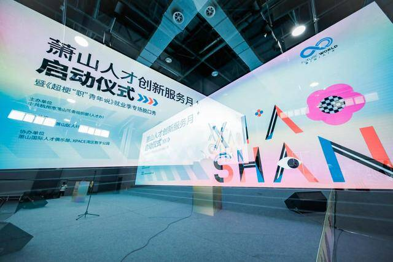
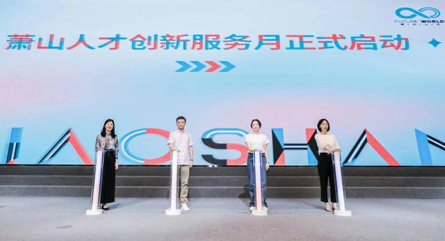
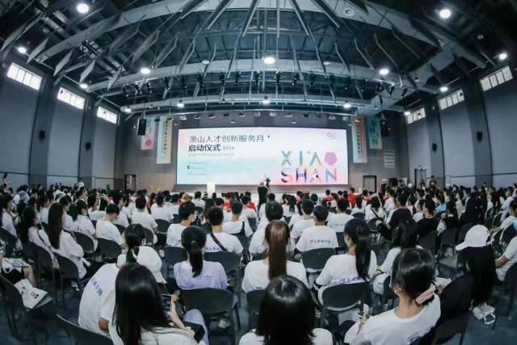
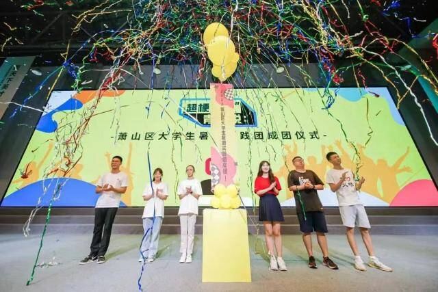

# 人才生态玩起“元宇宙” 萧山人才创新服务月启动

7月16日，萧山湾区数字公园ENIAC路演中心，400份“萧山人才创新服务月”数字纪念藏品成了“硬通货”。

它由萧山区委组织部（人才办）与宇盒数字藏品平台VerseBox联合首发，属“人才服务生态”类数字藏品。萧山人才创新服务月期间，只要出示该数字藏品，就可享受一揽子人才服务，包括篮球、桌球等运动项目、湘湖夜游等。

人才创新服务月启动仪式上，宇盒数字藏品平台、杭州宇链科技CEO&创始人罗骁现身说法，宇盒VerseBox通过区块链技术构建元宇宙生态体系，为实体经济赋能。“此次用区块链技术赋能人才创新服务生态，也是一种新尝试，通过‘线上线下’结合，为人才服务打开了一种崭新模式，将更有效维系人才用户生态。”

现场，知衣科技创始人兼CEO郑泽宇和一知智能总经理陈哲乾也分享了他们的“萧山故事”——成长在萧山，全国化布局，前者将人工智能和数据挖掘领域的前沿技术转化为服装行业生产力，重新定义了万亿级的服装行业。后者则致力于成长为全球最大的AI数字员工提供商之一。郑泽宇感慨到，“萧山以创业者的激情招引项目和人才，让我们十分感动。”

近年来，萧山大力引进西电杭州研究院、浙江大学杭州国际科创中心等高能级创新平台，大力实施金梧桐人才安居计划，打造人才生态最优区。特别在创投领域，萧山将设立规模100亿的产业引导基金，重点扶持集成电路、生物医药和人工智能等战略性新兴产业。

同宇链、知衣、一知智能等准独角兽企业一样，杭州市大学生潮创季系列活动之萧山首届人才创新服务月也打开了专属“魔盒”。为期两个月的服务月期间，围绕惠才助才、青年人才夏游、大学生暑期实践等三大主题计划，开展就业市集、人才服务系列交流会、网易云音乐露营计划等十余场活动。

特别值得一提的，还有两场创业创新决赛。将于7月29日至8月2日举行的“华为杯”第五届中国研究生创“芯”大赛决赛，将有151支全国顶尖高校师生团队集聚萧山，围绕集成电路设计、半导体器件与工艺、EDA算法与工具设计三大方向展开冠军争夺。“萧傲江湖”首届青年创业创新大赛是萧山青年创新创业的第一个品牌，将揭晓大赛总冠军“领潮者”并签约落地项目。

活动现场，“才聚云萧”大学生一站式服务平台也正式发布，让青年人才与萧山共成长。
