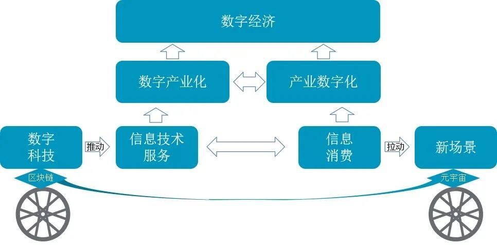
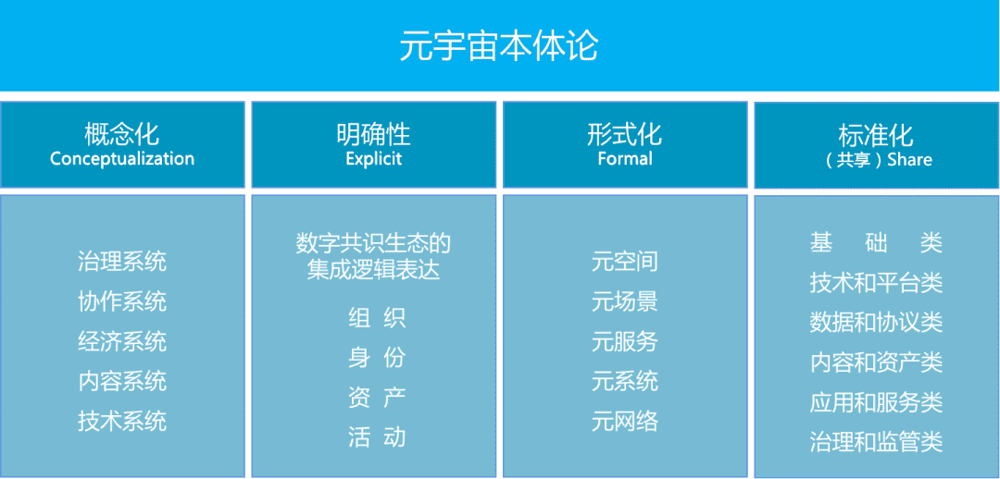
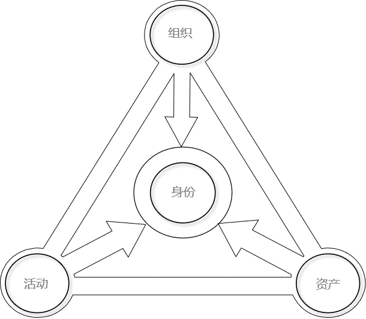

# 元宇宙是以区块链为核心的Web3.0数字生态

# 元宇宙是以区块链为核心的Web3.0数字生态

元宇宙的说法众说纷纭，技术、应用、资产、服务、产业、生态和哲学等不同层次的定义混杂，严重影响业界对元宇宙的认识。本体论是科技哲学的重要理论，是在科技发展初期解释科技发现的有效方法。通过本体论可以从不同视角调查、分析和研究事物的现象、范例及其相互关系，帮助提炼科技发现本质的定义、知识、要素及其内在逻辑结构，并用数学方式将知识固化形成科技范式，通过计算机相关技术和标准化方式呈现。元宇宙刚刚出现，需要用系统分析的方法明确外延、内涵和核心要素，从而统一产业共识，降低产业沟通成本，加速推动元宇宙产业支撑数字经济高质量发展。

**一 元宇宙是数字经济的新引擎**

数字经济是以数据资源为关键要素，以数字科技为支撑的经济形态。数字产业化和产业数字化是数字经济中的重点内容，数字产业化主要是推动数字科技形成规模化产业，产业数字化主要是利用数字科技支撑和推动传统产业转型升级。在这个过程中可以基于区块链等数字科技推动信息技术服务加速数字产业化，依托元宇宙的新场景拉动信息消费促进产业数字化。

**1、国家战略为数字经济发展注入强劲新动力**

2021年3月14日，《中华人民共和国国民经济和社会发展第十四个五年规划和2035年远景目标纲要》正式发布，在第十五章打造数字经济新优势的第二节和第三节分别提出“加快推动数字产业化”和“推进产业数字化转型”，并将区块链与云计算、大数据等新一代信息技术列为数字经济重点产业。2021年12月12日国务院印发《“十四五”数字经济发展规划》，在第五章和第六章分别提出“大力推进产业数字化转型”和“加快推动数字产业化”，并将区块链作为加快推动数字产业化和增强关键技术创新能力的重点方向之一。国家战略不仅明确了数字经济的发展目标，也指出了数字经济的发展方向，并给出了数字产业化和产业数字化的发展路径。同时，也明确了区块链在数字经济中推动数字产业化的战略作用。元宇宙的出现为产业数字化带来新的消费场景和模式，将汇聚社交、娱乐、金融、教育等更多产业资源，与区块链为代表的数字科技推动数字产业化形成合力，加快培育数据要素市场、价值体系、市场规则和配置作用、完善数字经济治理体系，加速推动数字经济演进，形成数字经济新优势。

**2、区块链推动信息技术服务拓展，助力数字产业化驶入快速道**

2021年11月15日工业和信息化部印发《“十四五”软件和信息技术服务业发展规划》，其中主要任务“激发数字化发展新需求”中提出“信息消费扩大升级”，在“推动软件产业链升级”中提出“优化信息技术服务”，并多次对区块链技术和平台发展提出具体要求。

从技术视角来看，区块链已由初期的技术探索进入到平台化、组件化和集成化发展阶段。主要体现在：一是平台化推动形成城市链网。长安链、蜀信链和海河链等城市链已经纷纷出现，城市链互相联通后将形成城市链网，以支撑更大规模的应用场景。二是组件化推动形成组件服务网络。身份认证、隐私计算、智能合约等关键组件已形成独立平台，共同支撑应用创新的价值已经显现，更细分技术市场即将出现。三是集成化推动形成面向数据和多技术融合的数字科技操作系统。区块链将与大数据、云计算、人工智能等新一代信息技术深度融合，实现数据和资产价值的最大化。在平台化、组件化和集成化发展的过程中，将形成围绕区块链的数字科技体系和信息技术服务体系，更大规模的创新应用场景落地实现获得支撑，数字产业化的新格局加速形成。

从应用视角来看，区块链技术正在从大规模应用探索向业务深度融合演进，存证溯源、数据共享、供应链管理、金融服务等创新应用场景不断涌现，已在政务、金融、教育、制造等众多领域得到深入应用，在应用过程中产生新的业务形态和商业模式，形成可编程经济、分布式共享经济等创新经济生态，将促进区块链技术体系、应用体系、服务体系“螺旋式演进”，迭代式发展的局面逐步形成，区块链技术的发展将有力加速数字产业化进程。

**3、元宇宙拉动信息消费升级，促进产业数字化新格局**

2021年底，上海市经信委印发的《上海市电子信息产业发展“十四五”规划》中提到对元宇宙的产业布局。该规划提出，要加强元宇宙底层核心技术基础能力的前瞻研发，推进深化感知交互的新型终端研制和系统化的虚拟内容建设，探索行业应用。元宇宙涉及区块链、人工智能、人机交互、云计算、信息安全等多个技术领域，具有大规模协作、沉浸式、自组织、多样性、用户创造生态等特点，容纳工业制造、社交娱乐、文化旅游、社会治理、金融服务等众多场景，汇聚内容管理、身份认证、支付交易、身份认证、资产管理、模拟仿真等多种服务，为信息消费提供了新场景，是数字科技发展的一次重要的融合创新和突破，将会推动形成数据和资产要素的价值体系和市场规则，培育更多信息消费的新型市场主体，形成跨多领域、地域的价值链和产业链，催生新的信息消费模式和习惯，拉动信息消费快速增长，加速各行业产业数字化进程。

以区块链为核心的数字科技可以推动信息技术服务，从而促进数字产业化；元宇宙可以创造和创新更广泛的应用场景，拉动信息消费促进产业数字化。因此，以区块链为核心的Web3.0技术体系推动形成的元宇宙数字生态，将对数字产业化和产业数字化提供有力支撑，为数字经济高质量发展打造新引擎。

**二 元宇宙是数字共识生态的集成逻辑表达**

1997年J.Studer定义Ontology为“本体是共享概念模型的明确的形式化规范说明”，并提出本体论应包括提出Conceptualization（概念模型）、Explicit（明确）、Formal（形式化）和Share（共享）四个方面。应用本体论的方法，抽象元宇宙的现象和表现形式，明确其关键要素和内在逻辑结构，通过形式化指导工程实践过程，并用标准化构建概念集形成更大范围的共识和共享。

概念模型是从普遍性的现象研究到收敛成为知识的科学方法。从**概念模型**的视角来看，元宇宙是**技术系统、内容系统、经济系统、协作系统和治理系统**的叠加。**技术系统**的核心是**融合**，其技术体系的表现形式应具有开源开放、可编程、互联互通、可扩展、可插拔等技术特点；**内容系统**的核心是**传播**，应具有多种内容生成方式、内容呈现模式和内容运营管理等能力；**经济系统**的核心是**交换**，需要提供价值载体、交换机制、身份认证、激励机制、权益保障等能力；**协作系统**的核心是**共识**，需要支持多方协作、分布式、自组织等特性；**治理系统**的核心是**规则**，需要提供科技伦理、版权保护、内容监管和金融合规等保障。

**“明确性****”**可以依据当前的产业现象和信息抽象出元宇宙的概念和知识体系。通过分析元宇宙的相关概念，剖析元宇宙的现象和本质，可以将元宇宙的概念归纳为：**元宇宙是数字共识生态的集成逻辑表达**。**数字**是指元宇宙的核心要素一定是在数字空间中，并通过数字技术表现；**共识**是指元宇宙的产业相关方应在共治的基础上，就权利、责任和义务等重要事项达成普遍的共识。**生态**是指元宇宙需众多相关方参与，形成相互影响、相互促进的动态平衡的统一体；**集成**是指元宇宙需要通过众多技术形成集成体，以支持元宇宙生态的稳定运行；**逻辑**是指元宇宙是众多要素组合的系统，各项要素之间要有相互逻辑关系，各项要素自身也需要有内在的逻辑体系；**表达**是指元宇宙要在不同层次上都呈现出特定的表现形式，从而形成聚像的、可工程化的最佳实践。元宇宙的核心要素包括**组织、身份、资产和活动**，通过核心要素的相互作用，推动形成数字生态的集成逻辑表达的科学实践。

**形式化**需要基于计算机科学建立逻辑框架，以呈现和运行本体论中的逻辑对象及相互关系。依据计算机领域常用的形式化分层方法，元宇宙可以分为**元网络、元系统、元服务、元场景和元空间五层架构**。**元网络**包含了通信、存储、计算、网络等支撑性技术，为元宇宙提供底层基础设施；**元系统**以区块链为核心，集成大数据、云计算、人工智能、物联网、人机交互和信息安全等技术，为元服务提供系统级基础技术能力；**元服务**包括身份认证、隐私计算、环境渲染、激励机制、内容运营、支付交易、资产管理、3D引擎和模拟仿真等技术，为元场景的搭建提供支撑；**元场景**包括元宇宙在工业制造、社交娱乐、文化旅游、社会治理等方面的应用，为用户消费提供具体应用支持；**元空间**包括内容呈现、位置感知、人机互动、感官触达等环境支持，为元宇宙提供与数字空间相管理的物理空间支撑。每个元场景可以形成**次元宇宙**，多个元场景可以组成元宇宙、多个元宇宙可以组成**多元宇宙**，这其中包括跨平台或跨域的身份认证、内容交互和资产流通等问题，而区块链具有的技术特性对于这些相关问题的解决具有独特的优势。

元宇宙本体论的“共享”可以通过标准化的形式表现，标准是在科学研究和理论实践的基础上，在一定范围内经过协商一致获得的最佳秩序。元宇宙的标准可分为基础类、技术和平台类、数据和协议类、内容和资产类、应用和服务类、治理和监管类等五大类。**基础类**标准为其他标准建立共同的语言环境，包括术语、本体和分类、代码和标识、参考架构等内容。**技术和平台类**标准主要规范技术系统的分布式网络、智能计算、数据流动、信息安全和隐私保护等；数据和协议类标准主要规范数据格式、数据共享和流动、人机交互、系统兼容和互操作、跨平台身份互认等。**内容和资产类**标准主要规范内容创作工具和方法、虚拟数字呈现引擎、内容生命周期管理等，以及**资产**相关的数字资产标识、资产生命周期管理、资产交换和流通等。**应用和服务类**标准主要规范宇宙在工业制造、文化旅游、社交娱乐应用方法，以及系统功能、性能、可靠性和服务能力等产业服务等内容。**治理和监管类**标准主要包括系统和服务能力测评、数字版权保护、数字身份认证、内容监管、数字资产合规、科技伦理等内容。

**三 元宇宙是以区块链为核心的Web3.0数字生态**

尽管元宇宙不是技术词汇，但却需要复杂的底层技术逻辑支撑。其中，区块链、人工智能、数字孪生、人机交互、物联网等面向数据的新一代信息技术的演进并非偶然，而是从Web2.0向Web3.0演进的技术准备，虽然技术就绪度尚有发展的空间，但也基本完成单项技术体系的构建。以往各项技术的独立发展没有形成闭环的商业生态，是因为各项数字科技的技术特性只覆盖数字经济的一部分。比如物联网的数据采集、5G的传输、大数据的处理、人工智能的利用和区块链的保障，每项技术都只完成数据要素生命周期的一部分，需要更大、更聚焦的概念、场景和商业模式拉动新一代信息技术进一步融合，从而构建面向数字化生态的基础设施，以支撑元宇宙复杂的应用逻辑、业务创新和商业模式。因此，从技术上来看，**元宇宙是基于Web3.0技术体系和运作机制支撑下的可信数字化价值交互网络**，是以区块链为核心的Web3.0数字新生态，是推动数字产业化和产业数字化的重要手段。

区块链是用密码技术将共识确认的区块按顺序追加形成的分布式账本，具有技术、金融和社会属性。回顾区块链的发展历程，**技术属性**相关的BaaS、跨链、隐私计算、身份认证、分布式存储和计算等底层平台为金融、制造、教育、能源等行业的分布式应用提供了基础设施。**金融属性**相关的FT（同质化通证）、DeFi（分布式金融）、NFT（非同质化通证）和xFi（泛指在各个领域的金融形式）通过大量的实践探索数字化金融服务模式，同时也带来新型金融风险，需要在合规的前提下审慎发展。其中，FT在金融体系中探索了新载体的可能，利用区块链技术解决了数字环境下金融交易的双花等问题；DeFi正在尝试创新传统金融服务模式，基于分布式网络环境下的借贷、质押、交易等金融服务纷纷出现；NFT进一步在数字生态中呈现了资产的表现形式，在映射物理资产的同时，催生了大量原生数字资产，扩大了数字经济的资产规模和想象空间。GameFi（游戏金融）尝试了将NFT带入到特定的真实消费场景，SocialFi（社交金融）进一步扩大了GameFi的应用场景，在增加了数字协作活动的同时，增加了数字资产的消费空间，xFi的出现为FT和NFT提供了更多样化、个性化的娱乐和社交的信息消费场景，未来更多xFi将会出现在教育、能源、制造、旅游等产业总，这将进一步加速数字环境下的资产流通和信息消费。从**社会属性**上来看，尽管DAO模式尚无成熟业态，但却为数字环境下的协作模式提供了新的思考。元宇宙的出现正是区块链技术、金融和社会属性发展的必然趋势，其持续性、实时性、开放性、兼容性、连接性、创造性、多样性等特点将会构建更多数字场景，也将推动建立以区块链为核心的Web3.0的数字生态，在推动数字产业化的同时，促进产业数字化的发展。

正像现实的社会生态一样，组织、身份、资产和活动四项关键要素将成为促进元宇宙健康发展的核心要素，区块链的技术、金融和社会属性将帮助构建可信数字化价值交互网络。

**首先**，传统互联网平台极易产生垄断型组织形式和商业模式，无论是Web1.0的网站，还是Web2.0更大场景的内容交互，都是平台占有绝对的优势，既控制着内容传播，也控制着基于内容产生的收益。尤其是Web2.0环境下，一旦形成平台生态，就会以平台作为工具从所有相关方获取高额的收益。而Web3.0的核心观点是用户和建设者共同拥有网络。在元宇宙中可能形成用户和建设者自治的组织形式，其组织规则在符合监管的前提下由程序代码来执行，这就需要利用区块链技术达到最大范围的共识，配合监管形成元宇宙的健康生态秩序。在数字环境中，物理世界的社会角色将会在数字环境中以数字形态存在，其变革将带来深远的影响。比如在物理环境下税务局承担十分关键的社会职能，在数字环境下，虽然可以构建税务元宇宙，但其本质就是一段程序，在数字环境下的协作交易过程中自动完成税收程序。

**其次**，传统集中式身份验证模式极易产生安全威胁和隐私滥用问题，而元宇宙不仅要能与真实的身份绑定，还需要在不同应用场景、次元宇宙、元宇宙间切换，这就需要利用区块链技术建立新的分布式身份认证体系，可以在跨生态网络中保护隐私和数据安全。以虚拟数字人为例，每个元宇宙都会有独特的应用场景，但如果在每个元宇宙中都有不同的虚拟数字人将会为用户带来很大的困扰，极大增加监管的复杂度。因此，需要通过区块链建立分布式身份体系，支持虚拟数字人在不同应用场景切换，以及虚拟数字人相关的静态属性、动态属性和资产随着虚拟身份同步切换。同时，从社会学视角来看，虚拟数字人是没有人类身份的数字化的形象，带来很多使用权、运营权等问题，同时也将带来法律、伦理、资产、安全等一系列新的社会问题。区块链技术可以通过分布式账本和智能合约完成虚拟数字人的权利分配和责任制约。

**再次**，资产是物理世界和数字世界的核心要素，是促进经济循环的必要载体。在数字世界中，资产的形态可以多种多样，可以是文字、视频、音频等数据资产，也可是游戏装备、影视作品、数字藏品、数字建筑等数字资产，也可以表现为股票、证券等金融资产，这些资产都可以表现为FT和NFT。以资产为核心的元宇宙应用场景才能成为可持续发展的产业和生态，只有完成资产的确权，并进行转移、交易和流通才能形成真正的经济体系。元宇宙中的道具、装备、UGC内容都需要以区块链为核心的元系统提供注册、登记、交换、交易等功能，区块链链的技术属性将为资产提供存证和确权等支持，金融属性将为资产提供载体和表现形式，同时为基于资产的价值交换提供保障，社会属性的组织治理模式将加速数字资产在元宇宙中的交换和流通。

**最后**，元宇宙中的一切活动皆可收敛为数据，多元宇宙（元宇宙和元宇宙）之间、次元宇宙（元宇宙内不同应用）之间、元宇宙和外部设备间的数据交互过程，以及外部设备采集、存储、处理、分发、利用和处置个人行为数据的过程，都需要区块链的技术来支持。Web2.0最大的问题是平台对用户数据的垄断和消费，平台在通过眼球经济汇聚用户数据的同时，通过广告、撮合等商业模式，独享用户数据和内容产生的价值。用户在平台上贡献内容和数据时，只能获得自身的认同感和微薄的收益。数据主权及其产生价值的回归正是Web3发展的目标，通过区块链技术可以建立分布式身份认证体系，让用户的数据、内容和资产等附着于独立可控的身份链上，商业组织可以在用户的授权下获得相应的数据和内容，并支付等价的价值，从而从根本上解决Web2环境下的垄断型经济体系的问题。

综上，元宇宙数字共识生态的集成逻辑表达，是以区块链技术为核心的可信数字化价值交互网络，是基于Web3.0技术体系和运作机制支撑下的数字新场景、新产业和新生态，将会在数字环境下催生大量创新商业模式，形成数字空间新范式。当前，亟需**统一产业共识**，加强以区块链为核心的元宇宙技术体系、服务体系、经济体系和治理体系研究，明确元宇宙技术发展路径，探索元宇宙加速信息消费的商业模式；探索**技术集成方法**，破解分布式身份认证、跨生态互联互通、数字资产流通、数字内容治理等焦点问题，鼓励研发区块链、人工智能、人机交互、物联网等多技术融合的数字科技操作系统；**创新应用场景和商业模式**，推动数字环境下的智能制造、信息消费、智慧城市、文化旅游等领域的应用创新，利用新技术升级传统产业基础设施，建立工业元宇宙、城市元宇宙、金融元宇宙等创新型商业生态；**加强科技伦理治理研究**，研判隐私保护、技术歧视、算法绑架、非法集资等相关风险，制定金融服务管理、内容和资产合规监管、数字版权保护和用户在线权益保障等策略，推动形成可监督、有活力、可推广的高效治理机制。
