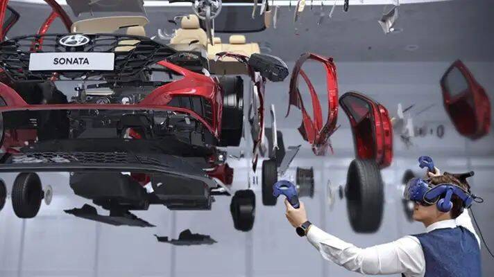
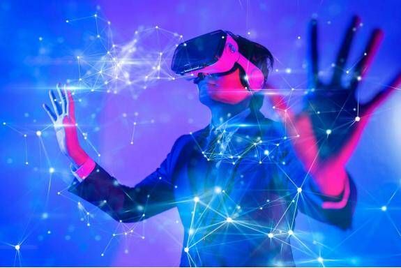

# 工业元宇宙系列：混合现实如何助力工业领域

# 产业元宇宙是各行各业的终极愿景(工业+元宇宙)

## **工业+元宇宙**

我们一起来看看全球知名的饮料企业和造车企业的做法。百威英博是全球最大的啤酒企业之一，共拥有200多家啤酒厂，15万员工。自1995年进入中国以来，百威英博已经在中国布局了50多家工厂和5000多家渠道分销商。这家企业还是各种新理念的积极实践者，他们尝鲜了各种新技术和新应用。

在百威英博构建的“元宇宙”中，融合了物理世界和数字世界中的多种元素，创造了一系列的变革性解决方案。在其中我们可以看到数字孪生、机器学习、混合现实、低代码、精准定位…多种技术的叠加，以及由这些技术和系统的构建的组合应用，在交织领域开启的全新想象力和创造力。

在生产过程中，百威英博为啤酒厂和供应链创建了一个完整的数字孪生。这套数字模型可以实时同步的反应物理环境的变化，映射出各种天然成分和酿造过程之间的复杂关系。酿酒师们可以更为精准的把握酿造过程，并且及时调整工艺。来自一线的操作员也可以根据这套系统，实时了解产品质量和状态参数，保证设备的正常运行并进行预测性维护。

在操作中，百威英博利用深度学习，帮助包装流水线的工程师，检测和修复在生产过程中的各种瓶颈问题。维修过程中，百威英博在数字孪生的基础上，叠加了混合现实应用，鼓励各种远程协作。员工在任何位置启用共享体验，促进了跨区域的有效知识共享。每个百威英博的员工都可以使用低代码方案，扩展系统中的数据，跟踪产品的生产历史以及预测未来状态。

在运输过程中，百威英博通过位置追踪和实时定位，减少供应链的碳排放。在零售端，百威英博通过在线服务，为杂货店提供定制化推荐。个性化产品的点击率提升近100%，订单转化率也提高了67%。元宇宙，让整个世界变成了百威英博的创意画布。

2022年初，韩国汽车制造企业现代汽车宣布与Unity签署合作备忘录，双方将共同构建元宇宙数字虚拟工厂，并构建全新元宇宙发展路线图和平台。Unity提供跨平台的2D和3D游戏引擎，知名的游戏包括《王者荣耀》《炉石传说》《神庙逃亡》等。利用生产创新，现代汽车希望未来可以转型成为一家智能汽车解决方案提供商。双方将共同设计元宇宙工厂Meta-Factory，如果一切顺利，现代汽车将成为全球第一家将元宇宙工厂概念引入汽车制造行业的车企。

市场研究机构IoT Analytics分析了近2500家美国上市公司在2021年第四季度的财报电话会议，其中1.7%的企业管理者提到了“元宇宙”这个关键词，比上一季度上升了338%。其中不乏知名企业。比如工业互联网企业PTC，在最近的资料和演讲中，正在使用“产业元宇宙”来替换过去的常用术语，比如AR、VR或数字孪生。PTC公司总裁兼首席执行官Jim Heppelmann在2021年11月的演讲中提到：“最近你可能听到很多关于元宇宙的声音，我猜你可能希望看到产业元宇宙的现场演示。我们将展示五种Vuforia Spatial Toolbox技术…”是否要跟进元宇宙热潮？对于这个问题，越来越多的企业给出了自己的解答。

提到工业领域的元宇宙应用，关键一步是将模型实体的结构化数据生成物理模型数据，这样三维模型与设备的数据就形成了一一对应的一张映射关系表，诸如XML、JSON等标准格式化数据结构以被工业软件领域充分利用。这时可以通过软件编程的方式控制数据表中的字面信息变量进行如机器人关节的姿态调整，电机转速的调整等。目前很多国内外工厂，则是利用数字化车间看板实现该功能，更多的是展示、监控为主。

说到这里或许还是少了一些元宇宙的味道，当然工业领域也是可以让制造升级，比如嵌入专家系统的AR系统，可以指导现场操作工人进行设备的养护、维修等工作，也可以利用5G的远程通信技术实现远程的技术支持，比如现场产线的联机调试、组装等工作，大大节约了时间、和专家成本。

而在工业元宇宙中工业数字孪生作为其关键技术之一，也是工业领域最先接触并尝试应用的一种技术，对工业企业降本增效，以及后续工业元宇宙的构建都起到至关重要的作用。

- ## **工业数字孪生的背景**

工业元宇宙中最为关键的技术是数字孪生的发展与应用，数字孪生在工业领域主要通过3D交互，数据可视化和实时仿真帮助企业降本增效。在传统工业领域，尤其是大型的先进制造企业，一般所用作生产的物联网设备价格高昂，技术复杂，维护成本较高，技术人员的整体技术素养要求高。在人员培训，设备维护，品质保障方面成本较高。而且随着设备使用年限的增加，设备损耗加剧，时常会有突发性的设备宕机或引发不易发觉的品质问题为企业带来较大的损失。人员对高精尖设备的不熟练维护效率低，不易发现的隐患问题时常导致较大损失。现如今大多数工业企业主要运用精益管理生产方法，在数字化方面的探索尤其数字化管理方面相对薄弱，而元宇宙的发展带动数字孪生AR等新兴技术的成熟及应用，为工业物联网企业带去了新的数字化管理模式。

- ## **工业数字孪生的作用**

在降低成本方面尤其针对智慧工厂，智能设备维修保养是最主要的成本，尤其设备突发故障使得产线长时间停产会导致企业重大损失，而设备的维修也是较大一部分成本。故而智慧工厂大都在推动预防性维护，旨在通过过程监控的加强，设备参数的实时监控与趋势预测来达到预防性设备维护，减少突发性宕机造成的损失，同时有计划的提前维修保养，可以提前统一采购备件，人员做好充分技术储备，在人力物力上也能降低很大成本。工业数字孪生在预防性维护中所发挥的作用主要是，将整体设备及设备所组成的各个关键部件都以3D模型可视化的方式更直观的展现在用户面前，通过将设备实时数据与模型联通，3D模型实时仿真可以提前暴露设备隐患。在维修计划阶段，技术人员也可以查看设备模型中各模块的损耗程度来制定维修计划的优先级，并且提前查看需维修模块的整体结构及技术资料确保高效率的维修。即使出现故障，也能根据设备模型的报警模块，迅速找到实际设备的损坏模块，快速维修或更换，确保生产线能及时恢复生产。

在提高效率方面，在工业领域主要有两种，一种是通过提高人员的技术素养，提高人员的维修操作效率，解决故障的能力，从而缩短停产的时间，减少由于人员失误造成的事故来降低成本，另一种是设备的优化，通过优化设备的性能参数，运动路径，在延长设备使用寿命的同时，使得设备更加符合所生产产品的工艺条件，最大程度的提升产品品质。

工业数字孪生在人员技术素养提升方面主要有帮助用户构建3D可视化的知识管理系统，随时随地的沉浸式技术培训，以及3维动画的智能助理和远程专家技术指导。其中3D可视化的知识管理系统，主要是对设备和关键部件的数字模型进行分层式技术讲解，并以动画，技术报告，语音等多种媒体方式传达该部件的作用，维修方法，注意事项，使得技术人员能更直观易懂的了解所面对的设备和关键模块，并将自己每次维修所总结的经验更新至系统中逐渐优化这个知识管理系统。在新员工培训时也可以通过这个系统和数字孪生模型让新员工身临其境的体验各种设备的维修使用方法，能够极大的缩短新员工的适应时间。而在发生故障维修过程中，知识管理系统伴随将来的AR技术能够智能的为技术人员推送当前损坏部件的技术维修演示动画，技术人员只需跟着动画一步步操作即可，如同打游戏的新手引导，可以极大的缩短维修时间提高维修效率，同时避免由于经验不足或遗忘导致出错，造成不必要的损失。而在设备性能优化方面，通过设备实时数据的反馈，在工业数字孪生模型中进行大规模的仿真，利用AI不断的尝试演练，可找出最佳的设备运作方案，应用到实际生产中，提升设备生产效率。

- ## **如何构建工业数字孪生**

工业物联网企业中主要有两种，一种是为企业生产物联网设备的设备厂商，另一种运用设备生产产品的生产企业。在这个两种厂商中，设备厂商对自家生产的设备更为了解，从研发设计到最后组装测试都有完整的技术储备，而生产企业则更为了解自家生产的产品，对设备了解并不太过深入，主要是对设备运用和维护方面的了解，但生产企业相比设备厂商所管理的设备更多且成体系，从整个工厂角度管理不同厂商设备所组成的生产线。

在数字孪生系统构建方面，设备厂商可以做到更细分的建模和更细节的设备性能数据管理，小到一个零件的参数和作用，例如通用电气的航空发动机的数字化管理，通过对每个零件，每个模块的建模，传感器方案的设计，实时数据监测，能更加精细化的管理设备性能，预测故障的发生。数字孪生系统的建立，可让物联网设备厂商为使用设备的智慧工厂制定更加精细化的售后服务方案，提前供给设备备件和技术咨询方案，更好的协助自身客户保障设备性能。同时设备性能的管理可控性不仅能让客户对设备的质量放心，还有益于之后的升级改造，建立长期合作关系，并且在为客户提供技术咨询时，能更加准确的找到问题点，迅速的解决问题，而不是先做大量排查和沟通后才确定问题范围，能为客户减少由于设备故障导致的大量停产时间。

对于生产企业的智慧工厂而言，数字孪生系统的建立一般无法追求设备厂商那样对单个设备足够精细的数据监控，智慧工厂主要是对各种不同厂商设备所组成的生产线或工厂的整体监测与管控，整体产线各单元设备性能的稳定是保障自身产品品质的基础条件，智慧工厂基于设备厂商的知识经验，保障整体设备的性能来服务所生产的自家产品。由于设备厂商对自身核心技术的保密，智慧工厂不太可能了解设备的所有细节，更多的是基于设备厂商的技术支持和自身长期的经验积累，对设备由外到内的建设知识体系。

智慧工厂在建设数字孪生系统时会更加注重整体产线或工厂的性能，对单个设备更适宜于由外到内的模块化监控，单个设备的数字孪生体建立其深入层度虽然不及设备厂商，但基于生产和维修经验可优先将易出故障的模块做重点监控管理，由于整个工厂或产线的实时监控数据量和复杂度要远远大于单个设备，这种单个设备由外到内，重点模块化孪生体的建立与监控，将有益于工厂迅速搭建起一个基本的数字孪生框架，后续再根据生产需求和维修经验不断填充与优化，不断打造更适合自身的工厂级数字孪生系统。

在建设数字孪生系统时无论是生产企业还是设备厂商在技术选型上都有对物联网设备数据实时获取和数据可视化的需求，数据获取方面首先是设备厂商在设备研发时设计的数据监控方案，但这些监控方面并不能满足不同类型生产企业的监控需求，后续根据实际生产情况，生产企业再自行增加需求模块的传感器数据获取方案，或邀请设备厂商进行升级改造进行定制，在保障设备性能数据实时监控传输后，后面便是将这些数据通过数字孪生系统与构建的模型交互起来，便捷易懂的展示出来。

而如今在3D模型交互和实时渲染方面虚幻引擎比较强大，但其以客户端形式存在，需要用户先安装客户端才能查看，不够便捷，不过随着webRTC技术的推进，虚幻引擎也可以通过像素流的方式将3D内容发送到浏览器端查看，同时由于是视频方式交互使得数据更加安全。还有一种是webGL那种基于游览器展示3D交互模型的方式，可以实现随时随地查看，分享也足够便捷，但其也有缺点，就是模型不够精细，比较适合那些对模型精度要求不够主要对数据流把控的用户。目前这两种C/S和B/S架构是市场上主流的两种数字孪生构建方式，随着英伟达omniverse的发展，既能将虚幻和blender等软件工具协同起来做数字孪生场景，又为其提供了人工智能，实时仿真的功能，把建模，渲染，人工智能优势都结合了起来，将把数字孪生推向更高阶的发展，为产业元宇宙的到来提供了莫大的帮助。
