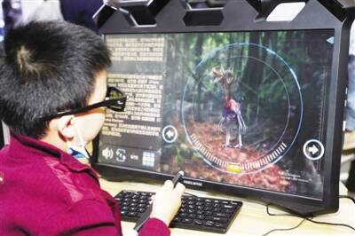

# 元宇宙发展三个阶段：解构、重塑、颠覆

# 元宇宙发展的三个阶段：解构、重塑、颠覆

​                                                               图为学生佩戴AR眼镜进行沉浸式学习

2022年第一季度，元宇宙发展经历“冰火两重天”。一方面，元宇宙在资本市场表现惨淡：全力转型元宇宙赛道的Meta相较2021年9月的历史高点市值已下跌逾40%；美股市场的“元宇宙第一股”罗布乐思（Roblox）今年以来市值已下跌近56%；A股市场的元宇宙概念股中青宝，今年以来市值下跌逾28%。另一方面，元宇宙受政府、科技企业关注度不减：谷歌、奥多比（Adobe）、浪潮等国内外企业仍看好元宇宙，推出元宇宙软硬件产品；2022年全国两会上，元宇宙引起代表们热议；上海、武汉、合肥、成都等多地政府工作报告提及元宇宙。“工业元宇宙”“消费元宇宙”“社交元宇宙”等元宇宙概念层出不穷。作为新兴技术，元宇宙需要分阶段与应用场景融合，从业者也要敬畏行业规律，勿借势虚提概念，应包容审慎创新。

**消费概念 元宇宙发展不确定性因素增加**

元宇宙在2021年上半年进入大众视野，聚合多种信息技术、展现丰富应用场景、孕育广阔市场空间的元宇宙引起了企业、投资者、科研机构、媒体等的高度关注。近一年来，国内外企业斥巨资投资、科技企业领军人物强推、各国政府态度积极等利好信号，坚定了业界对元宇宙广阔发展前景的信心。但与此同时，套用概念、滥用场景和资本炒作等现象给元宇宙发展蒙上了不确定的阴影。

现象一：元宇宙布局更趋多元化。元宇宙的概念界定较为清晰，涵盖物理现实世界和数字虚拟世界，以及互为映射的虚实融合世界，且具有高度沉浸感、可体验经济属性及自主创造等特点已成为共识，上述概念和特点也使元宇宙区别于虚拟现实、区块链、人工智能等其他新兴技术，呈现为若干类技术集合的形态。同时，“工业元宇宙”“消费元宇宙”“社交元宇宙”等使得元宇宙向热门应用领域拓展延伸，一定程度上促进元宇宙布局多元化，但也存在部分企业完全脱离元宇宙概念和特点，“蹭热点”式宣传自家技术和产品的现象。

现象二：元宇宙应用场景科幻化。元宇宙起源于国外科幻小说，近年来《头号玩家》等科幻电影对元宇宙也有涉及，将其描绘为一个真假难辨的全新世界，各生活生产场景科幻感十足。但元宇宙应用场景与科幻作品大相径庭，部分企业鼓吹的元宇宙应用场景不仅不符合该应用领域发展实际，也偏离了物理、电子、生物学的基本规律，更有甚者套用工业互联网、VR+社交、区块链溯源等既有场景，将核心技术名称替换为某某领域元宇宙，过分营销，引起了各行业对元宇宙的猜疑和困惑。

现象三：元宇宙资本要素泡沫化。元宇宙概念涵盖多种新一代信息技术，并展现了上述技术的新需求，有开辟全新市场空间的可能，因此资本大多对元宇宙持积极态度，提前注资入场布局。但炒热概念、制造估值虚高的元宇宙投资标的，再高点变现者有之；套用元宇宙概念，再行“炒币”“挖矿”等国家明令禁止的虚拟币交易者有之；甚至打着元宇宙旗号，明目张胆进行诈骗、非法集资等违法犯罪行为者亦有之。上述别有用心者在资本领域大做、恶做、滥做元宇宙文章，使得泡沫化风险如影随行，影响了投资者信心，减少了资本要素对元宇宙的有效支持。

**梯次发展 元宇宙落地或将经历“三步走”**

元宇宙指向人类全新的生产生活空间，其影响力在一定程度上将从技术和产业领域向社会治理领域延伸，有望颠覆当前经济规则，重塑政府治理理念，丰富既有文化形态。虽然从相关技术成熟度来看，元宇宙真正落地仍需数十年甚至更长时间的积淀，但当前瞄准行业痛点及需求、按元宇宙及其关联技术发展阶段进行有效应用，从而分三个阶段梯次实现行业赋能的价值巨大。

阶段一：解构行业需求，夯实底层基础。作为新兴技术，元宇宙的发展离不开各行业需求的牵引和带动，各行业的需求痛点有望借助元宇宙缓解或解决，同时也将推动元宇宙底层基础技术进步。这一良性循环将成为未来至少10年内元宇宙的发展逻辑。如游戏、视频等泛娱乐产业发展受限于手机、电脑等终端，难以给予用户更真实的感受，那么元宇宙底层的虚拟现实技术可针对行业核心诉求，发挥其沉浸式优势，持续优化用户体验，打开市场。而市场中的用户群体也将对虚拟现实的高并发计算、大带宽传输和4K/8K显示等提出要求，带动虚拟现实底层技术进步，从而助力元宇宙落地。

阶段二：重塑应用场景，拓展新兴模式。经过第一阶段的发展，元宇宙与应用场景结合更为紧密，虚拟现实、计算、网络等底层技术已相对成熟，那么将在满足各行业需求的基础上，实现对行业具体场景的重塑。如工业制造领域中，传统模式是“设计、打样、量产、交付”，交付后获取价值。而元宇宙的应用将重塑上述流程，拓展价值输出模式：通过实时数据传输、产品高精度建模以及工厂全面仿真，统筹数字孪生、工业互联网等技术，实现传统模式的某一环节可输出价值，解决打样成本较高、非标准化产品量产困难、交付产品与设计概念存在偏差等问题。

阶段三：颠覆理论框架，变革生产生活方式。经过前两个阶段的发展，元宇宙已与各行业深度融合，并产生众多新产业、新市场和新空间，元宇宙虚实融合、去中心化等特点将潜移默化地影响到人们的生产生活。如为一个或几个城市提供元宇宙服务，算力需求和网络负载将难以想象，因此摩尔定律、冯·诺伊曼计算机结构和互联网OSI模型等理论框架将被迭代或颠覆，以满足元宇宙应用场景需求。同时元宇宙中现实角色、虚拟角色共存，构成更复杂且不断变化的关系，也将对社会治理、道德观念等产生巨大影响，从而改变人们的生产生活方式。

**理性审慎 元宇宙发展的三点建议**

建议一：敬畏行业规律。制造、金融、教育等行业经过长时间的发展，其内在逻辑已经较为清晰。而技术创新的重要意义在于推动社会发展。因此，将元宇宙包装为代替某一行业的工具既不符合元宇宙的实际，也不符合行业发展的规律。推动元宇宙发展离不开对各行业发展内在规律的深入挖掘和精准理解，赋能行业才能实现发展。

建议二：勿借“元宇宙”之势虚提概念。无论是企业、政府还是资本，都应理性看待元宇宙的发展及作用。元宇宙的基础是沉浸式体验，符合信息技术与社会深度融合的总体发展趋势。近70年来，人类和技术之间的“亲密”程度越来越高，信息技术终端经历了从大型机到小型机，到PC机，再到移动终端和虚拟现实设备的发展历程，实现沉浸式体验是不断满足人们对技术可感受性需求的必然结果。因此元宇宙是以往科技创新的延续，距离颠覆为时尚早。

建议三：包容审慎创新。发展元宇宙应冷静挖掘概念背后的技术，如虚拟现实、区块链等，同时划定元宇宙技术发展路线，预测技术发展前景。既要充分包容技术创新的曲折和缓慢，又要明确反对借技术创新对元宇宙概念的炒作行为。同时，创新挖掘应用场景，利用元宇宙沉浸式、强交互、去中心化等特点满足场景核心诉求，从而带动元宇宙落地。
