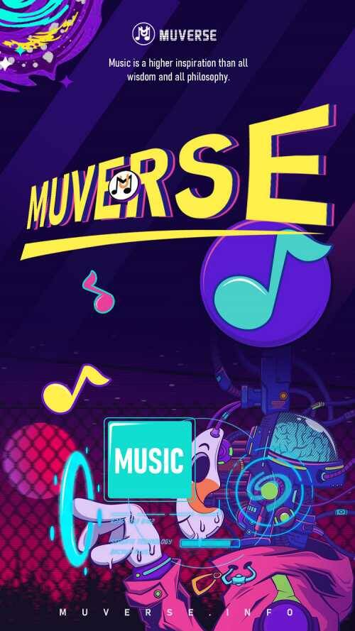

# 音乐元宇宙平台Muverse推出NFT头像YOLO Bunny 致敬周杰伦《最伟大的作品》

7月15日，由Web3.0音乐元宇宙平台Muverse推出的YOLO Bunny NFT盲盒开启白名单铸造，首批Private-Mint将包含部分致敬周杰伦《最伟大的作品》NFT。Muverse正在创建基于DApp和元宇宙的下一代音乐平台。作为Muverse平台的稀缺数字身份，YOLO Bunny NFT系列由9,999只来自1,402号宇宙的兔子音乐艺术家&爱好者组成。持有YOLO Bunny NFT是解锁未来平台各种权益的唯一凭证，可持续享受平台提供的Token、Listen to Earn创世耳机、元宇宙地块等空投福利。

　　时隔6年，天王巨星周杰伦的新专辑终于要在歌迷千呼万唤中“始出来”，周杰伦的第十五张新专辑《最伟大的作品》于7月15日正式发行，早在7月6日《最伟大的作品》同名主打MV《最伟大的作品/GREATESTWORKSOFART》首播，7月8日新专辑已在各大音乐平台开启预售，仅用15分钟就卖出50万张。

当Muverse音乐元宇宙遇上音乐之王周杰伦，作为一个服务全球音乐人Web3.0音乐平台，Muverse理解艺术家对音乐美学和方向的控制的重要性，Muverse试图通过建立一个新的基于社区的NFTs范式，为音乐人创造一个更自由、更公平、更适合的商业环境，帮助音乐人在Web3.0时代重新焕发活力。

　　对于华语乐坛而言，周杰伦是永不过时的流行天王。就像大部分80、90后的人来说，周杰伦这个名字就意味着他们的青春。周杰伦的新歌《最伟大的作品》再次登上热搜，简直让华语流行乐坛又支棱起来了。凭借超高的人气，这首歌在发布之前，有关周杰伦新歌的话题，就多次登上热搜榜，从开始预告，到新歌发布，每个话题都让人热血沸腾。

　　此次，音乐元宇宙平台Muverse致敬周杰伦《最伟大的作品》，不仅仅单独铸造出一张独一无二的周杰伦弹奏钢琴的NFT图片，而且在整个系列里有部分作品致敬了周杰伦《最伟大的作品》，作为Muverse用户可以在铸造NFT的时候有机会抽中相关NFT盲盒。

　　据悉，YOLO Bunny NFT盲盒系列将于北京时间7月15日22:00开启首批白名单Private-Mint，并于北京时间7月20日22:00开启Public-Mint，Mint结束即同步上线全球最大的NFT交易市场OpenSea。
