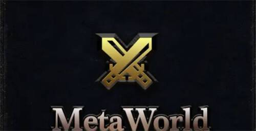
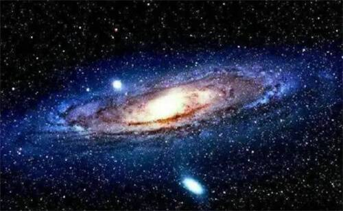

# 元宇宙项目MetaWorld获3000万美元投资

近日，总部位于瑞士的元宇宙项目MetaWorld已获得越南亿万富翁、SAPA Thale集团董事长Mai Vu Minh的3000万美元投资。Mai Vu Minh表示：“MetaWorld将为开发人员和创作者创造数百万个就业机会，并成为世界上最先进的数字基础设施之一。”

据悉，MetaWorld旨在创建一个区块链投资生态元宇宙，该生态系统将在在智能合约、金融服务、游戏、供应链、医疗保健和加密货币六个领域开发，以服务于全球MetaWorld的生态系统和合作伙伴。

Mai Vu Minh表示，通过MetaWorld，SAPA Thale的目标是一个大型数字经济，它将在正在建设的虚拟世界中开放。贸易将成为MetaWorld的重要组成部分，用户将可以销售实物和数字产品。

Mai Vu Minh看到了区块链在确保供应链透明度、实现快速交易支付、数字化艺术和确保数据隐私方面的潜力。他认为使用区块链可以为几乎任何类型的交易带来前所未有的安全性、自动化和效率。
