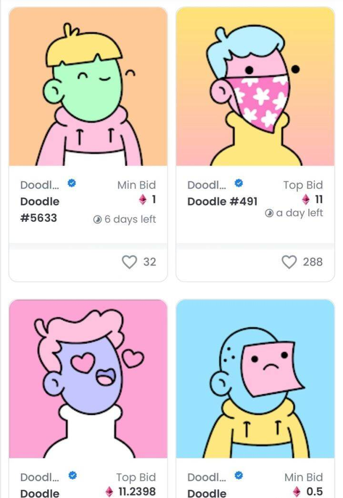

# 数字藏品：连接元宇宙与现实的钥匙

最近，“数字藏品”和“元宇宙”等术语和概念已经进入全球主流视野。这些概念很可能会成为虚拟世界规则改变者。

其实前几年，数字藏品市场的热度不断走弱，但是2021年，随着整个元宇宙概念的发展，而数字藏品作为元宇宙中的一个非常基础的要素，迅速发展起来。

**什么是数字藏品和元宇宙？**

数字藏品作为元宇宙世界特有的藏品形式，从最初的艺术品逐步拓展到游戏、体育等各领域，内容不断丰富、生态更加多元。

对此，MYEG中国合伙人Flora在中关村区块链产业联盟联合Cointelegraph华语举办的《链接世界》活动中表示，数字藏品是一个新经济数字商品。数字藏品的价值会被逐渐放大。

未来我们会花更多的时间在元宇宙世界中。Flora还认为，数字藏品会有更多的实际的应用场景，与我们的生活和部分产业相结合。

元宇宙是一个虚拟空间，是连接现实世界和虚拟世界的桥梁。元宇宙被用来描绘现实世界的真实性，允许用户工作、玩耍、玩乐，甚至建造家园。

甚至，许多专家预测，有一天，元宇宙会取代现实。

Facebook宣布更名为“Meta”，计划转型为元宇宙公司，并推出了“Horizon Worlds”元宇宙社交平台。

不仅是Facebook，英伟达、微软、苹果也相继宣布进入元宇宙领域。

Flow中国区负责人Amber在活动中表示，元宇宙就是人类拓展全新世界的维度的一个产物，它脱胎于现实世界，与现实世界平行又和现实之间互相影响。

**元宇宙与数字藏品共繁荣**

数字藏品是一个面向C端用户，且用户有直接付费意愿的区块链原生场景。

2021年，数字藏品率先在海外爆发，大家也把去年称为“数字藏品元年”。

目前，整个数字藏品行业处在上升通道，很多开发者与平台都在探索创新的模式。从短期来看，数字藏品的需求很明显，模式也很清晰，很多平台、知名IP百家争鸣。接下来，平台、藏品的内容和品质将会变得更加重要，因为消费者不会再对所有的藏品都抱有好奇心。优质的IP和内容肯定会成为一些平台争抢的对象。

在元宇宙当中，用户可以通过铸造协议，将资产数字化，来实现这种价值的流转。数字藏品可以解决数字资产的稀缺性、唯一性、数字产权化以及交易的需求。

未来，元宇宙的发展无疑会逐步走强，这也会促进数字藏品的发展。

**中外数字藏品的挑战**

随着数字藏品火遍全球，国内数字藏品市场也躁动起来。数字藏品这种艺术载体和表现形式，为创作者们提供更多想象力，来拓展人类创造力的边界。

国外的数字藏品在各个不同的领域百花齐放，目前主要是用于收藏品、艺术品、游戏、应用程序、体育、运动等，而国内的数字藏品其实还处于起步的探索阶段。

目前而言，国内的数字藏品还没有很好发挥进阶特性，比如可交互性、可组合性、可编程性。Flow中国区负责人Amber声称，目前国内的创新型案例还是较少的，典型的社区价值还没有被发挥。

由于海内外对数字藏品不同的定位和监管，以及文化的差异等，数字藏品必然会在海内外走上了不同的价值捕获之路。

国内的数字藏品发展路径和海外市场是不一样的。中国企业更多的是从版权保护角度来切入，来发挥数字资产凭证的证明功能。国外平台更偏向于虚拟世界和应用的属性。

不论是海外市场，还是国内市场，数字藏品的发展都有着需要突破的瓶颈。第一，整个生态还不健全，还需要建立一个庞大的开发者社区；第二，监管是不成熟的。任何一个新生事物要想健康的发展，必须符合各国的监管治理规则。第三，需要建设一个可靠的、稳定的、可信的数字藏品平台，来提高数字藏品在流转过程的公信力。

数字藏品不应该仅仅局限于虚拟世界，它也需要和现实世界发生联系，让数字藏品技术回归本质，更有利于长期发展。

**结语**

不久的将来，人类的文明终将迁移至元宇宙世界，而数字藏品其实就是构建元宇宙过程当中不可或缺的一个原子级事物。

在元宇宙运行过程，数字藏品将始终起着举足轻重的作用，在其中扮演着文明基石的角色
