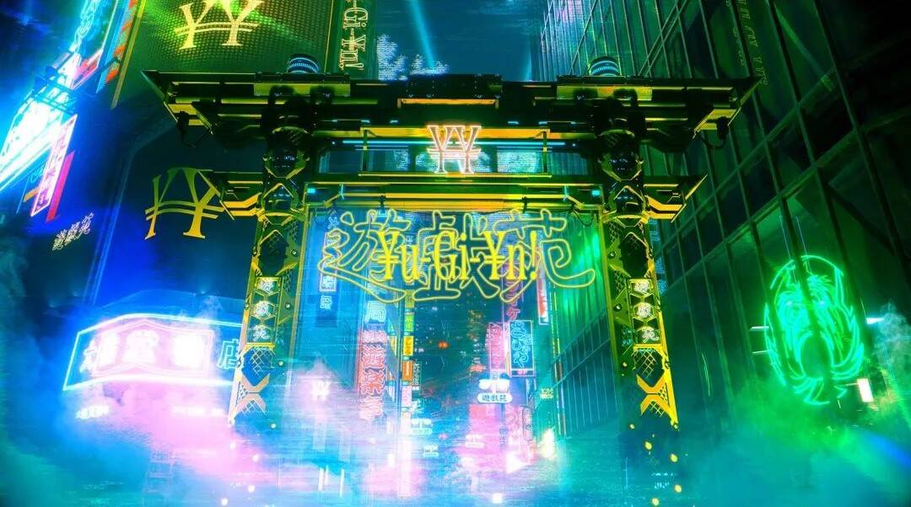
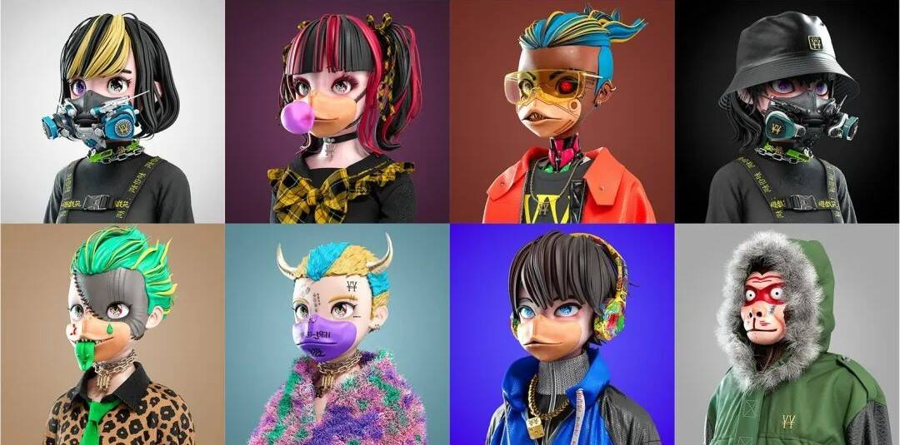
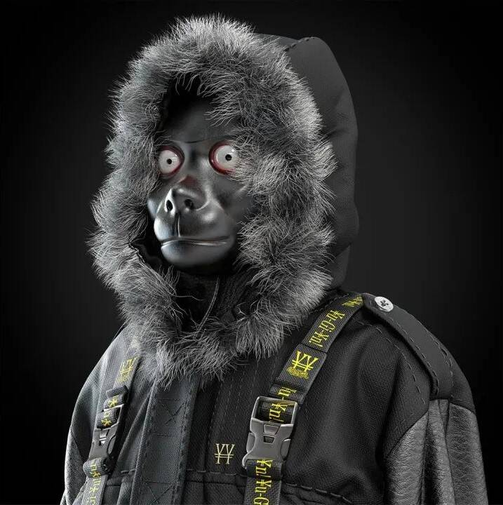
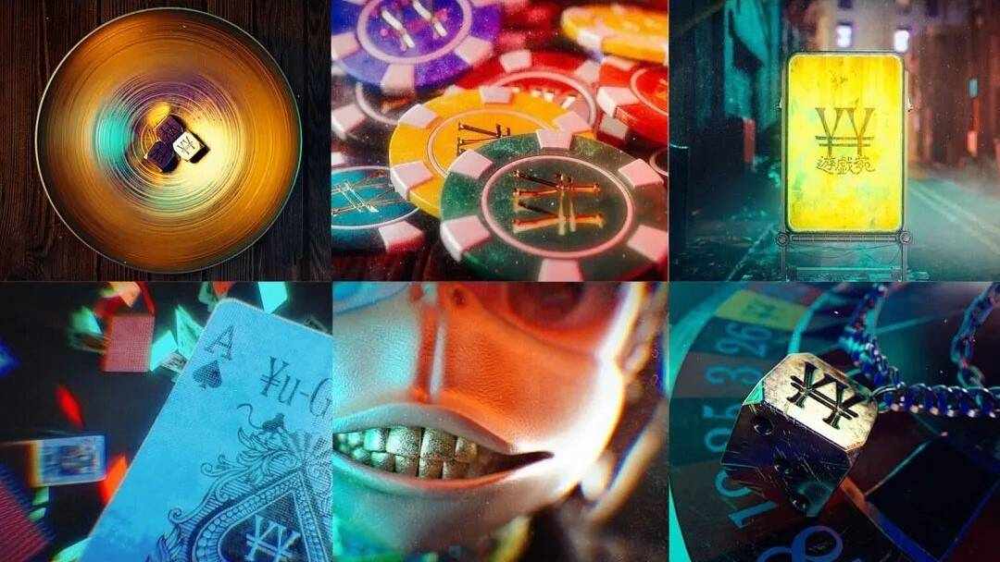

# NFT元宇宙项目「遊戯苑」即将推出 遊戯苑元宇宙项目概述

NFT 及元宇宙概念在当下的火热已是共识，在这一大背景下，时装、运动、奢侈品牌等纷纷入场，在 Web 3.0 的新环境中推出品牌相关的虚拟单品。在进入成长期的日本市场，正酝酿着一个由全球化专业团队打造的 NFT 元宇宙项目——遊戯苑。作为该团队首发的 NFT 项目，遊戯苑在「东京玩乐」的主题下，融合了音乐、时尚、动画漫画、游戏等多种元素，打造了一个未来主义想象空间。

故事背景设定在近未来，那时的现实世界已被数字经济圈所淘汰，曾经的世界金融中心之一——日本涩谷作为元宇宙 CENTRAL SHIBUYA 被重建。而统治世界的，是从不同国家分散的社区里创造了亿万财富的 APES（猴子），悬殊的贫富差距让人类只能生活于地下。目睹家园被占领的年轻少年少女们堵上命运，假扮成猴子，「混」进只允许 APES 进入的游戏中心【¥u-Gi-¥n】试图反击。

与故事设定相符，所有 NFT 角色均佩戴猴子嘴面具，以服装、配饰、纹身、背景色等元素区分稀有度，背景为黑色的稀有角色还会拥有特殊能力等，在之后的元宇宙游戏中拥有反转局面的强大力量。

该项目集结东京音乐界和娱乐圈的顶级创意设计者及市场分析家，以超豪华的阵容组成跨业界梦幻团队 Yu-Gi Labs。

角色及世界观的创作由东京最先端的现代艺术创作团队完成，其作品还包括日本摇滚乐队 King Gnu、 millennium parade 的 MV 和 CD 封面、周边等所有 Art Work；其中所属 3DCG 艺术家担任项目主导设计师，有着《Fly with me》《Bon Dance》等高质量的全篇 CG 映像作品，3D 设计、制作能力超群；艺术总监由创意组合 Margt 出任；创意总监则由美国洛杉矶的 HIP-HOP 组合 Dos Monos 成员担任。此外，项目还同时拥有日本现代艺术画廊和广告代理公司的强大背书支持，专业度极强。

拥有如此专业的跨领域团队，「遊戯苑」的目标未被 NFT 世界所局限，还将推出元宇宙以及包含相关 NFT 内容的作品世界和故事进行再设计，进行多次扩张，实现虚拟与现实世界的「跨次元」联通，探索不同次元的边界。

据悉，「遊戯苑」将于今夏推出，感兴趣的读者不妨移步遊戯苑官方网站持续关注。
