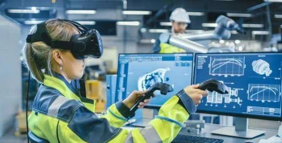
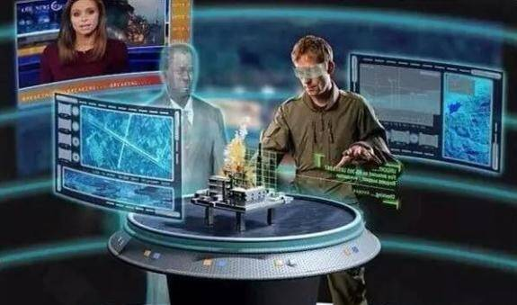
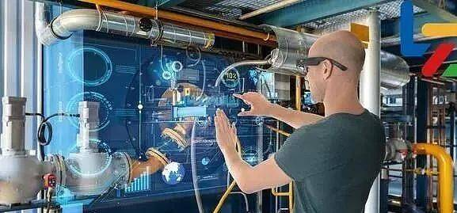

# 元宇宙在工业领域的应用

今天为大家讲解一下元宇宙在工业上，也就是元宇宙工业。元宇宙概念以及相关技术在工业领域上的应用，它将现实环境中的研发流程、生产流程、营销流程、售后流程等环节部署到虚拟空间，通过虚拟空间和现实空间的活动来实现生产和服务的优化改进，形成全新的制造和服务体系，达到降本增效，协同作业的效果《工业元宇宙白皮书》上是这么来定义的。

工业元宇宙目前三类设计，虚拟现实、增强现实、人工智能数字完胜互联网、5G、网络大数据、云计算等新兴技术的发展优化带着升级并有机大技术，作为基础设施将大幅度提升，顺利展示以交互水平杜绝浏览数据，数据、数量将促进工业、企业、行业的生态发生革命性改变，改变人的思维模式，促进、创业、创新、创业，促进工业产品高质量、精细化的具备竞争力，进而创造巨大的经济价值、社会价值。

工业元宇宙和数字孪生的概念区别在于数字本身是现实世界对虚拟世界的1:1映射，强调的是在虚拟世界模拟，现实世界的工业生产场景，而工业元宇宙在此基础上还具有现实世界中尚未实现甚至无法实现的体验，就强调虚拟空间和现实空间的协同联动，从而实现虚拟操作，指导现实供应，实现虚实协同。那么工业元宇宙在哪些场景上可以使用？大家可以从以下几个方面预测一下。

  1. 研发设计：通过工业元宇宙平台可控制产品应用时的环境因素，并基于产品模型对产品各零部件及作用方式做出十分精准的模，能够有效验证产品性能，同时可以打破地域限制，支持多方协同设计，甚至要求用户设计提高用户体验。

  2. 生产优化：通过工业元宇宙平台能够沉浸式体验，虚拟智能工厂的建设和运营过程，与虚拟智能工厂的设计产线进行实时交互，可以更加直观便捷的优化生产流程，对于智能工厂的建设和生产过程中的概念，可以在虚拟环境中进行模拟预测，进行提前验证，降低研究成本。

  3. 设备运维：在工业园机构平台建立的运维人员将不受域限对生产设备储备能够逐渐变成时时确认设备情况，及时修复问题，对于难度的复杂程度高的设备，可以通过工业元宇宙平台，共同商讨解决方案，从而提高生产效率。

  4. 产品测试：工业元宇宙能够提供虚拟环境，已开展试验验证和产品性能测试，通过虚实结合，实现物理空间和虚拟空间的同步测试，更加直观的感受产品，提高测试认证效率和准确性。

  5. 培训技能：元宇宙平台通过沉浸式体验，让学员更加直观的操作，提高教学培训效率。例如，可以在虚拟环境中搭建火灾现场，供相关人员进行演习，工业元宇宙的应用场景，覆盖研发到售后服务的产品全生命周期值，指导和推进工业流程优化和效率提升，除此之外还有更多的场景值得我们想象。

---

建设工业元宇宙，不仅要采集数据、传输数据、存储数据，更要通过人工智，国内外专家反对对数据进行分析，更友好方式进行展示，从而促进数据数字知识的应用，辅助生产经营、决策应用，解决问题，促进创新，这一切需要更加强大的算力平台、展示技术、网络通信技术等技术来支持，需要我们在这些基础设施建设方面和相关技术研发与用户方面做出很多的努力。
