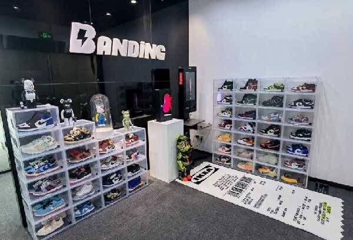

# 上海推动元宇宙抢抓万亿级新赛道，HOTDOG以虚促实赋能新消费场景

​     7月8日，《上海市培育“元宇宙”新赛道行动方案（2022-2025年）》发布，成为截至目前由地方政府发布的最完整的“元宇宙”行动方案。《方案》制定了上海市元宇宙产业的发展目标，到2025年，“元宇宙”相关产业规模达到3500亿元。

　　实际上，此前上海已多次释放发展培育元宇宙新赛道的积极信号，奋力推动元宇宙更好赋能经济、生活、治理数字化转型。据《方案》介绍，上海将培育10家以上具有国际竞争力的创新型头部企业和“链主企业”，打造100家以上掌握核心技术、高能级高成长的“专精特新”企业。同时围绕城市数字化转型，打造50个以上垂直场景融合赋能的创新示范应用，推出100个以上引领行业前沿的标杆性产品和服务，鼓励加快“元宇宙”产业人才育引。

　　不久前，立足上海本地的全球领先数字藏品平台HOTDOG与新零售业巨头上市公司百联股份宣布合作，共同投身于中国元宇宙的新消费领域建设。双方联名打造全新的3D元宇宙数字藏品盲盒，让百联股份“美好生活体验官”GINA向会员展示更丰富的生活态度。未来，HOTDOG还将作为主办方参与百联集团55购物节。

复旦大学大数据研究院教授、复旦大学国家智能评价与治理实验基地副主任赵星认为，上海拥有元宇宙生存和发展的肥沃土壤。 他认为，“以虚促实”和“以虚强实”的虚实交互发展路径，是我国部分地区元宇宙发展的模式创新，这一指导性模式，不仅为目前部分元宇宙构想无法落地的问题提供了解决方向，更指出了一条不同于西方部分游戏与互联网公司的元宇宙发展道路。

　　HOTDOG由上海瓣鼎网络科技有限公司打造，通过与品牌方深度结合，打通品牌与艺术家联名合作，为品牌方提供元宇宙技术支持及供应链产品生产，已与线下200多家实体店合作，拥有国内头部潮流品牌入驻，如滔博体育旗下全线产品，及日本Be@rbrick、阿童木、比卡丘等IP，意大利Replay、美国潮牌BlackScale等百余家海内外品牌入驻。HOTDOG提供各类球鞋、潮玩、艺术、周边等服务，通过线上平台扩散，让品牌能落地，拉近消费者距离。

目前，HOTDOG已获得包括《艺术品经营机构备案证明》、《增值电信业务经营许可证》及ICP备案等多项现有政策下的合规经营资质，并已取得区块链信息服务备案（沪网信备31011222333571300014号），与具有国资背景的上海紫竹创业投资公司签署投资协议，在紫竹高新区的牵头下对接了上海公证处的司法链，打通了上海高院数据。

　　据上海瓣鼎网络科技有限公司董事长、元宇宙产业委常务委员、中国通信工业协会信息化工业创新专业委员会副会长、HOTDOG 创始人兼CEO史明，在由中国移联元宇宙产业委举办的2022“探索与实验”元宇宙共识大会上介绍，HOTDOG着眼于区块链技术在知识产权领域的应用，立足于数字艺术产业的蓬勃发展，针对未来的战略布局加强关键核心技术研究，拓展元宇宙赋能场景，不断致力于传播中华民族文化。

　　公司的主打产品HOTDOG旨在成为web 3.0时代下品牌与消费者之间的链接纽带。该产品大力支持艺术家生态，并用多元的科技手段增强用户交互，打造沉浸式体验，是Z世代首选的社交、娱乐、消费社群。HOTDOG将实体经济和精神消费相结合，为品牌提供线上运营、线下活动、产品供应链等支持。

　　**关于HOTDOG**

　　上海瓣鼎网络科技有限公司成立于2019年，旗下核心产品HOTDOG APP是致力作全球领先数字潮流艺术收藏品综合创意平台。HOTDOG通过“创意、潮流、艺术、科技”四位一体的理念，利用创新的技术打造颠覆传统的沉浸式体验，将潮流与跨界艺术串联，虚拟世界与现实社会交互，让品牌与消费者在互动中增强认知，更好连接品牌、创作者与消费者。平台聚集了1000万潮流年轻用户，签约艺术家75000多名，涵盖英法美日韩等二十余个国家，连接近1000所国内外高等院校，拥有众多线下艺术展馆资源。

　　HOTDOG已经获得多项现有政策下的合规经营资质，包括《艺术品经营机构备案证明》、《增值电信业务经营许可证》及ICP备案等，并已取得区块链信息服务备案（沪网信备31011222333571300014号），并且正式入驻中国移动通信联合会元宇宙产业委员会成为委员会第一届常务委员单位，中国仿真学会元宇宙专业委员会成员，中国通信工业协会信息化科技创新专业委员会副会长单位，也是中国计算机行业协会元宇宙产业专委会创始成员。HOTDOG着眼于区块链技术在知识产权领域的应用，立足于数字艺术产业的蓬勃发展，针对未来的战略布局，坚定不移的加强关键核心技术研究，拓展元宇宙赋能场景，不断致力于传播中华民族文化。
