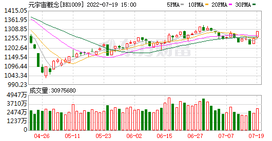
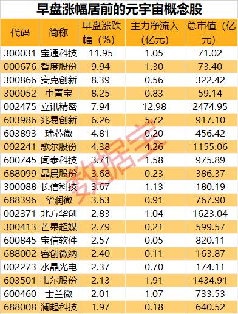

# 元宇宙相关产业迎来利好 11只元宇宙概念股获亿元主力资金净流入

A股中布局元宇宙概念的个股共有53只，其中歌尔股份已发布今年上半年业绩预告，预计实现归母净利润20.77亿元至24.23亿元，同比增长20%至40%，主要由于公司VR虚拟现实、智能游戏主机等产品销售收入增长，盈利能力提升。

**2025年“元宇宙”相关产业规模达到3500亿元**

近日，多只元宇宙概念股盘中冲高，安克创新盘中涨近12%，截至午间收盘，智度股份涨停，宝通科技涨11.95%，中青宝、立讯精密、兆易创新涨幅居前。

消息面上，上海市人民政府办公厅印发《上海市培育“元宇宙”新赛道行动方案(2022—2025年)》(以下简称为《方案》)，到2025年，“元宇宙”相关产业规模达到3500亿元，带动全市软件和信息服务业规模超过15000亿元、电子信息制造业规模突破5500亿元。

《方案》中指出，培育10家以上具有国际竞争力的创新型头部企业和“链主企业”，打造100家以上掌握核心技术、高能级高成长的“专精特新”企业。打造50个以上垂直场景融合赋能的创新示范应用，推出100个以上引领行业前沿的标杆性产品和服务。产业发展生态持续完善。推动建设各具特色的“元宇宙”产业园区，打造一批创新服务平台，加快“元宇宙”产业人才育引，优化生态环境。

除上海市外，其他还有多地发布规划加大元宇宙投资，促进元宇宙产业发展。此前南京启动元宇宙产业先导区，《江宁高新区“十四五”数字经济产业发展规划》将元宇宙产业作为未来数字经济发展的重要领域。广州天河区“元界创新生态大会”上，天河区元宇宙联合投资基金正式发布，据称总规模将超过 200 亿元。

**早盘11只概念股获亿元主力资金净流入**

证券时报·数据宝统计，A股中布局元宇宙概念的个股共有53只，其中歌尔股份已发布今年上半年业绩预告，预计实现归母净利润20.77亿元至24.23亿元，同比增长20%至40%，主要由于公司VR虚拟现实、智能游戏主机等产品销售收入增长，盈利能力提升。

资金流向上来看，早盘11只元宇宙概念股获主力资金净流入1亿元以上，立讯精密净流入最高，合计12.98亿元，其他还有兆易创新、歌尔股份净流入居前，分别净流入5.72亿元、4.26亿元。

经过去年下半年的概念炒作后，今年以来元宇宙概念股略有降温，多只个股最新价较年内高度回撤。统计显示，11只元宇宙概念股回撤幅度超过40%，睿创微纳、深信服、长信科技回撤幅度最高，分别为53.29%、48.42%、48.08%。

