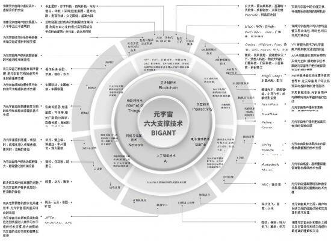
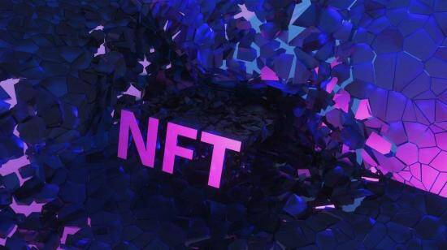

# 难于上青天，区块链技术在元宇宙里学会赚钱怎么这么难？

# 难于上青天，区块链技术在元宇宙里学会赚钱怎么这么难？

> 通俗点来说，元宇宙就是一个平行于现实世界运行的人造空间，用户可以通过虚拟现实或增强现实头盔或计算机屏幕在其中移动和访问；NFT则是存在于区块链上的数字资产；而DAO则是一个去中心化自治组织，一个由其成员拥有并在区块链技术上运行的互联网社区。

可以说，NFT与DAO都与区块链有着千丝万缕的联系，而众所周知，区块链又是元宇宙六大支撑技术中极为重要的一环。那么在热度与争议并存的元宇宙中，区块链技术究竟扮演着何种角色？这个2008年因比特币诞生的架构理念，又能否在元宇宙时代发扬光大？

区块链，元宇宙时代的“身份证”、“银行卡”和“保险箱”

元宇宙，作为被寄予厚望的下一张“互联网”，其内部自然也存在着一些支撑“网点”。

根据《元宇宙通证》一书，元宇宙有六大支撑技术BIGANT，分别为区块链技术(Blockchain)、交互技术(Interactivity)、电子游戏技术(Game)、人工智能技术(Ai)、网络及运算技术(Network)、物联网技术(IOT）。在这之中，区块链技术往往被视为元宇宙的核心支点。

六大技术里，区块链之所以能在元宇宙中扮演如此重要的角色，得益于其内生的五大特性，即去中心化、开放性、自治性、匿名性以及信息不可篡改。在《螳螂观察》看来，区块链的这几大特性，使其仿佛化身元宇宙时代的“身份证”、“银行卡”和“保险箱”。

首先，元宇宙作为一个共创、共享、共治的虚拟世界，那么“人”这个角色便不可或缺。就像是现实生活中的身份证、游戏中的ID一样，元宇宙时代也需要自己的身份标识。

区块链的“防篡改和可追溯性”则使其天生具备了“防复制”的特点，顺利成章的也为元宇宙提供身份标识创造了条件。通过区块链技术，可以判断使用者身份，令他人身份不会被复制或盗用，保证元宇宙里身份的唯一性。

其次，如果说元宇宙的终极目标是构建一个独立于现实世界又与现实世界相连接的生态体系，那么，健全而又透明的货币体系将是确保这个生态可以运转下去的前提条件，而区块链技术正是未来元宇宙经济系统的重要基础。

一方面，区块链“不可篡改”的特性令主要通过共识机制实现，而共识机制能够解决并保证每一笔交易在所有记帐节点上的一致性和正确性问题，并使得修改交易数据的成本极高，某种程度上保证了交易过程的公平有效。

另一方面，欧科云链研究院高级研究员孙宇林也曾说过：借助区块链的加密算法、共识机制、链式结构、智能合约等技术，元宇宙将实现可靠确权可信流转及服从制度、服从契约的稀缺性，从而建立兼具相对公平和公信的经济秩序。比如，NFT可以是商品形态的数字化基础的资产形态；DeFi可以与传统金融模式共同为元宇宙内的各类资产提供充沛的流动性。

最后，凡是涉及到数据的地方，安全性和隐私性就是用户最关心的话题，一旦数据泄露，轻则被电话、短信骚扰，重则财产可能被洗劫一空。区块链技术“去中心化”的特性，则为元宇宙加了把“保险锁”。

区块链的本质其实就是一个去中心化的分布式数据库，能实现数据信息的分布式记录与分布式存储，能保证在其上的数据不会被篡改，不可伪造，数据的传递可以追溯。所以区块链技术堪称“安全清道夫”，有了它的存在，元宇宙时代里，个人的数据很难被其他人篡改，也不会被随意处置，如果想要某个人的数据则需要授权，并向其支付一定的费用来换取脱敏后的数据，一定程度上提高了信息的安全性。

这样看来，在元宇宙时代里扮演者“身份证”、“银行卡”和“保险箱”等重要角色的区块链技术是否即将迎来赚钱的“黄金期”呢？在《螳螂观察》看来，并不尽然。

银行卡未“制卡”、保险箱不“保险”，区块链“掘金”元宇宙道阻且长

区块链技术与元宇宙的“贴贴”已经有了一定的成果。

比如元宇宙概念项目区块链游戏，以目前市值最高的链游Axie Infinity为例，它通过把游戏道具，游戏角色、游戏属性等以去中心化的方式分配给了用户，带动更多的玩家进入游戏，截至目前，该游戏一天创造的经济收益目前已经超过了王者荣耀，向市场展示出了将区块链技术应用在游戏数字资产方面的巨大可能性。

虽然链游与NFT市场热度高涨，不过随着时间的推移，市场情绪开始回归理性，区块链在元宇宙的“黄金期”似乎还没到来。

其一也是最现实的一点，元宇宙现阶段说白了只是一个热度爆棚的科技概念，具体什么时候能落地还是一个未知数。

清华大学新媒体研究中心年内发布的《2020-2021年元宇宙发展研究报告》里指出：目前大规模“元宇宙”的产品化还十分遥远。科幻作家陈楸帆也认为，目前没有一家公司或者一种技术可以涵盖所有“元宇宙”需要实现的全部东西，因为它涉及大量基础设施，并非单一平台，也不是单一应用。

所以，即使区块链能充当“身份证”、“银行卡”和“保险箱”的角色，但在元宇宙还未落地的背景下，区块链技术的“元宇宙想象力”都会大打折扣。

其二，2009年1月3日第一个序号为0的创世区块诞生。几天后2009年1月9日出现序号为1的区块，并与序号为0的创世区块相连接形成了链，标志着区块链的诞生。

区块链诞生至今，经过十余年的发展，一些挑战与隐患也在逐渐浮现。陈根在《元宇宙时代，区块链如何发展》一文中也有提到，随着区块链的发展，节点存储的区块链数据体积越来越大，其存储和计算的负担越来越重，这会给区块链核心客户端的运行带来很大的困难。

除此之外，区块链的应用效率较低，比特币的一次交易需要六次确认，每次确认要十分钟左右，全网确认需要一小时左右才能完成，这样的效率就不适合高性能的金融交易事务。这些问题如果没有得到妥善的解决，势必也将影响到区块链技术在元宇宙内的商业化进程。

其三，今年以来，打着元宇宙、区块链旗号的骗局与套路已经开始滋生。

据不完全统计，目前我国注册区块链相关企业9.7万家，2017年到2020年区块链行业全球复合增速73.2%，我国复合增长率达到83.5%，高于全球增速。但在众多民众还没有弄清到底什么是“区块链”时，一些企业开始顶着“链游”、“元宇宙”的“帽子”开始收割用户。

有记者发现，“农X世界”“X武神”“殖民X星”等多款涉嫌诈骗游戏，均用“元宇宙”“区块链”等概念包装自己。号称“3天就能回本”、“每日躺赚7万”、“客户已资产翻倍”、“强制暴富新方式”，实际上，这些游戏与普通游戏一样，大多是网页版2D游戏。

不仅仅是链游领域，基于区块链技术的特性，导致链上的犯罪行为速度快、身份隐匿和全球去中心化分布，预防和追踪极为困难。

以NFT领域为例，据Authentic AI.的创意总监Jeff Nicholas描述，有一部分骗子会假装成头部NFT市场OpenSea的客服人员，当用户在OpenSea社区中提出他们的问题后，他们就会联系该用户假称自己的是客服人员。然后获得用户钱包的控制权，并提走所有的NFT和以太坊，Jeff Nicholas就被转移走了钱包里所有的猿猴头像、狗狗币、猫币、空投产品、以太坊。就目前的市场行情来看，损失不小。

总而言之，不可否认区块链技术在未来元宇宙时代的作用，但现实是，这张“身份证”还在挂失、“银行卡”还未制卡、“保险箱”的密码也不复杂。当然，随着国内外互联网巨头的推动以及金融科技监管及处置力度加大，区块链技术在元宇宙的商业化会越来越成熟，而这，还需要很长的时间。
