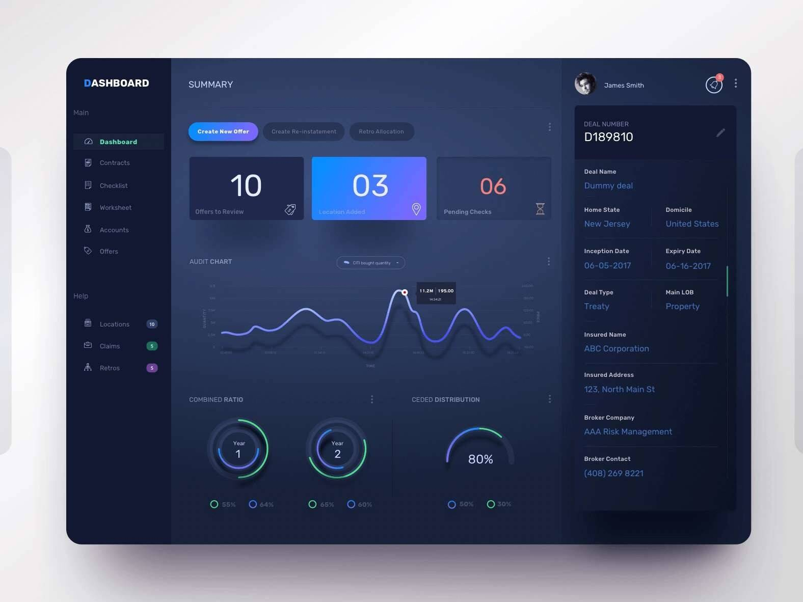

# 区块链与元宇宙

# 区块链与元宇宙 

随着互联网相关技术的发展以及用户规模的扩大，互联网账户的数目也越来越庞大。不过，虽然这些互联网账户中所包含的信息都是用户自己的数据，但无论就法律层面还是技术层面而言，用户都既不拥有这些互联网账户，也不能进行利益方面的管控，而互联网账户中用户数据的泄露和滥用问题却越来越突出。如何让个体拥有自己的数字身份，并对其中所包含的信息进行存储和保护，也就是去中心化的身份认证问题，已经成为互联网用户最为强烈的需求之一。

分散式标识符(Decentralized Identifier，DID)，是能够对用户数字身份的“自我主权”进行验证的一种新型标识符。其基于区块链技术，能够对用户的数字身份进行创建、验证等管理，以保证用户的身份信息得到有效的保护和规范的管理。

与其他的联合标识符不同，分散式标识符所需要标识的对象由其控制者决定，且独立于集中式注册表、身份提供者或证书颁发机构。分散式标识符拥有极高的可解析性以及可以解密以及可进行加密验证等优点。而且，为了构建更加安全的通信信道，分散式标识符通常与公钥和服务终端等加密内容进行关联。每个分散式标识符中都包含加密材料、验证方法或服务端点等信息，而这也就保证了用户对分散式标识符文档的控制。

不仅如此，分散式标识符除了是一种全球性的唯一标识符之外，也是应用于互联网空间的一种全新的分布式数字身份和公钥基础设施(PKI)层的核心组成部分。

分布式数字身份的优点主要表现在以下三个方面:

◆安全性

这也是分布式数字身份最主要的优点。由于用户的数字身份标识经过脱敏设置，因此可以最大限度地避免用户的数据信息被泄露。在用户许可的情况下，其身份信息的提供坚持最小披露原则，且不会被无意泄露。此外，用户可以长久保存相关的身份信息。而这也就使得用户可以自己完全管理和控制实体的现实身份和可验证数字凭证等个人信息，未经过授权的机构无法获得与用户有关的实体信息。

◆身份自主可控

由于分散式标识符将用户的主体身份与数字身份紧密关联起来，并且只有经过用户的授权才能够合理使用，因此，用户的身份是自主可控的，不依赖于任何第三方进行身份信息管理。

◆分布式

在分布式数字身份系统中，用户身份信息管理是去中心化的，因此也可以避免被随意地泄露和篡改。基于这样的数字身份系统，个体在互联网空间中交流的基础是自己的身份数据，而不需要依赖于特定的第三方平台。而从平台的维度来看，分布式数字身份也更有利于平台之间的平等合作，共同为用户提供服务。
